# golang study notes

## 准备开始go

### 官方文档

地址：[Documentation - The Go Programming Languageopen in new window](https://go.dev/doc/)

文档里有着对于学习Go语言所需要准备的一切东西，包括安装，快速开始，代码示例，风格建议，以及许多在线教程，大多数都是全英文的，少数支持中文，不过并没有什么特别晦涩难懂的词汇，大致意思都比较容易看懂。

### Go之旅

地址：[Go 语言之旅 (go-zh.org)open in new window](https://tour.go-zh.org/welcome/1)

这是由官方编写的一个非常简洁明了的教程，全中文支持，通过互动式的代码教学来帮助你快速了解Go语言的语法与特性，适合想要快速了解Go语言的人，如果将该教程浏览过一遍后，那么本站的基础教程理解起来会轻松很多。

### Effective Go

地址：[Effective Go - The Go Programming Languageopen in new window](https://go.dev/doc/effective_go)

这是由官方编写的一个比较全面的教程，时间最早可以追溯到2009年，内容比较详细，小到变量命名，大到一些设计思想。不过官方也标注了该文档已经很久没有进行大幅度更新，一些内容可能已经过时了，但是大部分教程都仍然适用。

### 参考手册

地址：[The Go Programming Language Specificationopen in new window](https://go.dev/ref/spec)

参考手册的重要性不言而喻，参考手册的内容永远会随着版本的变化而变化，时刻保持最新，其内容有：词法结构，概念定义，语句定义等等，这是一些关于Go语言中最基础的定义，适合有需要的时候查询一些概念，同时里面也有着不少的代码示例。

### 在线代码

地址：[Go Playground - The Go Programming Languageopen in new window](https://go.dev/play/)

由官方搭建的可在线编译并运行Go程序的网站，对于一些代码量不是特别大的Go程序，可以在官方的在线网站直接进行编写，能省去不少时间。

### 更新日志

地址：[Release History - The Go Programming Languageopen in new window](https://go.dev/doc/devel/release)

根据以往的惯例，官方大概每半年发布一个二级版本，每一次更新的变动都可以在更新日志中查看，例如在1.18版本中的最大变动就是增加了泛型，而1.19的更新就相对而言要温和很多，了解一下每一个版本的更新内容也会有所帮助。

### Go安装

推荐使用官方的安装包直接安装，下载地址：https://golang.google.cn/dl/

贴士：本笔记都是基于go1.22.1

**Win安装Go**：
打开Win安装包下一步下一步即可，默认安装在目录：c:/Go

**Mac安装Go**：
打开Mac安装包下一步下一步即可，需要预装Xcode。安装完毕后需配置环境变量即可使用，但是如果要使用一些`go mod`功能推荐如下配置：

``` bash
vim ~/.bash_profile

export GOROOT=/usr/local/go                 # golang本身的安装位置
export GOPATH=~/go/                         # golang包的本地安装位置
export GOPROXY=https://goproxy.io           # golang包的下载代理
export GO111MODULE=on                       # 开启go mod模式
export PATH=$PATH:$GOROOT/bin               # go本身二进制文件的环境变量
export PATH=$PATH:$GOPATH/bin               # go第三方二进制文件的环境便令

# 重启环境
source ~/.bash_profile
```

测试安装：

``` bash
# 查看go版本
go version

# 查看go环境配置
go env
GO111MODULE='on'  # 开启mod模式
GOARCH='amd64'
GOBIN=''
GOCACHE='/home/echo9z/.cache/go-build'
GOENV='/home/echo9z/.config/go/env'
GOEXE=''
GOEXPERIMENT=''
GOFLAGS=''
GOHOSTARCH='amd64'
GOHOSTOS='linux'
GOINSECURE=''
GOMODCACHE='/home/echo9z/go/pkg/mod'
GONOPROXY=''
GONOSUMDB=''
GOOS='linux'
GOPATH='/home/echo9z/go' # golang中的默认工作路径
GOPRIVATE=''
GOPROXY='https://goproxy.cn,direct' # 获取go相关包的代理地址
GOROOT='/home/echo9z/.g/go'
GOSUMDB='sum.golang.org'
GOTMPDIR=''
GOTOOLCHAIN='auto'
GOTOOLDIR='/home/echo9z/.g/go/pkg/tool/linux_amd64'
GOVCS=''
GOVERSION='go1.23.1' # goland的版本
GODEBUG=''
GOTELEMETRY='local'
GOTELEMETRYDIR='/home/echo9z/.config/go/telemetry'
GCCGO='gccgo'
GOAMD64='v1' # 控制编译器生成的代码中使用哪些特定于 AMD64 架构指令集扩展的环境变量。
AR='ar'
CC='gcc'
CXX='g++'
CGO_ENABLED='1'
GOMOD='/dev/null'
GOWORK=''
CGO_CFLAGS='-O2 -g'
CGO_CPPFLAGS=''
CGO_CXXFLAGS='-O2 -g'
CGO_FFLAGS='-O2 -g'
CGO_LDFLAGS='-O2 -g'
PKG_CONFIG='pkg-config'
GOGCCFLAGS='-fPIC -m64 -pthread -Wl,--no-gc-sections -fmessage-length=0 -ffile-prefix-map=/tmp/go-build2405391928=/tmp/go-build -gno-record-gcc-switches'
```

安装目录`$GOROOT`，如下目录：
>`/bin`：包含可执行文件，如：编译器，Go 工具
>`/doc`：包含示例程序，代码工具，本地文档等
>`/lib`：包含文档模版
>`/misc`：包含与支持 Go 编辑器有关的配置文件以及 cgo 的示例
>`/pkg`：包含编译后生成的文件（比如：.a）
>`/src`：包含源代码构建脚本和标准库的包的完整源代码（Go 是一门开源语言）
>`/src/cmd`：包含 Go 和 C 的编译器和命令行脚本

### Go 运行时（runtime）
runtime 类似 Java 和 .NET 语言所用到的虚拟机，它负责管理包括内存分配、垃圾回收（第 11.8 节）、栈处理、goroutine、channel、切片（slice）、map 和反射（reflection）等等。

runtime 主要由 C 语言编写（自 Go 1.5 起开始自举），并且是每个 Go 包的最顶级包。你可以在目录 $GOROOT/src/runtime 中找到相关内容。


### 开发工具推荐

笔者推荐的go开发工具：

- goland
- vscode

vscode的相关go插件会出现无法下载情况，解决办法：

``` bash
# 如果开启了go mod，则
    go get -u -v github.com/ramya-rao-a/go-outline
    go get -u -v github.com/acroca/go-symbols
    go get -u -v golang.org/x/tools/cmd/guru
    go get -u -v golang.org/x/tools/cmd/gorename
    go get -u -v github.com/rogpeppe/godef
    go get -u -v github.com/sqs/goreturns
    go get -u -v github.com/cweill/gotests/gotests
    go get -u -v golang.org/x/lint/golint

# 如果未开启go mod，则需要进入cd $GOPATH/src ，使用 git clone 下载上述文件        

# 安装
cd $GOPATH
    go install github.com/ramya-rao-a/go-outline
    go install github.com/acroca/go-symbols
    go install golang.org/x/tools/cmd/guru
    go install golang.org/x/tools/cmd/gorename
    go install github.com/rogpeppe/godef
    go install github.com/sqs/goreturns
    go install github.com/cweill/gotests/gotests
    go install golang.org/x/lint/golint
```

## 基础语法

### HelloWorld

通过一个简单的Hello World示例来进行讲解。

go的项目依赖管理一直饱受诟病，在go1.11后正式引入了`go modules`功能，在go1.13版本中将会默认启用。

1.`go mod init golang/notes`初始化并写入一个新的go.mod至当前目录中，实际上是创建一个以当前目录为根的新模块。可以理解nodejs中package.json

```mod
# go.mod
module golang/notes // 以后自定包，都需要golang/notes/xxx

go 1.21.1
```

2.新建文件`hello.go`，代码如下：

```go
package main                        //每个程序都有且仅有一个main包

import "fmt"    
// 程序的入口文件
func main() {                       //主函数main只有一个
    fmt.Println("Hello World!")     //函数调用：包名.函数名
}
```

`package`关键字代表的是当前go文件属于哪一个包，启动文件通常是`main`包，启动函数是`main`函数，在自定义包和函数时命名应当尽量避免与之重复。

`import`是导入关键字，后面跟着的是被导入的包名。

`func`是函数声明关键字，用于声明一个函数。

`fmt.Println("Hello World!")`是一个语句，调用了`fmt`包下的`Println`函数进行控制台输出。

运行文件：

``` bash
# 执行方式一：先编译，再运行
go build hello.go        # 编译。在同级目录下生成文件`hello`，添加参数`-o 名称` 则可指定生成的文件名 
./hello                  # 运行。贴士：win下生成的是.exe文件，直接双击执行即可 编译二进制文件

# 执行方式二：直接运行
go run hello.go         
```

两种执行流程的区别：

- 先编译方式：可执行文件可以在任意没有go环境的机器上运行，（因为go依赖被打包进了可执行文件）
- 直接执行方式：源码执行时，依赖于机器上的go环境，没有go环境无法直接运行

### package包

在Go中，程序是通过将包链接在一起来构建的，也可以理解为最基本的调用单位是包，而不是go文件。包其实就是一个文件夹，包内共享所有源文件的变量，常量，函数以及其他类型。包的命名风格建议都是小写字母，并且要尽量简短。

在 Go 的安装文件里包含了一些可以直接使用的包，即标准库。一般情况下，标准包会存放在 `$GOROOT/src/`下。Go标准库 .a 文件在`$GOROOT/pkg/`下。

标准库源码主要在以下目录：
- `$GOROOT/src/` - 标准库源代码
- `$GOROOT/pkg/` - 编译后的包文件
- `$GOROOT/bin/` - Go 工具链

#### 包导入

例如创建一个`utils`包，包下有如下函数

utils/say.go

```go
package utils // 注意：文件夹 要与utils一直

import "fmt"

const PI float64 = 3.14

// Add 函数 首字母大写，表示对外可见
func Add(a, b int) int {  
    return a + b  
}

func GoRun() {
	fmt.Println("go run")
}
```

在`main`函数中导入utils包

```go
package main // 程序主入口  
import "fmt"  
import (  
    "01_package/utils"  // 与go mod为准
) 
  
func main() { // 该文件必须包含main函数  
    fmt.Println("这是主函数main")  
    res := utils.Add(3, 5) // 调用utils包下的add函数  
    fmt.Println(res)  
    utils.GoRun()
    // 使用可见常量  
	fmt.Println("PI=", utils.PI)
}
```

注意：在导入包的路径写法，要与当前文件下的go.mod 中的module 模块名为准
```go
module 01_package  

go 1.23
```

还可以给包起别名

```go
package main

import u "01_package/utils"

func main() {
   u.GoRun()
}
```

批量导入时，可以使用括号`()`来表示

```go
package main

import (
	"fmt"
	"math"
	u "01_package/utils"
)
func main() {
	fmt.Println("多包导入", math.Pi)
	u.GoRun()
	res := utils.Add(3, 5) // 调用utils包下的add函数  
	fmt.Println(res)
}
```

或者说只导入不调用，通常这么做是为了调用该包下的`init`函数。

```go
package main

import (
   "fmt"
    _ "mysql-driver" // 下划线表示匿名导入，比如初始化包中init() 启动函数
)
```

init()函数在包加载时就会默认最先调用，用来对包中的一些属性进行初始化操作：

```go
package driver  
  
import "fmt"  
  
// init函数会在包初始化时自动调用，且每个包可以有多个init函数  
func init() {  
    fmt.Println("init: 初始化")  
}
```
一个go包可以拥有多个init函数，会按照包中不同文件名顺序、同文件名中init函数前后顺序依次调用。

> 注意：
> Go中完全禁止循环导入，不管是直接的还是间接的。例如包A导入了包B，包B也导入了包A，这是直接循环导入，包A导入了包C，包C导入了包B，包B又导入了包A，这就是间接的循环导入，存在循环导入的话将会无法通过编译。

`package main` 与 `package util`区别：

- `package main`
	定义为package main时，该文件为程序主入口，同时该文件必须包含main()函数。
	同时一个项目只有一个package main包。
	编译后会产生二进制文件（如 `.exe` 或可执行脚本）。
- `package xxx`
	自定义包没有特殊的入口函数，用于其他项目或者模块引入调用。
	若单独编译，会生成 `.a` 文件（静态库），但通常作为源码被其他包导入。

| 特性    | `package main`    | `package util`（自定义包） |
| ----- | ----------------- | -------------------- |
| 入口函数  | 必须包含 `main()` 函数  | 无特殊入口函数              |
| 编译结果  | 生成可执行文件（如 `.exe`） | 生成库文件（`.a` 或源码复用）    |
| 可见性规则 | 大写开头的标识符可导出       | 大写开头的标识符可导出          |
| 用途    | 程序启动与初始化          | 代码复用、模块化组织           |
| 依赖关系  | 可导入其他包            | 可被其他包导入              |

#### 包导出

在Go中，导出和访问控制是通过命名来进行实现的，如果想要对外暴露一个函数或者一个变量，只需要将其名称首字母大写即可，例如`example`包下的`SayHello`函数。

```go
package utils

import "fmt"

// 首字母大写，可以被包外访问
func SayHello() {
   fmt.Println("Hello")
}
```

如果想要不对外暴露的话，只需将名称首字母改为小写即可，例如下方代码

```go
package utils

import "fmt"

// 首字母小写，外界无法访问
func sayHello() {
   fmt.Println("Hello")
}
```

对外暴露的函数和变量可以被包外的调用者导入和访问，如果是不对外暴露的话，那么仅包内的调用者可以访问，外部将无法导入和访问，**该规则适用于整个Go语言**，例如后续会学到的结构体及其字段，方法，自定义类型，接口等等。

#### 包加载
在执行 main 包的 mian 函数之前， Go 引导程序会先对整个程序的包进行初始化。整个执行的流程如下图所示：


Go语言包的初始化有如下特点：

- 包初始化程序从 main 函数引用的包开始，逐级查找包的引用，直到找到没有引用其他包的包，最终生成一个包引用的有向无环图。
- Go 编译器会将有向无环图转换为一棵树，然后从树的叶子节点开始逐层向上对包进行初始化。
- 单个包的初始化过程如上图所示，先初始化常量，然后是全局变量，最后执行包的 init 函数。

#### 包编译执行顺序
在进行包的编译，`A.go` → `B.go` → `C.go` 这样的依赖链时，编译器会**自动分析依赖关系**，按照**自底向上**的顺序编译：
1. 首先编译 C.go (没有依赖)  go tool compile c.go → c.a
2. 然后编译 B.go (依赖 C)  go tool compile b.go → b.a (使用 c.a)
3. 最后编译 A.go (依赖 B) go tool compile A.go → A.o (使用 b.a)
4. 生成可执行文件 go tool link A.o → 可执行文件

查看编译顺序：
```bash
go build -x A.go # -x 参数会显示详细的编译过程
```

**编译缓存机制**
```bash
# 编译后的包会缓存在
go env GOCACHE
```

**增量编译**
- 如果只修改了 `A.go`，只重新编译 A
- 如果修改了 `C.go`，需要重新编译 C、B、A
- 如果修改了 `B.go`，需要重新编译 B、A

#### 私有包

go中约定，一个包内名为`internal` 包为私有包，其它的包将无法访问私有包中的任何东西。下面看一个例子。

```bash
 tree ./02_private_pkg
./02-basegra
|-- main.go
|-- pri
|   |-- internal
|   |   `-- ser
|   |       `-- ser.go
|   |-- ser
|   |   `-- ser.go
|   `-- pri.go
`-- utils
    |-- run.go
    `-- say.go
```
文件结构中可知，`utils`包无法访问`ser`包中的类型。

```go
package utils  
  
import "fmt"  
import pri "02_private_pkg/pri"  
import ser "02_private_pkg/pri/ser" // utils可以访问pri包下的共有 ser包  

//import priv "02_private_pkg/pri/internal/ser"  // utils无法访问pri包下的私有 internal包  
  
func GoRun() {  
    fmt.Println("go run")  
    pri.Pri_Test()  
    ser.Ser()  
    // priv.Ser() 无法引用 pri下文件夹名为 internal的私有函数或类型  
}
```

#### 注释

go支持单行注释和多行注释。

```go
// 这是main包
package main

// 导入了fmt包
import "fmt"

/*
* 这是启动函数main函数
*/
func main() {
	// 这是一个语句
	fmt.Println("Hello 世界!")
}
```

### 标识符与变量

#### 标识符

标识符就是一个名称，用于包命名，函数命名，变量命名等等，命名规则如下：

- 只能由字母，数字，下划线组成
- 只能以字母和下划线开头
- 严格区分大小写
- 不能与任何已存在的标识符重复，即包内唯一的存在
- 不能与Go任何内置的关键字冲突

下方列出所有的内置关键字，也可以前往[参考手册-标识符](https://go.dev/ref/spec#Identifiers)

Go现在拥有25个关键字：

```go
if      for     func    case        struct      import               
go      type    chan    defer       default     package
map     const   else    break       select      interface
var     goto    range   return      switch      continue     fallthrough 
```

保留字

```go
内建常量：  
        true        false       iota        nil
内建类型：  
        int         int8        int16       int32       int64
        uint        uint8       uint16      uint32      uint64      uintptr
        float32     float64 
        complex128  complex64
bool：      
        byte        rune        string 	    error
内建函数：   
        make        delete      complex     panic       append      copy    
        close       len         cap	        real        imag        new   	    recover
```

#### 变量

Go变量声明的三种方式：

```go
var a int		    // 声明一个变量，默认为0
var b = 10		    // 声明并初始化，且自动推导类型
c := 20			    // 初始化，且自动推导

func Variable() {
	var a = 5 // 声明一个 a 变量
	a += 1    // a + 1 = 6
	a /= 2    // a / 2 = 3
	a &^= 2   // a &^ 2 = 1
	fmt.Println("a", a)
    
	var c int // 声明一个变量，默认值为0
	fmt.Println(c)

	b := 20 // 声明并初始化，且自动推导类型，只能在函数内部使用，不可以用于全局变量的声明与赋值。使用var定义全局变量
	fmt.Println(b)
}
```

注意：

- `:=`定义变量只能在函数内部使用，所以经常用var定义全局变量
- Go对已经声明但未使用的变量会在编译阶段报错：`a declared and not used`
- Go中的标识符以字母或者下划线开头，大小写敏感
- Go推荐使用驼峰命名

####  多变量声明

```go
// 多变量声明
var a1,b1 string
var c1,c2 int = 25,26 // 类型可以直接省略
d1,d2 := "h2","h4"
```

该方式声明多个数据：

```go
const(
    i = 100
    pi = 3.1415
    prefix = "Go_"
)
    
 var(
    i int
    pi float32 = 3.14
    prefix string
)
```

当一个变量被声明之后，系统自动赋予它该类型的零值：int 为 0，float 为 0.0，bool 为 false，string 为空字符串，指针为 nil。记住，所有的内存在 Go 中都是经过初始化的。

一个变量（常量、类型或函数）在程序中都有一定的作用范围，称之为作用域。如果一个变量在函数体外声明，则被认为是全局变量，可以在整个包甚至外部包（被导出后）使用，不管你声明在哪个源文件里或在哪个源文件里调用该变量。

在函数体内声明的变量称之为局部变量，它们的作用域只在函数体内，参数和返回值变量也是局部变量。

```go
package utils  
import "fmt"  
  
const PI float64 = 3.14  // 全局变量
  
func Add(a, b int) int {  
	var c int = 10
    return a + b + c
}
```

#### 变量值互换
在其他编程语言中的，比如js，java，两值的交换通过添加一个temp临时变量进行存储交换
```js
let a, b = 9, 10
let temp = a;
a = b
b = temp

// js中的结构
let a = 1, b = 2; [a, b] = [b, a];
```
在go中直接通`a,b = b,a`，将a和b的值进行交换，类似于js中结构
```go
var m = 15
var n = 20
m,n = n,m // 直接将m与n的值互换
fmt.Println("m,n",m, n)

var n1,m2 = 22,25
var temp int
temp,_ = n1,m2 // 将n1的值赋值给n1，_表示丢弃变量 m2
fmt.Println("temp", temp)
```

多个变量值进行交换
```go
// 三个值进行交换  
num1, num2, num3 := 25, 36, 49  
num1, num2, num3 = num3, num1, num2  
fmt.Println(num1, num2, num3) //49 25 36  
// 下面分解下  
// 第一步 num1, num2, num3 = num3, num1, num2 等式右边num3, num1, num2顺序，n3:49，n1:25，n2:36  
// 第二步 等式左边，按照将49，25，36顺序，对num1, num2, num3进行赋值，最终得到 n1:49, n2:25, n3:36
```

#### 变量比较
变量之间的比较有一个大前提，那就是它们之间的类型必须相同，go 语言中不存在隐式类型转换。
```go
func main() {
	var a uint64
	var b int64
	fmt.Println(a == b) 
}
```
编译会报出`mismatched types uint64 and int64`类型不匹配。必须使用强制类型转换
```go
func main() {  
    var a uint64  
    var b int64  
    fmt.Println(int64(a) == b)  
}
```

在没有泛型之前，早期 go 提供的内置`min`，`max`函数只支持浮点数，到了 1.21 版本，go 才终于将这两个内置函数用泛型重写，可以使用`min`函数比较最小值

```go
minVal := min(0, -1, 0.05)
```

使用`max`函数比较最大值

```go
maxVal := max(15.5, 15, 855, 1024.8)
```

go 中的可比较类型有
- 布尔
- 数字
- 字符串
- 指针
- 通道 （仅支持判断是否相等）
- 元素是可比较类型的数组（切片不可比较）（仅支持判断是否相等）（仅支持相同长度的数组间的比较，因为数组长度也是类型的一部分，而不同类型不可比较）
- 字段类型都是可比较类型的结构体（仅支持判断是否相等）

除此之外，还可以通过导入标准库`cmp`来判断，不过仅支持有序类型的参数，在 go 中内置的有序类型只有数字和字符串。
```go
import "cmp"  
  
func main() {  
	cmp.Compare(15, 456)  
	cmp.Less(1, 2) // x 是否小于 y
}
```

#### 代码块作用域
在函数中，花括号建立一个代码块，代码块彼此之间的变量作用域是相互独立的，不受干扰，无法访问，但是会受父级块中的影响。
```go
func main() {  
    a := 1  
    {  
       a := 2  
       fmt.Println(a)  
    }  
    {
	    fmt.Println(a)  
    }    
    fmt.Println(a)  
}
```

#### \_丢弃变量

`_`是个特殊的变量名，任何赋予它的值都会被丢弃。该变量不占用命名空间，也不会分配内存。
```go
_, b := 34, 35      // 将值35赋予b，并同时丢弃34
```
Go对于已声明但未使用的变量会在编译阶段报错，比如下面的代码就会产生一个错误：声明了`i`但未使用。
```go
package main

func main() {
	var i int // 在编译阶段出现 i declared and not used
}
```
比如`os.Open`函数有两个返回值，只想要第一个，不想要第二个
```go
// Open(name string) (*File, error)
file, _ := os.Open("readme.txt")
```
未使用的变量是无法通过编译的，当你不需要某一个变量时，就可以使用下划线`_`代替。
### 运算符

下面是Go语言中支持的运算符号的优先级排列，也可以前往[参考手册-运算符open in new window](https://go.dev/ref/spec#Operators)查看更多细节。

```go
Precedence    Operator
5             *  /  %  <<  >>  &  &^
4             +  -  |  ^
3             ==  !=  <  <=  >  >=
2             &&
1             ||
```



go也支持增强赋值运算符，如下。

```go
a += 1
a /= 2
a &^= 2
```

> 提示
>
> Go语言中没有自增与自减运算符，它们被降级为了语句`statement`，并且规定了只能位于操作数的后方，所以不用再去纠结`i++`和`++i`这样的问题。
>
> ``` text
> a++ // 正确
> ++a // 错误
> a-- // 正确
> ```
>
> 注意：它们不再具有返回值，因此`a = b++`这类语句的写法是错误的。

#### 进制转换
##### 常见进制
- 二进制：只有0和1，Go中不能直接使用二进制表示整数
- 八进制：0-7，以数字0开头
- 十进制：0-9
- 十六进制：0-9以及A-F，以0X开头，A-F以及X不区分大小写
##### 任意进制转换为十进制
二进制转十进制：

> 从最低位开始，每个位上数乘以2（位数-1）次方然后求和 1011 = 1\*2^0 + 1\*2^1 + 0\*2^2 + 1\*2^3 = 11

八进制转十进制：

> 从最低位开始，每个位上数乘以8（位数-1）次方然后求和 0123 = 3\*8^0 + 2\*8^1 + 1\*8^2 + 0\*8^3 = 83

其他进制转十进制同理。

##### 十进制转其他进制
十进制转二进制：

> 不断除以2，直到0为止,余数倒过来即可，如图计算28转换为二进制11100


十进制转八进制：不断除以8，直到0为止，余数倒过来即可。
十进制转十六进制：不断除以16，直到0为止，余数倒过来即可。
##### 其他进制互转
- 二进制转换八进制：将二进制数从低位开始，每三位一组，转换成八进制数即可
- 二进制转十六进制：将二进制数从低位开始，每四位一组，转换成十六进制数即可
- 八进制转换二进制：将八进制数每1位转换成一个3位的二进制数（首位0除外）
- 十六进制转二进制：将十六进制每1位转换成对应的一个4位的二进制数即可

#### 计算机常见的术语
术语：
- bit：比特，代表1个二进制位，一个位只能是0或者1
- Byte：字节，代表8个二进制位，计算机中存储的最小单元是字节
- WORD：双字节，即2个字节，16位
- DWORD：两个WORD，即4个字节，32位

一些常用单位：
- 1b：1bit，1位  1b：1bit，1 位
- 1Kb：1024bit，即1024位
- 1Mb：1024*1024bit
- 1B：1Byte，1字节，8位  1B：1Byte，1 字节，8 位
- 1KB：1024B
- 1MB：1024K

对于有符号数而言，二进制的最高为是符号位：0表示正数，1表示负数，比如 1在二进制中：

```
1  二进制位：0000  0001
-1 二进制位：1000  0001
```

正数的原码、反码、补码都一样，负数的反码=原码符号位不变，其他位取反，补码是反码+1

```
         1              -1
原码  0000  0001        1000  0001
反码  0000  0001        1111  1110
补码  0000  0001        1111  1111
```
常见理解：
- 0的反码补码都是0
- 计算机中是以补码形式运算的

#### 算术运算符

算术运算符通常用于数字型数据运算。下表列举了所有算术运算符及其含义。

| 算术运算符 | 含 义  |
| ---------- | ------ |
| +          | 相加   |
| -          | 相减   |
| *          | 相乘   |
| /          | 相除   |
| %          | 取余数 |
| ++         | 自增1  |
| --         | 自减1  |

上表中列举的运算符除 % 之外均可用于整型、浮点型和复数型数据运算。% 仅可用于整型数据运算，其运算结果的符号与被除数保持一致。当被除数为正数时，余数也为正数；当被除数为负数时，余数也为负数，与除数是否为正数无关。

注意，如果算术运算结果超出了类型本身的范围，就会发生溢出现象。发生溢出现象后，程序不会有任何异常，但溢出的高位会被丢弃。

```go
package main
import (
    "fmt"
)
/*算术运算符的使用
*/
func main() {
    var b = 22 //声明 expNumOne 变量
	var c = 10
	fmt.Println("b+c", b+c) //相加的结果
	fmt.Println("b-c", b-c) //相减的结果
	fmt.Println("b*c", b*c) //相乘的结果
	fmt.Println("b/c", b/c) // 两个数相除的取整数结果
	fmt.Println("b%c", b%c) // 余数的结果
    b++ // b变量自增    1
    fmt.Println("b", b)
    c-- // c变量自减    1
    fmt.Println("c", c) / /输出运算结果
 
    var uInt8Max uint8=255 // 声明uInt8Max变量，类型为uint8,值为该类型最大值
    fmt.Println(uInt8Max+1) / /输出运算结果
    var int8Max int8=127 // 声明int8Max变量，类型为uint8,值为该类型最大值
    fmt.Println(int8Max+1) //输出运算结果
}
```

#### 关系运算符

关系运算符用于表示两个值的大小关系。下表列举了所有关系运算符及其含义。

| 关系运算符 | 含 义   |
| ----- | ----- |
| ==    | 相等    |
| !=    | 不相等   |
| <     | 小于    |
| <=    | 小于或等于 |
| >     | 大于    |
| >=    | 大于或等于 |

使用关系运算符通常会返回一个布尔型值，若大小关系的条件成立，则返回 true，否则返回 false。

```go
func Relationship()  {
	fmt.Println(100 == (50+50)) // true
	fmt.Println((51+49)!=(50*2)) // false
	var str string = "abcde"
	fmt.Println(str[0]==97) // true
}
```

#### 逻辑运算符

逻辑运算符，有时又被称为逻辑连接词。顾名思义，它可以将两个逻辑命题连接起来，组成新的语句或命题，最终形成复合语句或复合命题，其返回结果为布尔型值。

Go 语言支持的所有逻辑运算符及其含义如下表所示。

| 逻辑运算符 | 含 义                                                           |
| ----- | ------------------------------------------------------------- |
| &&    | 逻辑与（AND），当运算符前后两个条件的结果均为 true 时，运算结果为 true                    |
| \|\|  | 逻辑或（OR），当运算符前后两个条件的结果中有一个为 true 时，运算结果为 true                  |
| !     | 逻辑非（NOT），对运算符后面的条件的结果取反，当条件的结果为 true 时，整体运算结果为 false，否则为 true |

```go
func Logic() {
	fmt.Println(true && false)
	fmt.Println(true || false)
	fmt.Println(!(1 > 6))
}
```

#### 位运算符

位运算符提供了整型数据的二进制位操作。在计算机内部，所有的数据都是由二进制的 0 和 1 进行存储的，整型数据也不例外。整型数据经过位运算后，可以得到按位操作后的新数值。

举一个简单的例子来看下 CPU 是如何进行计算的，比如这行代码：

```go
int a = 35;
int b = 47;
int c = a + b;
```

计算两个数的和，因为在计算机中都是以二进制来进行运算，所以上面我们所给的 int 变量会在机器内部先转换为二进制在进行相加：

```
35:  0 0 1 0 0 0 1 1
47:  0 0 1 0 1 1 1 1
————————————————————
82:  0 1 0 1 0 0 1 0
```

所以，相比在代码中直接使用(+、-、*、/)运算符，合理的运用位运算更能显著提高代码在机器上的执行效率。

##### "与"运算（&）

运算规则：

```go
0&0=0  0&1=0  1&0=0  1&1=1
```

总结：两位同时为1，结果才为1，否则结果为0。

例如：3&5 即 0000 0011& 0000 0101 = 0000 0001，因此 3&5 的值得1。

注意：负数按补码形式参加按位与运算。

**与运算的用途：**

1）清零

如果想将一个单元清零，即使其全部二进制位为0，只要与一个各位都为零的数值相与，结果为零。

2）取一个数的指定位

比如取数 X=1010 1110 的低4位，只需要另找一个数Y，令Y的低4位为1，其余位为0，即Y=0000 1111，然后将X与Y进行按位与运算（X&Y=0000 1110）即可得到X的a指定位。

3）判断奇偶

只要根据最未位是0还是1来决定，为0就是偶数，为1就是奇数。因此可以用if ((a & 1) == 0)代替if (a % 2 == 0)来判断a是不是偶数。

##### ”或“运算（|）

定义：参加运算的两个对象，按二进制位进行"或"运算。

运算规则：

```
0|0=0  0|1=1  1|0=1  1|1=1
```

总结：参加运算的两个对象只要有一个为1，其值为1。

例如：3|5即 0000 0011| 0000 0101 = 0000 0111，因此，3|5的值得7。　

注意：负数按补码形式参加按位或运算。

或运算的用途：

1）常用来对一个数据的某些位设置为1

比如将数 X=1010 1110 的低4位设置为1，只需要另找一个数Y，令Y的低4位为1，其余位为0，即Y=0000 1111，然后将X与Y进行按位或运算（X|Y=1010 1111）即可得到。

##### 异或运算符（^）

定义：参加运算的两个数据，按二进制位进行"异或"运算。

运算规则：

```go
0^0=0  0^1=1  1^0=1  1^1=0
```

总结：参加运算的两个对象，如果两个相应位相同为0，相异为1。

异或的几条性质:

- 1、交换律
- 2、结合律 (a^b)^c == a^(b^c)
- 3、对于任何数x，都有 x^x=0，x^0=x
- 4、自反性: a^b^b=a^0=a;

异或运算的用途：

1）翻转指定位

比如将数 X=1010 1110 的低4位进行翻转，只需要另找一个数Y，令Y的低4位为1，其余位为0，即Y=0000 1111，然后将X与Y进行异或运算（X^Y=1010 0001）即可得到。

2）与0相异或值不变

例如：1010 1110 ^ 0000 0000 = 1010 1110

3）交换两个数

```go operator.go
func Swap(n1, n2 int) (int, int) {
	if n1 != n2 {
		n1 ^= n2
		n2 ^= n1
		n1 ^= n2
	}
	return n1, n2
}
```

##### 取反运算符 (~)

定义：参加运算的一个数据，按二进制进行"取反"运算。

运算规则：　

```
~1=0
~0=1
```

总结：对一个二进制数按位取反，即将0变1，1变0。

异或运算的用途：

1）使一个数的最低位为零

使a的最低位为0，可以表示为：a & ~1。~1的值为 1111 1111 1111 1110，再按"与"运算，最低位一定为0。因为" ~"运算符的优先级比算术运算符、关系运算符、逻辑运算符和其他运算符都高。

##### 左移运算符（<<）

定义：将一个运算对象的各二进制位全部左移若干位（左边的二进制位丢弃，右边补0）。

设 a=1010 1110，a = a<< 2 将a的二进制位左移2位、右补0，即得a=1011 1000。

若左移时舍弃的高位不包含1，则每左移一位，相当于该数乘以2。

```go
174：1010 1110
<< 向移动2位，右边补0
1011 10|00 补0
```

##### 右移运算符（>>）

定义：将一个数的各二进制位全部右移若干位，正数左补0，负数左补1，右边丢弃。

例如：a=a>>2 将a的二进制位右移2位，左补0 或者 左补1得看被移数是正还是负。

```go
174：1010 1110
>> 右移2位 正数左侧补0 负数左侧补1
43：001010 11|10丢弃
```

##### 复合赋值运算符

位运算符与赋值运算符结合，组成新的复合赋值运算符，它们是：

```go
&=        例：a&=b    相当于     a=a&b
|=        例：a|=b    相当于     a=a|b
>>=      例：a>>=b   相当于     a=a>>b
<<=      例：a<<=b     相当于      a=a<<b
^=        例：a^=b    相当于   a=a^b
```

运算规则：和前面讲的复合赋值运算符的运算规则相似。

不同长度的数据进行位运算：如果两个不同长度的数据进行位运算时，系统会将二者按右端对齐，然后进行位运算。

以"与运算"为例说明如下：我们知道在C语言中long型占4个字节，int型占2个字节，如果一个long型数据与一个int型数据进行"与运算"，右端对齐后，左边不足的位依下面三种情况补足，

- 1）如果整型数据为正数，左边补16个0。
- 2）如果整型数据为负数，左边补16个1。
- 3）如果整形数据为无符号数，左边也补16个0。
- 如：long a=123；int b=1；计算a& b。
- 如：long a=123；int b=-1；计算a& b。
- 如：long a=123；unsigned intb=1；计算a & b

##### Go语言5个位运算符

Go语言提供了5个位运算符，如下表所示：

| 位运算符 | 含 义                                                                                       |
| ---- | ----------------------------------------------------------------------------------------- |
| &    | 按位与（AND）操作，其结果是运算符前后的两数各对应的二进制位相与后的结果                                                     |
| \|   | 按位或（OR）操作，其结果是运算符前后的两数各对应的二进制位相或后的结果                                                      |
| ^    | 按位异或（XOR）操作，当运算符前后的两数各对应的二进制位相等时，返回 0；反之，返回 1                                             |
| <<   | 按位左移操作，该操作本质上是将某个数值乘以 2 的 n 次方，n 为左移位数。更直观地来看，其结果就是将某个数值的所有二进制位向左移了 n 个位置，并将超限的高位丢弃，低位补 0 |
| >>   | 按位右移操作，该操作本质上是将某个数值除以 2 的 n 次方，n 为右移位数。更直观地来看，其结果就是将某个数值的所有二进制位向右移了 n 个位置，并将超限的低位丢弃，高位补 0 |

除了上表中的 5 个常见位运算符，Go语言还提供了“＆^”运算符，该运算符用于执行按位清空（AND NOT）操作。在使用该运算符时，若运算符右侧数值的第 N 位为 1，则运算结果的第 N 位为 0；若运算符右侧数值的第 N 位为 0，则运算结果的第 N 位为运算符左侧相应位的值。

举例来说，1011＆^1001 的结果是 0010。该运算符的目的是保证运算结果中的某位或某几位的值始终为 0。

**位清除 &^**
`a &^ b` 保留 a 中的位，但清除 b 中为 1 的对应位
换句话说：
- 当 `b` 的某一位是 `1` 时：无论 `a` 是什么，结果都是 `0`（**清除**）
- 当 `b` 的某一位是 `0` 时：保持 `a` 的原值（**保留**）
```go
   1100 (a = 12) 
&^ 1010 (b = 10) 
   ----
   0100 (result = 4)
```

位运算符 eg：
```go
func Bitwise() {
	fmt.Println(1561 & 0) // 与运算
	fmt.Println(3 | 5)    // 或运算
	numOne, numTwo := 10, 20
	fmt.Println(numOne ^ numTwo)  // 输出 numOne 和 numTwo 变量的按位异或结果
	fmt.Println(numOne &^ numTwo) // 输出 numOne 和 numTwo 变量的按位清空结果

	// &^ 清除运算  
	a := 12 // 二进制 0000 1100
	b := 10 // 二进制 0000 1010
	fmt.Println("通过清除运算", a&^b) // 0000 0100 = 4  
	// &^ b 保留 a 中的位，但清除 b 中为 1 的对应位  
	//当 `b` 的某一位是 `1` 时：无论 `a` 是什么，结果都是 `0`（清除）  
	//当 `b` 的某一位是 `0` 时：保持 `a` 的原值（保留）

	fmt.Println(174 << 2)
	fmt.Println(174 >> 2)
}
```

**注意**，go语言中没有选择将`~`作为取反运算符，而是复用了`^`符号，当两个数字使用`^`时，例如`a^b`，它就是异或运算符，只对一个数字使用时，例如`^a`，那么它就是取反运算符。

```go
x := 12                                        // 二进制 0000 1100
y := ^x                                        // 取反运算
fmt.Printf("x的值 %d (%08b)\n", x, uint8(x))     // x的值 12 (00001100)
fmt.Printf("x取反，y结果 %d (%08b)\n", y, uint8(y)) // y结果 -13 (11110011)
```

go中 `^x`是一元取反运算符，但也可以用二元异或 m^x 来达到相同效果，m 的选择：
- **无符号类型**: `m` 应该是"全部位设置为1"的值
- **有符号类型**: `m` 应该是 `-1`

异或的性质
任何数与"全1"异或，结果就是该数的按位取反：
```go
x ^ 11111111 = ~x (按位取反)
```

无符号类型: m 应该是"全部位设置为1"的值
```go
var x1 uint8 = 12  
var z1 uint8 = x1 ^ 255 // 11111111 = 255  
fmt.Printf("无符号与255的异或运算 %d (%08b)\n", z1, uint8(z1))  
var z2 uint8 = ^x1  
fmt.Printf("z2取反结果 %d (%08b)\n", z2, uint8(z2))
// 输出结果
// 无符号与255的异或运算 243 (11110011)
// z2取反结果 243 (11110011)
```

有符号类型: m 应该是 -1
```go
var x2 int8 = 12  
var z3 int8 = x2 ^ -1  
// -1 的二进制表示为11111111  
// 1 的原码: 00000001  
// 1 的反码: 11111110  
// 1 的补码: 11111111 (反码+1) 最终-1=11111111  
fmt.Printf("有符号与-1的异或运算 %d (%08b)\n", z3, uint8(z3))  
var z4 int8 = ^x2  
fmt.Printf("z4取反结果 %d (%08b)\n", z4, uint8(z4))
// 输出结果
// 有符号与-1的异或运算 -13 (11110011)
// z4取反结果 -13 (11110011)
```


#### 赋值运算符

表列举了Go语言支持的所有赋值运算符及其含义。

| 赋值运算符 | 含 义                                          |
| ----- | -------------------------------------------- |
| =     | 直接将运算符右侧的值赋给左侧的变量或表达式                        |
| +=    | 先将运算符左侧的值与右侧的值相加，再将相加和赋给左侧的变量或表达式            |
| -=    | 赋给左侧的变量或表达式侧的值相减，再将相减差赋给左侧的变量或表达式            |
| *=    | 先将运算符左侧的值与右侧的值相乘，再将相乘结果赋给左侧的变量或表达式           |
| /=    | 先将运算符左侧的值与右侧的值相除，再将相除结果赋给左侧的变量或表达式           |
| %=    | 先将运算符左侧的值与右侧的值相除取余数，再将余数赋给左侧的变量或表达式          |
| <<=   | 先将运算符左侧的值按位左移右侧数值指定数量的位置，再将位移后的结果赋给左侧的变量或表达式 |
| >>=   | 先将运算符左侧的值按位右移右侧数值指定数量的位置，再将位移后的结果赋给左侧的变量或表达式 |
| &=    | 先将运算符左侧的值与右侧的值按位与，再将位运算后的结果赋给左侧的变量或表达式       |
| \|=   | 先将运算符左侧的值与右侧的值按位或，再将位运算后的结果赋给左侧的变量或表达式       |
| ^=    | 先将运算符左侧的值与右侧的值按位异或，再将位运算后的结果赋给左侧的变量或表达式      |

```go
// ASS 赋值运算
func Ass() {
	var num int = 10
	num += 10 // num = num + 10
	fmt.Println(num)
	num -= 9
	num *= 100
	num /= 20
	num %= 4  // num = num%4
	num <<= 2 // num = num << 2
	num >>= 2 // num = num >> 2
	fmt.Println("num", num)
}
```

#### 指针运算符

Go语言提供了两个指针运算符，如下表所示。

| 指针运算符 | 含 义                          |
| ---------- | ------------------------------ |
| &          | 获取某个变量在内存中的实际地址 |
| *          | 声明一个指针变量               |

```go
func Pointerfnc() {
	var num int = 10
	var pointer *int = &num // 声明pointer变量,类型位指针，值为num变量的内存地址
	fmt.Println(&num)       // num变量的实际内存地址0xc00000a0b8
	fmt.Println(*pointer) // pointer变量表示的内存地址所存储的变量的值 10
}
```

num 是 int 类型的变量。当使用“＆”运算符时，可以得到其实际的内存地址，即“0xc00000a0b8”。这个值并不是固定的，在每次运行时都可能发生改变。pointer 是指针类型的变量，它的值保存了 num 变量的实际内存地址，在使用“\*”运算符时，可以得到该内存地址所存储的变量的值。

### 字面量

计算机科学的术语来讲是用于表达源代码中一个固定值的符号，也叫字面值。

#### 整型字面量
便于阅读，允许使用下划线`_`来进行数字划分，但是仅允许在**前缀符号之后**和**数字之间**使用
```go
24 // 24
024 // 24
2_4 // 24
0_2_4 // 24
10_000 // 10k
100_000 // 100k
0O24 // 20
0b00 // 0
0x00 // 0
0x0_0 // 0
```

#### 转义字符

Go中可用的转义字符

```go
\a   U+0007 响铃符号（建议调高音量）
\b   U+0008 回退符号
\f   U+000C 换页符号
\n   U+000A 换行符号
\r   U+000D 回车符号
\t   U+0009 横向制表符号
\v   U+000B 纵向制表符号
\\   U+005C 反斜杠转义
\'   U+0027 单引号转义 (该转义仅在字符内有效)
\"   U+0022 双引号转义 (该转义仅在字符串内有效)
```

#### 字符字面量
字符字面量必须使用单引号括起来`''`，Go中的字符完全兼容`utf8`。
```go
'a'
'ä'
'你'
'\t'
'\000'
'\007'
'\377'
'\x07'
'\xff'
'\u12e4'
'\U00101234'
```
#### 字符串字面量
字符串字面量必须使用双引号`""`括起来或者反引号（反引号字符串不允许转义）
```go
`abc`                // "abc"
`\n
\n`                  // "\\n\n\\n"
"\n"
"\""                 // `"`
"Hello, world!\n"
"今天天气不错"
"英語"
"\u65e5本\U00008a9e"
"\xff\u00FF"
```
eg：
```go
"这是一个普通字符串\n"
"abcdefghijlmn\nopqrst\t\\uvwxyz"
```
输出结果


#### 格式化输出
常用格式化输出：

```go
%%	%字面量
%b	二进制整数值，基数为2，或者是一个科学记数法表示的指数为2的浮点数
%c	该值对应的unicode字符
%d	十进制数值，基数为10
%e	科学记数法e表示的浮点或者复数
%E	科学记数法E表示的浮点或者附属
%f	标准计数法表示的浮点或者附属
%o	8进制度
%p	十六进制表示的一个地址值
%s	输出字符串或字节数组
%T	输出值的类型，注意int32和int是两种不同的类型，编译器不会自动转换，需要类型转换。
%v	值的默认格式表示
%+v	类似%v，但输出结构体时会添加字段名
%#v	值的Go语法表示
%t	单词true或false
%q	该值对应的单引号括起来的go语法字符字面值，必要时会采用安全的转义表示
%x	表示为十六进制，使用a-f
%X	表示为十六进制，使用A-F
%U	表示为Unicode格式：U+1234，等价于"U+%04X"  
```
示例：
```go
// 格式化输出  
type User struct { // 定义一个User类  
    Name string  
    Age  int  
}  
  
func Format() {  
    // 创建一个user实例对象  
    var user User = User{  
       Name: "tom",  
       Age:  15,  
    }  
    // 通过Printf(输出的format, 原数据)  
    fmt.Printf("%%\n")     // 输出 %    fmt.Printf("%b\n", 16) // 将16以二级制格式进行输出  
  
    fmt.Printf("%c\n", 65)     // A 将数值转化为对应的unicode字符  
    fmt.Printf("%c\n", 0x4f60) // 你  
    fmt.Printf("%d\n", 'A')    // 将A 转换为十进制数值  
    fmt.Printf("%d\n", '你')    // 将你 转换为十进制数值，转换为20320  
  
    fmt.Printf("%x\n", '你') // 将字符转换为十六进制，字母使用小写 4f60
    fmt.Printf("%X\n", '你') // 将字符转换为十六进制，字母使用大写 4F60 
    fmt.Printf("%U\n", '你') // 将字符转换为Unicode格式 U+4F60  
    fmt.Printf("%t\n", 1 > 2)            // false  
    fmt.Printf("%e\n", 4396.7777777)     // 4.396778e+03 默认精度6位  
    fmt.Printf("%20.3e\n", 4396.7777777) // 4.397e+03 设置宽度20,精度3,宽度一般用于对齐  
    fmt.Printf("%E\n", 4396.7777777)     // 4.396778E+03  
    fmt.Printf("%f\n", 4396.7777777)     // 4396.777778  
    fmt.Printf("%o\n", 16)               // 20  
    fmt.Printf("%p\n", []int{1})         // 0xc000016110  
    fmt.Printf("Hello %s\n", "World")    // Hello World  
    fmt.Printf("Hello %q\n", "World")    // Hello "World"  
    fmt.Printf("%T\n", 3.0)              // 输出值的类型 float64  
    fmt.Printf("%v\n", user)  // 值的默认格式输出{tom 15}  
    fmt.Printf("%+v\n", user) // 值的默认格式输出{Name:tom Age:15} kv形式的值  
    fmt.Printf("%#v\n", user) // 值的默认格式输出base.User{Name:"tom", Age:15}  
}
```

### 数据类型
#### 数据类型分类
下面列出 Go 语言中全部的内置类型

**布尔类型**
布尔类型只有ture和false值。

| 类型     | 描述                   |
| ------ | -------------------- |
| `bool` | `true`为真值，`false`为假值 |

>在 Go 中，整数 0 并不代表假值，非零整数也不能代表真值，即数字无法代替布尔值进行逻辑判断，两者是完全不同的类型。

**整型**
不同位数的整数分配了不同的类型，主要分为无符号整型与有符号整型。

| 序号        | 类型和描述                                 |
| --------- | ------------------------------------- |
| `uint8`   | 无符号 8 位整型                             |
| `uint16`  | 无符号 16 位整型                            |
| `uint32`  | 无符号 32 位整型                            |
| `uint64`  | 无符号 64 位整型                            |
| `int8`    | 有符号 8 位整型                             |
| `int16`   | 有符号 16 位整型                            |
| `int32`   | 有符号 32 位整型                            |
| `int64`   | 有符号 64 位整型                            |
| `uint`    | 无符号整型 至少 32 位                         |
| `int`     | 整型 至少 32 位                            |
| `uintptr` | 等价于无符号 64 位整型，但是专用于存放指针运算，用于存放死的指针地址。 |

**浮点型**
`IEEE-754`浮点数，主要分为单精度浮点数与双精度浮点数。

| 类型        | 类型和描述            |
| --------- | ---------------- |
| `float32` | IEEE-754 32 位浮点数 |
| `float64` | IEEE-754 64 位浮点数 |
**复数类型**
形如a+bi（a、b均为实数）的数为复数。

| 类型           | 描述        |
| ------------ | --------- |
| `complex128` | 64 位实数和虚数 |
| `complex64`  | 32 位实数和虚数 |
**字符类型**
go 语言字符串完全兼容 UTF-8

| 类型       | 描述                            |
| -------- | ----------------------------- |
| `byte`   | 等价 `uint8` 可以表达 ANSCII 字符     |
| `rune`   | 等价 `int32` 可以表达 Unicode 字符    |
| `string` | 字符串即字节序列，可以转换为`[]byte`类型即字节切片 |
>Go语言没有字符型，可以使用byte来保存单个字母

**派生类型**

| 类型  | 例子                                  |
| --- | ----------------------------------- |
| 数组  | `[5]int、[2]int{51,65} `，长度为 5 的整型数组 |
| 切片  | `[]float64`，64 位浮点数切片               |
| 映射表 | `map[string]int`，键为字符串类型，值为整型的映射表   |
| 结构体 | `type Gopher struct{}`，Gopher 结构体   |
| 指针  | `*int`，一个整型指针。                      |
| 函数  | `type f func()`，一个没有参数，没有返回值的函数类型   |
| 接口  | `type Gopher interface{}`，Gopher 接口 |
| 通道  | `chan int`，整型通道                     |
**零值**
官方文档中零值称为`zero value`，零值并不仅仅只是字面上的数字零，而是一个类型的空值或者说默认值更为准确。

|类型|零值|
|---|---|
|数字类型|`0`|
|布尔类型|`false`|
|字符串类型|`""`|
|数组|固定长度的对应类型的零值集合|
|结构体|内部字段都是零值的结构体|
|切片，映射表，函数，接口，通道，指针|`nil`|

>复合类型没有真正的值，它使用 nil 作为默认值（在 Objective-C 中是 nil，在 Java 中是 null，在 C 和 C++ 中是 NULL 或 0）。

**nil**
`nil`类似于其它语言中的`none`或者`null`，但并不等同。`nil`仅仅只是一些引用类型的零值，并且不属于任何类型，从源代码中的`nil`可以看出它仅仅只是一个变量。

```go
var nil Type
```

并且`nil == nil`这样的语句是无法通过编译的。

#### 零值机制
Go变量初始化会自带默认值，比如java其他语言为空，js中为undefined，下面列出各种数据类型对应的0值：

```go
int     0
int8    0
int32   0
int64   0
uint    0x0
rune    0           // rune的实际类型是 int32
byte    0x0         // byte的实际类型是 uint8
float32 0           // 长度为 4 byte
float64 0           // 长度为 8 byte
bool    false
string  ""
```

#### 常量
##### 初始化
程序编译阶段就确定下来的值，而程序在运行时无法改变该值。用到`const`关键字，常量在声明时就必须初始化一个值，并且常量的类型可以省略。

```go
const Pi float32 = 3.1415926
```

常量声明的例子：

```go
const name string = "tom"  
const msg = "ok 123"  
const PI float32 = 3.14159  
const A byte = 'A'  
const numExpression = (1+2+3)/2%100 + A // 常量表达式  
const c1 = 2 / 3  
fmt.Println(name, msg, numExpression, A, PI)  
```

Go 常量和一般程序语言不同的是，可以指定相当多的小数位数(例如200位)， 若指定給float32自动缩短为32bit，指定给float64自动缩短为64bit，详情参考[链接](http://golang.org/ref/spec#Constants)

如果仅仅只是声明而不指定值，将会无法通过编译。

```go
const name string
```

批量声明常量可以用`()`括起来以提升可读性，可以存在多个`()`达到分组的效果
```go
const (  
    COUNT int    = 5  
    NAME  string = "ok"  
)  
  
const (  
    a = 5  
    b = 10  
)
```

在同一个常量分组中，在已经赋值的常量后面的常量可以不用赋值，其值默认就是前一个的值，比如
```go
const (  
    A = 100  
    B // 100
    C // 100
)
```

##### 关键字iota
`iota`是一个内置的常量标识符，通常用于表示一个常量声明中的无类型整数序数，一般都是在括号中使用。
关键字`iota`，这个关键字用来声明`enum`的时候采用，它默认开始值是0，const中每增加一行加1：

```go
const (
    a = iota    	        // 0
    b =	iota 		        // 1        
    c = iota 		        // 2
)

const (
    d = iota    	        //  0
    e 				// 1        
    f 				// 2
)

//如果iota在同一行，则值都一样
const (
    g = iota    	        //0
    h,i,j = iota,iota,iota      // 1,1,1
    // k = 3                    // 此处不能定义缺省常量，会编译错误	
)

const (
	a       = iota //a=0
	b       = "B"
	c       = iota             //c=2
	d, e, f = iota, iota, iota //d=3,e=3,f=3
	g       = iota             //g = 4
)
```

还可以表达式形式，iota初始值为0  
```go
const (  
    value = iota * 2  
    v1    // 2  
    v2    // 4  
)  
// 还可以  
const (  
    AA = iota << 2*3 + 1 // 1  
    BB // 1 << 2*3+1=13  
    CC // 2 << 2*3+1=25  
    // 重新初始 iota 递增规则  
    DD = iota // 3  
    EE // 4  
)
```
通过上面几个例子可以发现，`iota`是递增的，第一个常量使用`iota`值的表达式，根据序号值的变化会自动的赋值给后续的常量，直到用新的`const`重置，这个序号其实就是**代码的相对行号**，是相对于当前分组的起始行号。
```go
const (  
    N1 = iota<<2*3 + 1 // 1 第一行  
    N2 = iota<<2*3 + 1 // 13 第二行  
    _                  // 25 第三行 占位符进行忽略  
    N3                 // 37 第四行  
    N4 = iota          // 4 第五行  
    _                  // 5 第六行  
	N6                 // 6 第七行
)
```
例子中使用了匿名标识符`_`占了一行的位置，可以看到`iota`的值本质上就是`iota`所在行相对于当前`const`分组的第一行的差值，即从0开始。

##### 枚举
Go 语言没有为枚举单独设计一个数据类型，不像其它语言通常会有一个`enum`来表示。比如ts中
```ts
enum Permission {
	Read = "read"
	Write = "write"
	Delete = "delete"
}
```

`iota`标识符在每个`const`声明块中都会重置为0，然后逐行递增。本质上枚举数值，Go 也不支持直接将其转换为字符串，但我们可以通过给自定义类型添加方法来返回其字符串表现形式，实现`Stringer`接口。

- 定义类型安全，约束每个常量类型
```go
type Season uint8  
  
const (  
    Spring Season = iota  
    Summer    
    Autumn    
    Winter
)  
```

- `String()`方法，枚举实际上就是数字，Go 也不支持直接将其转换为字符串，但我们可以通过给自定义类型添加方法来返回其字符串表现形式，实现Stringer接口即可。  
```go
// 实现String()方法让枚举值在打印时更可读  
func (s Season) String() string {  
    switch s {  
    case Spring:  
       return "Spring"  
    case Summer:  
       return "Summer"  
    case Autumn:  
       return "Autumn"  
    case Winter:  
       return "Winter"  
    default:  
       return fmt.Sprintf("Unknown Season: %d", s) // %d十进制输出  
    }  
}    
```
也可以通过官方工具[Stringer](https://pkg.go.dev/golang.org/x/tools/cmd/stringer)来自动生成枚举。

- 验证方法：添加`IsValid()`方法可以在运行时验证枚举值的有效性
```go
// IsValid()等方法可以在运行时验证枚举值的有效性  
func (s Season) IsValid() bool {  
    switch s {  
    case Spring, Summer, Autumn, Winter:  
       return true  
    default:  
       return false  
    }  
}  

func main() {  
    // Go 语言没有为枚举单独设计，而是通过 自定类型+const+iota 实现  
    var season Season = Summer  
    fmt.Printf("当前季节:%s (值%d)\n", season, int(season)) // 输出: 当前季节: Summer  %s输出字符串, %d输出十进制整数  
    fmt.Printf("季节是否有效: %t\n", season.IsValid())  
}
```
- **iota特性**：Go的`iota`标识符在每个`const`声明块中都会重置为0，然后逐行递增。这是实现枚举的核心机制。
- **类型安全**：通过定义自定义类型（如`type Status int`），通过类型安全，避免了直接使用数字可能带来的错误。
- **String()方法**：实现`String()`方法让枚举值在打印时更可读，这在调试时非常有用。
- **验证方法**：添加`IsValid()`等方法可以在运行时验证枚举值的有效性。

#### 布尔Boolean
在Go中，布尔值的类型为`bool`，值是`true`或`false`，默认为`false`。
```go
var isActive bool  // 全局变量声明
var enabled, disabled = true, false  // 忽略类型的声明
func test() {
	var available bool  // 一般声明
	valid := false      // 简短声明
	available = true    // 赋值操作
}
```

Go 对于值之间的比较有非常严格的限制，只有两个类型相同的值才可以进行比较，如果值的类型是接口（interface），它们也必须都实现了相同的接口。如果其中一个值是常量，那么另外一个值的类型必须和该常量类型相兼容的。如果以上条件都不满足，则其中一个值的类型必须在被转换为和另外一个值的类型相同之后才可以进行比较。

#### 整型
##### int整数类型

整数类型有无符号(uint)和带符号(int)两种，这两种类型的长度相同，但具体长度取决于不同编译器的实现。uint和int对于的长度都为32bit

Go直接定义好位数的类型：`rune`, `int8`, `int16`, `int32`, `int64`和`byte`, `uint8`, `uint16`, `uint32`, `uint64`。其中`rune`是`int32`的别称，`byte`是`uint8`的别称。

有符号类型：

``` go
int     32位系统占4字节（与int32范围一样），64位系统占8个节（与int64范围一样）     
int8    占据1字节   范围 -128 ~ 127
int16   占据2字节   范围 -2(15次方) ~ 2（15次方）-1
int32   占据4字节   范围 -2(31次方) ~ 2（31次方）-1
int64   占据8字节   范围 -2(63次方) ~ 2（63次方）-1
rune	int32的别称
```

无符号类型：

``` go
uint	32位系统占4字节（与uint32范围一样），64位系统占8字节（与uint64范围一样）     
uint8   占据1字节   范围 0 ~ 255
uint16  占据2字节   范围 0 ~ 2（16次方）-1
uint32  占据4字节   范围 0 ~ 2（32次方）-1
uint64  占据8字节   范围 0 ~ 2（64次方）-1
byte	uint8的别称
```

注意：
- 上述类型的变量由于是不同类型，不允许互相赋值或操作，例如 var a int8，var b int32，c:=a+b会在编译时·`Invalid operation: a + b (mismatched types int and int32)
- Go默认的整型类型是int
- 查看数据所占据的字节数方法：unsafe.Sizeof()，例如 var n1 int8 = 5 `unsafe.Sizeof(n1)`

##### float浮点类型
###### 浮点类型分类
浮点数的类型有`float32`和`float64`两种（没有`float`类型），默认是`float64`。
```go
float32 单精度  占据4字节   范围 -3.403E38 ~ 3.403E38    (math.MaxFloat32)
float64 双精度  占据8字节   范围 -1.798E208 ~ 1.798E308  (math.MaxFloat64)
```

- 浮点数是有符号的，浮点数在机器中存放形式是：浮点数=符号位+指数位+尾数位
- `float32`（单精度）：使用 32 位。
    - 符号：1 位
    -  指数：8 位
    - 尾数：23 位（这允许大约 6-9 位十进制精度）

- `float64`（双精度）： 使用 64 位。
    - 符号：1 位
    - 指数：11 位
    - 尾数：52 位（这允许大约 15-17 位十进制精度）
- 浮点型的范围是固定的，不受操作系统限制
- `.512` 这样数可以识别为 `0.512`
- 科学计数法：
    - 5.12E2 = 5.12 * 102
    - 5.12E-2 = 5.12 / 102

###### 精度损失
float32可以提供大约6个十进制数的精度，float64大约可以提供15个十进制的精度（一般选择float64），在使用 `==` 或者 `!=` 来比较浮点数时应当非常小心。
```go
var ff1 float32 = -123.0000803  
var ff2 float64 = -123.0000803  
fmt.Println(ff1, ff2) // 精度缺失 -123.000084 -123.0000803// 精度缺失，ff1 经过二进制转换后，变成了 -123.000084// float32是32位的浮点数，其中1位是符号位，8位是指数位，23位是尾数位  
// float64是64位的浮点数，其中1位是符号位，11位是指数位，52位是尾数位  
// -123.0000803 转换为它的二进制浮点数表示（符号、指数、尾数）。小数部分 .0000803 在二进制中没有有限表示。存储二进制分数的前 23 位，然后将剩余部分四舍五入。
```
尽可能地使用 float64，因为 `math` 包中所有有关数学运算的函数都会要求接收这个类型。

###### 浮点数判断相等
在Go语言中，判断浮点数相等是一个比较复杂的问题，因为浮点数由于精度问题，很难直接用`"=="`来比较是否相等。为了更准确地比较两个浮点数是否相等，通常使用一个很小的数值作为误差范围（epsilon）。
两个浮点数是否“相等”的正确方法是检查它们之间的**绝对差**值是否小于微小的预定义容差值。这种容忍度通常被称为“epsilon”。如果 `a` 和 `b` 彼此非常接近，我们可以认为它们在所有实际目的上都是相等的。检查变为：`$|a - b| \< \\epsilon$`

```go
func FloatEqual(a, b, epsilon float64) bool {  
    return math.Abs(a-b) < epsilon  
}  
  
func testEqual() {  
    a := 0.1 + 0.2  
    b := 0.3  
    epsilon := 1e-9 // 误差范围  
    if FloatEqual(a, b, epsilon) {  
       fmt.Println("a and b are equal.")  
    } else {  
       fmt.Println("a and b are not equal.")  
    }  
}
```

使用`math.Abs`计算两个浮点数之差的绝对值，并判断这个差值是否小于容差值`epsilon`。如果是，则认为这两个浮点数相等。
注意：
1. `epsilon`的大小取决于你的应用场景以及浮点数的数量级。通常`1e-9`到`1e-15`都是常见的选择。
2. **相对误差**：在某些情况下，你可能需要使用相对误差而不是绝对误差。相对误差的计算方式是将误差除以期望值或者平均值。

##### 数字转换
当进行类似 `var a int32 = int32(a32Float)` 的转换时，小数点后的数字将被丢弃。当从取值范围较大的类型转换为取值范围较小的类型时，可以写一个专门用于处理类型转换的函数来确保没有发生精度的丢失。
eg：int 型转换为 int8
```go
// int => uint8 大取值范围 转换 小取值范围  
func Uint8FromInt(n int) (uint8, error) {  
    // uint8 的取值范围是 0 到 255    
    if n >= 0 && n <= math.MaxUint8 {  
       return uint8(n), nil  
    }  
    return 0, fmt.Errorf("int %d is out of range for uint8", n)  
}

func main() {
    // 数字值转换  
    var i3 int = -10  
    value, err := Uint8FromInt(i3)  
    if err != nil {  
       fmt.Println(err)  
    } else {  
       fmt.Println("转换后的值:", value)  
    }
}
```


##### 复数
Go中复数默认类型是**complex128**（64位实数+64位虚数）。如果需要小一些的，也有**complex64**(32位实数+32位虚数)。

复数的形式为`RE + IMi`，其中RE是实数部分，IM是虚数部分，而最后的i是虚数单位。

如下所示：

```go
var t complex128
t = 2.1 + 3.14i
t1 = complex(2.1,3.14) // 结果同上	
fmt.Println(real(t))   // 实部：2.1
fmt.Println(imag(t))   // 虚部：3.14
```

##### NaN非数
在进行科学计算或浮点数计算时，会遇到特殊情况，比如除 0 错误、无限大以及无定义值等等。这时候，NaN（Not a Number）的概念就应运而生了。NaN 是一个数学术语，表示一个无法表示或计算的值，或者是一个无法定义的数。有些时候，需要在程序中使用 NaN 来表示一些特殊值。

```go
var n float64  
fmt.Println("NaN：", n, -n, 1/n, -1/n, n/n) // 0 -0 +Inf -Inf NaN
```

`math.NaN()`函数返回一个 NaN 值，该函数的返回值类型为 float64。使用 math.NaN() 函数取得一个 NaN 值，利用该值进行特殊计算。比如：通过比较 NaN 和任何值，得到的结果都是 false。

``` go
var x, y float64  
x = math.NaN() // 返回一个Nan值  
y = 10.36  
fmt.Println(x == y) // false  
fmt.Println(x == x) // false  
fmt.Println(y == y) // true

z := x + y          // 进行数值计算，返回NaN  
fmt.Println(z)
```

可以看到，只有比较同一变量时结果才是 true，而与 NaN 值比较时则永远为 false。同时将 x 和 y 相加，赋值给变量 z 输出结果为 NaN。

##### 字符串
###### 字符
Golang 中没有专门的`char`字符类型，如果要存储单个字符(字母)，一般使用 `byte` 来保存，且使用单引号包裹。

- byte
```go 
// byte是uint8的别名，用于表示 ASCII 字符（单字节字符）
var c1 byte = 'A' // 65  
var c2 byte = '0' // 48  
fmt.Println("c1:", c1)  
fmt.Println("c2:", c2)  
  
var c3 byte = 98          // 98  
fmt.Printf("c3 %d\n", c3) // 98  
fmt.Printf("c3 %c\n", c3) // 输出字符b
```
- 字符类型也可以用`%d`以十进制输出，`%c`以对于`Unicode`，或者` ASCII字符`输出
```go
//字符可以和整型进行运算  
c4 := 'A' + 1           // 'A'的unicode码为65，65+1=66  
fmt.Printf("c4=%c", c4) // 输出66  
fmt.Printf("c4=%d", c4) // 输出B
```
- 保存的字符对应码值大于 255，这时我们可以考虑使用 int 类型保存
- 字符可以和整型进行运算

- rune
```go
// 2.rune是int32的别名，Unicode 字符（支持中文、表情等）  
var r1 rune = '你' // 20320  
fmt.Printf("r1=%c", r1)  // 输出你
fmt.Printf("r1=%d\n", r1)  // 输出20320
  
var f1 rune = '🚀'  
fmt.Printf("f1=%c", f1) // 输出火箭🚀
```
- `int32` 的别名（4 字节），用于表示 **Unicode 字符**（支持中文、表情等）


#### 类型别名

在使用某个类型时，可以给它起另一个名字，然后给变量使用新的名字（用于简化名称或解决名称冲突）。
```go
type MyInt int

func main() {
    var aVle, bVle MyInt = 10, 20  
    cVle := aVle + bVle // MyInt 类型为 int类型的别名  
    fmt.Printf("value: %d", cVle)  
}
```
