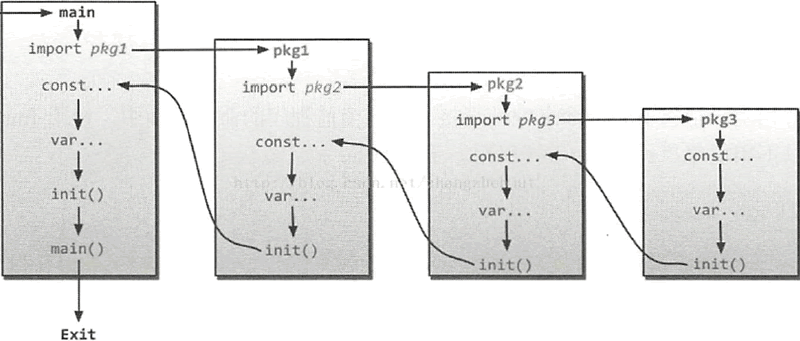
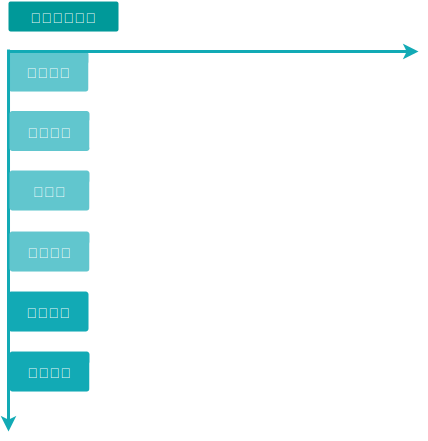
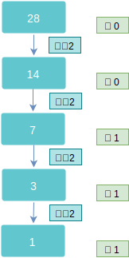
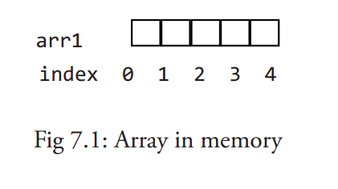
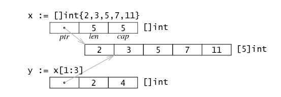
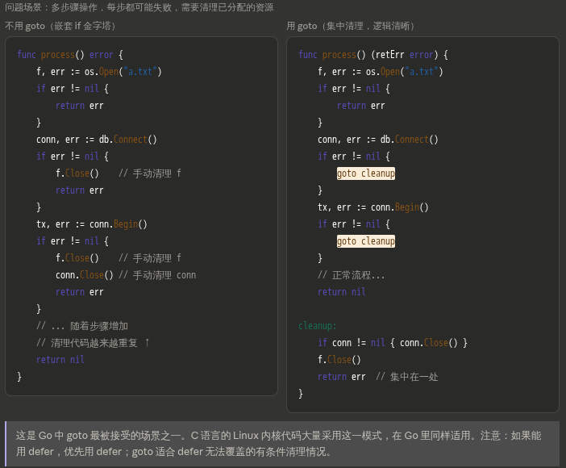

# golang study notes

## 准备开始go

### 官方文档

地址：[Documentation - The Go Programming Languageopen in new window](https://go.dev/doc/)

文档里有着对于学习Go语言所需要准备的一切东西，包括安装，快速开始，代码示例，风格建议，以及许多在线教程，大多数都是全英文的，少数支持中文，不过并没有什么特别晦涩难懂的词汇，大致意思都比较容易看懂。

### Go之旅

地址：[Go 语言之旅 (go-zh.org)open in new window](https://tour.go-zh.org/welcome/1)

这是由官方编写的一个非常简洁明了的教程，全中文支持，通过互动式的代码教学来帮助你快速了解Go语言的语法与特性，适合想要快速了解Go语言的人，如果将该教程浏览过一遍后，那么本站的基础教程理解起来会轻松很多。

### Effective Go

地址：[Effective Go - The Go Programming Languageopen in new window](https://go.dev/doc/effective_go)

这是由官方编写的一个比较全面的教程，时间最早可以追溯到2009年，内容比较详细，小到变量命名，大到一些设计思想。不过官方也标注了该文档已经很久没有进行大幅度更新，一些内容可能已经过时了，但是大部分教程都仍然适用。

### 参考手册

地址：[The Go Programming Language Specificationopen in new window](https://go.dev/ref/spec)

参考手册的重要性不言而喻，参考手册的内容永远会随着版本的变化而变化，时刻保持最新，其内容有：词法结构，概念定义，语句定义等等，这是一些关于Go语言中最基础的定义，适合有需要的时候查询一些概念，同时里面也有着不少的代码示例。

### 在线代码

地址：[Go Playground - The Go Programming Languageopen in new window](https://go.dev/play/)

由官方搭建的可在线编译并运行Go程序的网站，对于一些代码量不是特别大的Go程序，可以在官方的在线网站直接进行编写，能省去不少时间。

### 更新日志

地址：[Release History - The Go Programming Languageopen in new window](https://go.dev/doc/devel/release)

根据以往的惯例，官方大概每半年发布一个二级版本，每一次更新的变动都可以在更新日志中查看，例如在1.18版本中的最大变动就是增加了泛型，而1.19的更新就相对而言要温和很多，了解一下每一个版本的更新内容也会有所帮助。

### Go安装

推荐使用官方的安装包直接安装，下载地址：https://golang.google.cn/dl/

贴士：本笔记都是基于go1.22.1

**Win安装Go**：
打开Win安装包下一步下一步即可，默认安装在目录：c:/Go

**Mac安装Go**：
打开Mac安装包下一步下一步即可，需要预装Xcode。安装完毕后需配置环境变量即可使用，但是如果要使用一些`go mod`功能推荐如下配置：

``` bash
vim ~/.bash_profile

export GOROOT=/usr/local/go                 # golang本身的安装位置
export GOPATH=~/go/                         # golang包的本地安装位置
export GOPROXY=https://goproxy.io           # golang包的下载代理
export GO111MODULE=on                       # 开启go mod模式
export PATH=$PATH:$GOROOT/bin               # go本身二进制文件的环境变量
export PATH=$PATH:$GOPATH/bin               # go第三方二进制文件的环境便令

# 重启环境
source ~/.bash_profile
```

测试安装：

``` bash
# 查看go版本
go version
# 开启mod模式
go env -w GO111MODULE=on

# 查看go环境配置
go env
GO111MODULE='on'  # 开启mod模式
GOARCH='amd64'
GOBIN=''
GOCACHE='/home/echo9z/.cache/go-build'
GOENV='/home/echo9z/.config/go/env'
GOEXE=''
GOEXPERIMENT=''
GOFLAGS=''
GOHOSTARCH='amd64'
GOHOSTOS='linux'
GOINSECURE=''
GOMODCACHE='/home/echo9z/go/pkg/mod'
GONOPROXY=''
GONOSUMDB=''
GOOS='linux'
GOPATH='/home/echo9z/go' # golang中的默认工作路径
GOPRIVATE=''
GOPROXY='https://goproxy.cn,direct' # 获取go相关包的代理地址
GOROOT='/home/echo9z/.g/go'
GOSUMDB='sum.golang.org'
GOTMPDIR=''
GOTOOLCHAIN='auto'
GOTOOLDIR='/home/echo9z/.g/go/pkg/tool/linux_amd64'
GOVCS=''
GOVERSION='go1.23.1' # goland的版本
GODEBUG=''
GOTELEMETRY='local'
GOTELEMETRYDIR='/home/echo9z/.config/go/telemetry'
GCCGO='gccgo'
GOAMD64='v1' # 控制编译器生成的代码中使用哪些特定于 AMD64 架构指令集扩展的环境变量。
AR='ar'
CC='gcc'
CXX='g++'
CGO_ENABLED='1'
GOMOD='/dev/null'
GOWORK=''
CGO_CFLAGS='-O2 -g'
CGO_CPPFLAGS=''
CGO_CXXFLAGS='-O2 -g'
CGO_FFLAGS='-O2 -g'
CGO_LDFLAGS='-O2 -g'
PKG_CONFIG='pkg-config'
GOGCCFLAGS='-fPIC -m64 -pthread -Wl,--no-gc-sections -fmessage-length=0 -ffile-prefix-map=/tmp/go-build2405391928=/tmp/go-build -gno-record-gcc-switches'
```

安装目录`$GOROOT`，如下目录：
>`/bin`：包含可执行文件，如：编译器，Go 工具
>`/doc`：包含示例程序，代码工具，本地文档等
>`/lib`：包含文档模版
>`/misc`：包含与支持 Go 编辑器有关的配置文件以及 cgo 的示例
>`/pkg`：包含编译后生成的文件（比如：.a）
>`/src`：包含源代码构建脚本和标准库的包的完整源代码（Go 是一门开源语言）
>`/src/cmd`：包含 Go 和 C 的编译器和命令行脚本

### Go 运行时（runtime）
runtime 类似 Java 和 .NET 语言所用到的虚拟机，它负责管理包括内存分配、垃圾回收（第 11.8 节）、栈处理、goroutine、channel、切片（slice）、map 和反射（reflection）等等。

runtime 主要由 C 语言编写（自 Go 1.5 起开始自举），并且是每个 Go 包的最顶级包。你可以在目录 $GOROOT/src/runtime 中找到相关内容。


### 开发工具推荐

笔者推荐的go开发工具：

- goland
- vscode

vscode的相关go插件会出现无法下载情况，解决办法：

``` bash
# 如果开启了go mod，则
    go get -u -v github.com/ramya-rao-a/go-outline
    go get -u -v github.com/acroca/go-symbols
    go get -u -v golang.org/x/tools/cmd/guru
    go get -u -v golang.org/x/tools/cmd/gorename
    go get -u -v github.com/rogpeppe/godef
    go get -u -v github.com/sqs/goreturns
    go get -u -v github.com/cweill/gotests/gotests
    go get -u -v golang.org/x/lint/golint

# 如果未开启go mod，则需要进入cd $GOPATH/src ，使用 git clone 下载上述文件        

# 安装
cd $GOPATH
    go install github.com/ramya-rao-a/go-outline
    go install github.com/acroca/go-symbols
    go install golang.org/x/tools/cmd/guru
    go install golang.org/x/tools/cmd/gorename
    go install github.com/rogpeppe/godef
    go install github.com/sqs/goreturns
    go install github.com/cweill/gotests/gotests
    go install golang.org/x/lint/golint
```

## 基础语法

### HelloWorld

通过一个简单的Hello World示例来进行讲解。

go的项目依赖管理一直饱受诟病，在go1.11后正式引入了`go modules`功能，在go1.13版本中将会默认启用。

1.`go mod init golang/notes`初始化并写入一个新的go.mod至当前目录中，实际上是创建一个以当前目录为根的新模块。可以理解nodejs中package.json

```mod
# go.mod
module golang/notes // 以后自定包，都需要golang/notes/xxx

go 1.21.1
```

2.新建文件`hello.go`，代码如下：

```go
package main                        //每个程序都有且仅有一个main包

import "fmt"    
// 程序的入口文件
func main() {                       //主函数main只有一个
    fmt.Println("Hello World!")     //函数调用：包名.函数名
}
```

`package`关键字代表的是当前go文件属于哪一个包，启动文件通常是`main`包，启动函数是`main`函数，在自定义包和函数时命名应当尽量避免与之重复。

`import`是导入关键字，后面跟着的是被导入的包名。

`func`是函数声明关键字，用于声明一个函数。

`fmt.Println("Hello World!")`是一个语句，调用了`fmt`包下的`Println`函数进行控制台输出。

运行文件：

``` bash
# 执行方式一：先编译，再运行
go build hello.go        # 编译。在同级目录下生成文件`hello`，添加参数`-o 名称` 则可指定生成的文件名 
./hello                  # 运行。贴士：win下生成的是.exe文件，直接双击执行即可 编译二进制文件

# 执行方式二：直接运行
go run hello.go         
```

两种执行流程的区别：

- 先编译方式：可执行文件可以在任意没有go环境的机器上运行，（因为go依赖被打包进了可执行文件）
- 直接执行方式：源码执行时，依赖于机器上的go环境，没有go环境无法直接运行

### package包

在Go中，程序是通过将包链接在一起来构建的，也可以理解为最基本的调用单位是包，而不是go文件。包其实就是一个文件夹，包内共享所有源文件的变量，常量，函数以及其他类型。包的命名风格建议都是小写字母，并且要尽量简短。

在 Go 的安装文件里包含了一些可以直接使用的包，即标准库。一般情况下，标准包会存放在 `$GOROOT/src/`下。Go标准库 .a 文件在`$GOROOT/pkg/`下。

标准库源码主要在以下目录：
- `$GOROOT/src/` - 标准库源代码
- `$GOROOT/pkg/` - 编译后的包文件
- `$GOROOT/bin/` - Go 工具链

#### 包导入

例如创建一个`utils`包，包下有如下函数

utils/say.go

```go
package utils // 注意：文件夹 要与utils一直

import "fmt"

const PI float64 = 3.14

// Add 函数 首字母大写，表示对外可见
func Add(a, b int) int {  
    return a + b  
}

func GoRun() {
	fmt.Println("go run")
}
```

在`main`函数中导入utils包

```go
package main // 程序主入口  
import "fmt"  
import (  
    "01_package/utils"  // 与go mod为准
) 
  
func main() { // 该文件必须包含main函数  
    fmt.Println("这是主函数main")  
    res := utils.Add(3, 5) // 调用utils包下的add函数  
    fmt.Println(res)  
    utils.GoRun()
    // 使用可见常量  
	fmt.Println("PI=", utils.PI)
}
```

注意：在导入包的路径写法，要与当前文件下的go.mod 中的module 模块名为准
```go
module 01_package  

go 1.23
```

还可以给包起别名

```go
package main

import u "01_package/utils"

func main() {
   u.GoRun()
}
```

批量导入时，可以使用括号`()`来表示

```go
package main

import (
	"fmt"
	"math"
	u "01_package/utils"
)
func main() {
	fmt.Println("多包导入", math.Pi)
	u.GoRun()
	res := utils.Add(3, 5) // 调用utils包下的add函数  
	fmt.Println(res)
}
```

或者说只导入不调用，通常这么做是为了调用该包下的`init`函数。

```go
package main

import (
   "fmt"
    _ "mysql-driver" // 下划线表示匿名导入，比如初始化包中init() 启动函数
)
```

init()函数在包加载时就会默认最先调用，用来对包中的一些属性进行初始化操作：

```go
package driver  
  
import "fmt"  
  
// init函数会在包初始化时自动调用，且每个包可以有多个init函数  
func init() {  
    fmt.Println("init: 初始化")  
}
```
一个go包可以拥有多个init函数，会按照包中不同文件名顺序、同文件名中init函数前后顺序依次调用。

> 注意：
> Go中完全禁止循环导入，不管是直接的还是间接的。例如包A导入了包B，包B也导入了包A，这是直接循环导入，包A导入了包C，包C导入了包B，包B又导入了包A，这就是间接的循环导入，存在循环导入的话将会无法通过编译。

`package main` 与 `package util`区别：

- `package main`
	定义为package main时，该文件为程序主入口，同时该文件必须包含main()函数。
	同时一个项目只有一个package main包。
	编译后会产生二进制文件（如 `.exe` 或可执行脚本）。
- `package xxx`
	自定义包没有特殊的入口函数，用于其他项目或者模块引入调用。
	若单独编译，会生成 `.a` 文件（静态库），但通常作为源码被其他包导入。

| 特性    | `package main`    | `package util`（自定义包） |
| ----- | ----------------- | -------------------- |
| 入口函数  | 必须包含 `main()` 函数  | 无特殊入口函数              |
| 编译结果  | 生成可执行文件（如 `.exe`） | 生成库文件（`.a` 或源码复用）    |
| 可见性规则 | 大写开头的标识符可导出       | 大写开头的标识符可导出          |
| 用途    | 程序启动与初始化          | 代码复用、模块化组织           |
| 依赖关系  | 可导入其他包            | 可被其他包导入              |

#### 包导出

在Go中，导出和访问控制是通过命名来进行实现的，如果想要对外暴露一个函数或者一个变量，只需要将其名称首字母大写即可，例如`example`包下的`SayHello`函数。

```go
package utils

import "fmt"

// 首字母大写，可以被包外访问
func SayHello() {
   fmt.Println("Hello")
}
```

如果想要不对外暴露的话，只需将名称首字母改为小写即可，例如：
```go
package utils

import "fmt"

// 首字母小写，外界无法访问
func sayHello() {
   fmt.Println("Hello")
}
```

对外暴露的函数和变量可以被包外的调用者导入和访问，如果是不对外暴露的话，那么仅包内的调用者可以访问，外部将无法导入和访问，**该规则适用于整个Go语言**，例如后续会学到的结构体及其字段，方法，自定义类型，接口等等。

#### 包加载
在执行 main 包的 mian 函数之前， Go 引导程序会先对整个程序的包进行初始化。整个执行的流程如下图所示：


Go语言包的初始化有如下特点：

- 包初始化程序从 main 函数引用的包开始，逐级查找包的引用，直到找到没有引用其他包的包，最终生成一个包引用的有向无环图。
- Go 编译器会将有向无环图转换为一棵树，然后从树的叶子节点开始逐层向上对包进行初始化。
- 单个包的初始化过程如上图所示，先初始化常量，然后是全局变量，最后执行包的 init 函数。

#### 包编译执行顺序
在进行包的编译，`A.go` → `B.go` → `C.go` 这样的依赖链时，编译器会**自动分析依赖关系**，按照**自底向上**的顺序编译：
1. 首先编译 C.go (没有依赖)  go tool compile c.go → c.a
2. 然后编译 B.go (依赖 C)  go tool compile b.go → b.a (使用 c.a)
3. 最后编译 A.go (依赖 B) go tool compile A.go → A.o (使用 b.a)
4. 生成可执行文件 go tool link A.o → 可执行文件

查看编译顺序：
```bash
go build -x A.go # -x 参数会显示详细的编译过程
```

**编译缓存机制**
```bash
# 编译后的包会缓存在
go env GOCACHE
```

**增量编译**
- 如果只修改了 `A.go`，只重新编译 A
- 如果修改了 `C.go`，需要重新编译 C、B、A
- 如果修改了 `B.go`，需要重新编译 B、A

#### 私有包

go中约定，一个包内名为`internal` 包为私有包，其它的包将无法访问私有包中的任何东西。下面看一个例子。

```bash
 tree ./02_private_pkg
./02-basegra
|-- main.go
|-- pri
|   |-- internal
|   |   `-- ser
|   |       `-- ser.go
|   |-- ser
|   |   `-- ser.go
|   `-- pri.go
`-- utils
    |-- run.go
    `-- say.go
```
文件结构中可知，`utils`包无法访问`ser`包中的类型。

```go
package utils  
  
import "fmt"  
import pri "02_private_pkg/pri"  
import ser "02_private_pkg/pri/ser" // utils可以访问pri包下的共有 ser包  

//import priv "02_private_pkg/pri/internal/ser"  // utils无法访问pri包下的私有 internal包  
  
func GoRun() {  
    fmt.Println("go run")  
    pri.Pri_Test()  
    ser.Ser()  
    // priv.Ser() 无法引用 pri下文件夹名为 internal的私有函数或类型  
}
```

#### 注释

go支持单行注释和多行注释。

```go
// 这是main包
package main

// 导入了fmt包
import "fmt"

/*
* 这是启动函数main函数
*/
func main() {
	// 这是一个语句
	fmt.Println("Hello 世界!")
}
```

### 标识符与变量

#### 标识符

标识符就是一个名称，用于包命名，函数命名，变量命名等等，命名规则如下：

- 只能由字母，数字，下划线组成
- 只能以字母和下划线开头
- 严格区分大小写
- 不能与任何已存在的标识符重复，即包内唯一的存在
- 不能与Go任何内置的关键字冲突

下方列出所有的内置关键字，也可以前往[参考手册-标识符](https://go.dev/ref/spec#Identifiers)

Go现在拥有25个关键字：

```go
if      for     func    case        struct      import               
go      type    chan    defer       default     package
map     const   else    break       select      interface
var     goto    range   return      switch      continue     fallthrough 
```

保留字

```go
内建常量：  
        true        false       iota        nil
内建类型：  
        int         int8        int16       int32       int64
        uint        uint8       uint16      uint32      uint64      uintptr
        float32     float64 
        complex128  complex64
bool：      
        byte        rune        string 	    error
内建函数：   
        make        delete      complex     panic       append      copy    
        close       len         cap	        real        imag        new   	    recover
```

#### 变量

Go变量声明的三种方式：

```go
var a int		    // 声明一个变量，默认为0
var b = 10		    // 声明并初始化，且自动推导类型
c := 20			    // 初始化，且自动推导

func Variable() {
	var a = 5 // 声明一个 a 变量
	a += 1    // a + 1 = 6
	a /= 2    // a / 2 = 3
	a &^= 2   // a &^ 2 = 1
	fmt.Println("a", a)
    
	var c int // 声明一个变量，默认值为0
	fmt.Println(c)

	b := 20 // 声明并初始化，且自动推导类型，只能在函数内部使用，不可以用于全局变量的声明与赋值。使用var定义全局变量
	fmt.Println(b)
}
```

注意：

- `:=`定义变量只能在函数内部使用，所以经常用var定义全局变量
- Go对已经声明但未使用的变量会在编译阶段报错：`a declared and not used`
- Go中的标识符以字母或者下划线开头，大小写敏感
- Go推荐使用驼峰命名

####  多变量声明

```go
// 多变量声明
var a1,b1 string
var c1,c2 int = 25,26 // 类型可以直接省略
d1,d2 := "h2","h4"
```

该方式声明多个数据：

```go
const(
    i = 100
    pi = 3.1415
    prefix = "Go_"
)
    
 var(
    i int
    pi float32 = 3.14
    prefix string
)
```

当一个变量被声明之后，系统自动赋予它该类型的零值：int 为 0，float 为 0.0，bool 为 false，string 为空字符串，指针为 nil。记住，所有的内存在 Go 中都是经过初始化的。

一个变量（常量、类型或函数）在程序中都有一定的作用范围，称之为作用域。如果一个变量在函数体外声明，则被认为是全局变量，可以在整个包甚至外部包（被导出后）使用，不管你声明在哪个源文件里或在哪个源文件里调用该变量。

在函数体内声明的变量称之为局部变量，它们的作用域只在函数体内，参数和返回值变量也是局部变量。

```go
package utils  
import "fmt"  
  
const PI float64 = 3.14  // 全局变量
  
func Add(a, b int) int {  
	var c int = 10
    return a + b + c
}
```

#### 变量值互换
在其他编程语言中的，比如js，java，两值的交换通过添加一个temp临时变量进行存储交换
```js
let a, b = 9, 10
let temp = a;
a = b
b = temp

// js中的结构
let a = 1, b = 2; [a, b] = [b, a];
```
在go中直接通`a,b = b,a`，将a和b的值进行交换，类似于js中结构
```go
var m = 15
var n = 20
m,n = n,m // 直接将m与n的值互换
fmt.Println("m,n",m, n)

var n1,m2 = 22,25
var temp int
temp,_ = n1,m2 // 将n1的值赋值给n1，_表示丢弃变量 m2
fmt.Println("temp", temp)
```

多个变量值进行交换
```go
// 三个值进行交换  
num1, num2, num3 := 25, 36, 49  
num1, num2, num3 = num3, num1, num2  
fmt.Println(num1, num2, num3) //49 25 36  
// 下面分解下  
// 第一步 num1, num2, num3 = num3, num1, num2 等式右边num3, num1, num2顺序，n3:49，n1:25，n2:36  
// 第二步 等式左边，按照将49，25，36顺序，对num1, num2, num3进行赋值，最终得到 n1:49, n2:25, n3:36
```

#### 变量比较
变量之间的比较有一个大前提，那就是它们之间的类型必须相同，go 语言中不存在隐式类型转换。
```go
func main() {
	var a uint64
	var b int64
	fmt.Println(a == b) 
}
```
编译会报出`mismatched types uint64 and int64`类型不匹配。必须使用强制类型转换
```go
func main() {  
    var a uint64  
    var b int64  
    fmt.Println(int64(a) == b)  
}
```

在没有泛型之前，早期 go 提供的内置`min`，`max`函数只支持浮点数，到了 1.21 版本，go 才终于将这两个内置函数用泛型重写，可以使用`min`函数比较最小值

```go
minVal := min(0, -1, 0.05)
```

使用`max`函数比较最大值

```go
maxVal := max(15.5, 15, 855, 1024.8)
```

go 中的可比较类型有
- 布尔
- 数字
- 字符串
- 指针
- 通道 （仅支持判断是否相等）
- 元素是可比较类型的数组（切片不可比较）（仅支持判断是否相等）（仅支持相同长度的数组间的比较，因为数组长度也是类型的一部分，而不同类型不可比较）
- 字段类型都是可比较类型的结构体（仅支持判断是否相等）

除此之外，还可以通过导入标准库`cmp`来判断，不过仅支持有序类型的参数，在 go 中内置的有序类型只有数字和字符串。
```go
import "cmp"  
  
func main() {  
	cmp.Compare(15, 456)  
	cmp.Less(1, 2) // x 是否小于 y
}
```

#### 代码块作用域
在函数中，花括号建立一个代码块，代码块彼此之间的变量作用域是相互独立的，不受干扰，无法访问，但是会受父级块中的影响。
```go
func main() {  
    a := 1  
    {  
       a := 2  
       fmt.Println(a)  
    }  
    {
	    fmt.Println(a)  
    }    
    fmt.Println(a)  
}
```

#### \_丢弃变量

`_`是个特殊的变量名，任何赋予它的值都会被丢弃。该变量不占用命名空间，也不会分配内存。
```go
_, b := 34, 35      // 将值35赋予b，并同时丢弃34
```
Go对于已声明但未使用的变量会在编译阶段报错，比如下面的代码就会产生一个错误：声明了`i`但未使用。
```go
package main

func main() {
	var i int // 在编译阶段出现 i declared and not used
}
```
比如`os.Open`函数有两个返回值，只想要第一个，不想要第二个
```go
// Open(name string) (*File, error)
file, _ := os.Open("readme.txt")
```
未使用的变量是无法通过编译的，当你不需要某一个变量时，就可以使用下划线`_`代替。

### 值类型与引用类型

#### 值类型
值类型的变量直接存储**实际的数据**。当将一个值类型的变量赋值给另一个变量，或者作为参数传递给函数时，系统会在内存中**完全复制**一份新的数据。这两个变量拥有各自独立的内存空间，修改其中一个，完全不会影响另一个。

- **基础数据类型**：整型 (`int`, `int8`, `uint32` 等)、浮点型 (`float32`, `float64`)、布尔型 (`bool`)。
- **字符串**：`string`（注意：Go 中的字符串本质上是一个只读的字节数组，虽然它表现为值类型，但为了性能，底层实现包含指针，不过由于它是不可变的，你完全可以将其当作纯值类型来理解）。
- **数组**：`[n]T`（例如 `[3]int`。注意与切片区分，定长的是数组）。
- **结构体**：`struct`。
    

**内存分配** 通常分配在栈（Stack）区。随着函数执行完毕，内存会自动释放，开销很小。零值（未初始化时的默认值）通常是具体的数值，如 `0`、`""`、`false`。

```go
var i int = 7
var j int = i // 实际上是在内存中将 i 的值进行了拷贝
fmt.Println("value：", &i, &j) // value： 0x1d7e33b54120 0x1d7e33b54128 地址值不同

// 修改1 不影响1，各自独立内存空间
j = 100
fmt.Printf("i1:%d, j1:%d\n", i, j) // i:7, j:100

// 栈内存布局：
// +--------+--------+
// | 地址   | 值     |
// +--------+--------+
// | 0xa130 |   7    |  <- i 的位置
// +--------+--------+
// | 0xa138 |   7    |  <- j 的位置
// +--------+--------+
```
- i 和 j 的内存地址不同，每个变量都有自己独立的内存空间，j=i 是将 i 的值拷贝了一份给 j
- i内存值0xc00000a130=7，存放在栈区
- j=i，j变量开辟内存值0xc00000a138，将值7进行拷贝到j内存中

如果想要相同的内存地址，得让j指向i的地址，此时 j 就是一个引用类型 指针类型
```go
var i int = 7
var j *int = &i // j 指向 i 的地址

fmt.Printf("i 的地址: %p\n", &i) // i 的地址: 0x1d7e33b54140
fmt.Printf("j 指向的地址: %p\n", j) //j 指向的地址: 0x1d7e33b54140
fmt.Printf("地址相同吗? %t\n", &i == j) // 地址相同吗? true
```

```go
// 值类型：数组
arr1 := [3]int{1, 2, 3}
arr2 := arr1 // 复制整个数组
arr2[0] = 100
fmt.Println(arr1[0]) // 输出 1 (原始不变)

// 值类型：结构体
type Person struct {
    Name string
    Age  int
}
pp1 := Person{"Alice", 20}
pp2 := pp1 // 复制整个结构体
pp2.Age = 30
fmt.Println(pp1.Age) // 输出 20
```

> 内存分配通常在**栈**上（编译器可能发生逃逸，但概念上仍是值语义）。
> 零值是类型对应的“零值”（如`int`的`0`，`string`的`""`，结构体的每个字段为零值）。
> 直接访问数据，无额外间接开销。
> 复制成本与数据大小成正比（大结构体或数组复制代价较高）。

#### 引用类型
引用类型的变量存储的是**底层数据结构的内存地址（指针）**，而不是数据本身。当你赋值或传参时，复制的只是这个**地址（或包含地址的数据结构头部）**。因此，多个变量可能指向同一块内存，修改其中一个变量底层的元素，会影响到其他指向该内存的变量。
比如：`slice`、`map`、`channel`、`pointer`、`func`、`interface`。

底层数据通常分配在堆（Heap）区，需要 Go 的垃圾回收器（GC）来管理内存释放。它们的零值通常是 `nil`。

```go
var sli1 []int = []int{1, 2, 3}
var sli2 []int = sli1 // 将 sli1 的引用赋值给了 sli2

fmt.Printf("sli1 切片头地址: %p\n", &sli1) // 切片变量本身的地址
fmt.Printf("sli2 切片头地址: %p\n", &sli2) // 切片变量本身的地址
fmt.Printf("sli1 底层数组地址: %p\n", sli1) // 底层数组的地址
fmt.Printf("sli2 底层数组地址: %p\n", sli2) // 底层数组的地址

// sli1 切片头地址: 0xc000008030
// sli2 切片头地址: 0xc000008048 <- 不同地址
// sli1 底层数组地址: 0xc000014108
// sli2 底层数组地址: 0xc000014108 <- 相同地址

// 栈上的切片头：
// +--------+------------+-----+-----+
// | 地址   | ptr         | len | cap |
// +--------+------------+-----+-----+
// | &sli1  | 0x12120    |  3  |  3  |  <- sli1 切片头
// +--------+------------+-----+-----+
// | &sli2  | 0x12120    |  3  |  3  |  <- sli2 切片头
// +--------+------------+-----+-----+

//  堆上的底层数组：
// +--------+---+---+---+
// | 地址    | 1 | 2 | 3 |
// +--------+---+---+---+
// |0x12120 | 底层数组   |  <- 两个切片都指向同一个底层地址
// +--------+-----------+
```

> 使用`make`函数创建（或字面量初始化），返回的变量就是引用。
> 零值是`nil`（未初始化），不能直接使用，需`make`或字面量赋值。
> 底层数据分配在**堆**上，引用（类似指针）在栈上。
> 复制成本低（只复制一个指针或少量描述信息，如切片需要复制`len`、`cap`和指针）。
> 通过引用修改数据会影响所有指向同一底层数据的变量。

### 变量和常量在内存区域的存储
在 Go 语富中，变量和常量在内存中的存储方式有所不同，主要体现在生命周期、存储区域和存储方式上。了解它们在内存中的存储方式有助于优化程序的性能和内存使用。

##### Go 内存区域划分
Go 语言中，内存通常分为三大区域
- 全局静态区：存储全局变量和常量。这些变量和常量在程序启动时分配内存，并在程序结束时释
- 堆：存储动态分配的内存，通常用于需要在多个国数间共享的对象。堆上的数据需要手动管理或由 Go的垃圾回收机制负责清理。
- 栈：用于函数调用时

##### 变量的内存存储
全局变量:
- 全局变量声明在函数外，属于静态存储区，存储在全局静态区中
- 这些变量在程序启动时被分配，程序结束时被释放。
- 全局变量的生命周期与程序的生命周期相同。


### 运算符

下面是Go语言中支持的运算符号的优先级排列，也可以前往[参考手册-运算符open in new window](https://go.dev/ref/spec#Operators)查看更多细节。

```go
Precedence    Operator
5             *  /  %  <<  >>  &  &^
4             +  -  |  ^
3             ==  !=  <  <=  >  >=
2             &&
1             ||
```



go也支持增强赋值运算符，如下。

```go
a += 1
a /= 2
a &^= 2
```

> 提示
>
> Go语言中没有自增与自减运算符，它们被降级为了语句`statement`，并且规定了只能位于操作数的后方，所以不用再去纠结`i++`和`++i`这样的问题。
>
> ``` text
> a++ // 正确
> ++a // 错误
> a-- // 正确
> ```
>
> 注意：它们不再具有返回值，因此`a = b++`这类语句的写法是错误的。

#### 进制转换
##### 常见进制
- 二进制：只有0和1，Go中不能直接使用二进制表示整数
- 八进制：0-7，以数字0开头
- 十进制：0-9
- 十六进制：0-9以及A-F，以0X开头，A-F以及X不区分大小写
##### 任意进制转换为十进制
二进制转十进制：

> 从最低位开始，每个位上数乘以2（位数-1）次方然后求和 1011 = 1\*2^0 + 1\*2^1 + 0\*2^2 + 1\*2^3 = 11

八进制转十进制：

> 从最低位开始，每个位上数乘以8（位数-1）次方然后求和 0123 = 3\*8^0 + 2\*8^1 + 1\*8^2 + 0\*8^3 = 83

其他进制转十进制同理。

##### 十进制转其他进制
十进制转二进制：

> 不断除以2，直到0为止,余数倒过来即可，如图计算28转换为二进制11100


十进制转八进制：不断除以8，直到0为止，余数倒过来即可。
十进制转十六进制：不断除以16，直到0为止，余数倒过来即可。
##### 其他进制互转
- 二进制转换八进制：将二进制数从低位开始，每三位一组，转换成八进制数即可
- 二进制转十六进制：将二进制数从低位开始，每四位一组，转换成十六进制数即可
- 八进制转换二进制：将八进制数每1位转换成一个3位的二进制数（首位0除外）
- 十六进制转二进制：将十六进制每1位转换成对应的一个4位的二进制数即可

#### 计算机常见的术语
术语：
- bit：比特，代表1个二进制位，一个位只能是0或者1
- Byte：字节，代表8个二进制位，计算机中存储的最小单元是字节
- WORD：双字节，即2个字节，16位
- DWORD：两个WORD，即4个字节，32位

一些常用单位：
- 1b：1bit，1位  1b：1bit，1 位
- 1Kb：1024bit，即1024位
- 1Mb：1024*1024bit
- 1B：1Byte，1字节，8位  1B：1Byte，1 字节，8 位
- 1KB：1024B
- 1MB：1024K

对于有符号数而言，二进制的最高为是符号位：0表示正数，1表示负数，比如 1在二进制中：

```
1  二进制位：0000  0001
-1 二进制位：1000  0001
```

正数的原码、反码、补码都一样，负数的反码=原码符号位不变，其他位取反，补码是反码+1

```
         1              -1
原码  0000  0001        1000  0001
反码  0000  0001        1111  1110
补码  0000  0001        1111  1111
```
常见理解：
- 0的反码补码都是0
- 计算机中是以补码形式运算的

#### 算术运算符

算术运算符通常用于数字型数据运算。下表列举了所有算术运算符及其含义。

| 算术运算符 | 含 义  |
| ---------- | ------ |
| +          | 相加   |
| -          | 相减   |
| *          | 相乘   |
| /          | 相除   |
| %          | 取余数 |
| ++         | 自增1  |
| --         | 自减1  |

上表中列举的运算符除 % 之外均可用于整型、浮点型和复数型数据运算。% 仅可用于整型数据运算，其运算结果的符号与被除数保持一致。当被除数为正数时，余数也为正数；当被除数为负数时，余数也为负数，与除数是否为正数无关。

注意，如果算术运算结果超出了类型本身的范围，就会发生溢出现象。发生溢出现象后，程序不会有任何异常，但溢出的高位会被丢弃。

```go
package main
import (
    "fmt"
)
/*算术运算符的使用
*/
func main() {
    var b = 22 //声明 expNumOne 变量
	var c = 10
	fmt.Println("b+c", b+c) //相加的结果
	fmt.Println("b-c", b-c) //相减的结果
	fmt.Println("b*c", b*c) //相乘的结果
	fmt.Println("b/c", b/c) // 两个数相除的取整数结果
	fmt.Println("b%c", b%c) // 余数的结果
    b++ // b变量自增    1
    fmt.Println("b", b)
    c-- // c变量自减    1
    fmt.Println("c", c) / /输出运算结果
 
    var uInt8Max uint8=255 // 声明uInt8Max变量，类型为uint8,值为该类型最大值
    fmt.Println(uInt8Max+1) / /输出运算结果
    var int8Max int8=127 // 声明int8Max变量，类型为uint8,值为该类型最大值
    fmt.Println(int8Max+1) //输出运算结果
}
```

#### 关系运算符

关系运算符用于表示两个值的大小关系。下表列举了所有关系运算符及其含义。

| 关系运算符 | 含 义   |
| ----- | ----- |
| ==    | 相等    |
| !=    | 不相等   |
| <     | 小于    |
| <=    | 小于或等于 |
| >     | 大于    |
| >=    | 大于或等于 |

使用关系运算符通常会返回一个布尔型值，若大小关系的条件成立，则返回 true，否则返回 false。

```go
func Relationship()  {
	fmt.Println(100 == (50+50)) // true
	fmt.Println((51+49)!=(50*2)) // false
	var str string = "abcde"
	fmt.Println(str[0]==97) // true
}
```

#### 逻辑运算符

逻辑运算符，有时又被称为逻辑连接词。顾名思义，它可以将两个逻辑命题连接起来，组成新的语句或命题，最终形成复合语句或复合命题，其返回结果为布尔型值。

Go 语言支持的所有逻辑运算符及其含义如下表所示。

| 逻辑运算符 | 含 义                                                           |
| ----- | ------------------------------------------------------------- |
| &&    | 逻辑与（AND），当运算符前后两个条件的结果均为 true 时，运算结果为 true                    |
| \|\|  | 逻辑或（OR），当运算符前后两个条件的结果中有一个为 true 时，运算结果为 true                  |
| !     | 逻辑非（NOT），对运算符后面的条件的结果取反，当条件的结果为 true 时，整体运算结果为 false，否则为 true |

```go
func Logic() {
	fmt.Println(true && false)
	fmt.Println(true || false)
	fmt.Println(!(1 > 6))
}
```

#### 位运算符

位运算符提供了整型数据的二进制位操作。在计算机内部，所有的数据都是由二进制的 0 和 1 进行存储的，整型数据也不例外。整型数据经过位运算后，可以得到按位操作后的新数值。

举一个简单的例子来看下 CPU 是如何进行计算的，比如这行代码：

```go
int a = 35;
int b = 47;
int c = a + b;
```

计算两个数的和，因为在计算机中都是以二进制来进行运算，所以上面我们所给的 int 变量会在机器内部先转换为二进制在进行相加：

```
35:  0 0 1 0 0 0 1 1
47:  0 0 1 0 1 1 1 1
————————————————————
82:  0 1 0 1 0 0 1 0
```

所以，相比在代码中直接使用(+、-、*、/)运算符，合理的运用位运算更能显著提高代码在机器上的执行效率。

##### "与"运算（&）

运算规则：

```go
0&0=0  0&1=0  1&0=0  1&1=1
```

总结：两位同时为1，结果才为1，否则结果为0。

例如：3&5 即 0000 0011& 0000 0101 = 0000 0001，因此 3&5 的值得1。

注意：负数按补码形式参加按位与运算。

**与运算的用途：**

1）清零

如果想将一个单元清零，即使其全部二进制位为0，只要与一个各位都为零的数值相与，结果为零。

2）取一个数的指定位

比如取数 X=1010 1110 的低4位，只需要另找一个数Y，令Y的低4位为1，其余位为0，即Y=0000 1111，然后将X与Y进行按位与运算（X&Y=0000 1110）即可得到X的a指定位。

3）判断奇偶

只要根据最未位是0还是1来决定，为0就是偶数，为1就是奇数。因此可以用if ((a & 1) == 0)代替if (a % 2 == 0)来判断a是不是偶数。

##### ”或“运算（|）

定义：参加运算的两个对象，按二进制位进行"或"运算。

运算规则：

```
0|0=0  0|1=1  1|0=1  1|1=1
```

总结：参加运算的两个对象只要有一个为1，其值为1。

例如：3|5即 0000 0011| 0000 0101 = 0000 0111，因此，3|5的值得7。　

注意：负数按补码形式参加按位或运算。

或运算的用途：

1）常用来对一个数据的某些位设置为1

比如将数 X=1010 1110 的低4位设置为1，只需要另找一个数Y，令Y的低4位为1，其余位为0，即Y=0000 1111，然后将X与Y进行按位或运算（X|Y=1010 1111）即可得到。

##### 异或运算符（^）

定义：参加运算的两个数据，按二进制位进行"异或"运算。

运算规则：

```go
0^0=0  0^1=1  1^0=1  1^1=0
```

总结：参加运算的两个对象，如果两个相应位相同为0，相异为1。

异或的几条性质:

- 1、交换律
- 2、结合律 (a^b)^c == a^(b^c)
- 3、对于任何数x，都有 x^x=0，x^0=x
- 4、自反性: a^b^b=a^0=a;

异或运算的用途：

1）翻转指定位

比如将数 X=1010 1110 的低4位进行翻转，只需要另找一个数Y，令Y的低4位为1，其余位为0，即Y=0000 1111，然后将X与Y进行异或运算（X^Y=1010 0001）即可得到。

2）与0相异或值不变

例如：1010 1110 ^ 0000 0000 = 1010 1110

3）交换两个数

```go operator.go
func Swap(n1, n2 int) (int, int) {
	if n1 != n2 {
		n1 ^= n2
		n2 ^= n1
		n1 ^= n2
	}
	return n1, n2
}
```

##### 取反运算符 (~)

定义：参加运算的一个数据，按二进制进行"取反"运算。

运算规则：　

```
~1=0
~0=1
```

总结：对一个二进制数按位取反，即将0变1，1变0。

异或运算的用途：

1）使一个数的最低位为零

使a的最低位为0，可以表示为：a & ~1。~1的值为 1111 1111 1111 1110，再按"与"运算，最低位一定为0。因为" ~"运算符的优先级比算术运算符、关系运算符、逻辑运算符和其他运算符都高。

##### 左移运算符（<<）

定义：将一个运算对象的各二进制位全部左移若干位（左边的二进制位丢弃，右边补0）。

设 a=1010 1110，a = a<< 2 将a的二进制位左移2位、右补0，即得a=1011 1000。

若左移时舍弃的高位不包含1，则每左移一位，相当于该数乘以2。

```go
174：1010 1110
<< 向移动2位，右边补0
1011 10|00 补0
```

##### 右移运算符（>>）

定义：将一个数的各二进制位全部右移若干位，正数左补0，负数左补1，右边丢弃。

例如：a=a>>2 将a的二进制位右移2位，左补0 或者 左补1得看被移数是正还是负。

```go
174：1010 1110
>> 右移2位 正数左侧补0 负数左侧补1
43：001010 11|10丢弃
```

##### 复合赋值运算符

位运算符与赋值运算符结合，组成新的复合赋值运算符，它们是：

```go
&=        例：a&=b    相当于     a=a&b
|=        例：a|=b    相当于     a=a|b
>>=      例：a>>=b   相当于     a=a>>b
<<=      例：a<<=b     相当于      a=a<<b
^=        例：a^=b    相当于   a=a^b
```

运算规则：和前面讲的复合赋值运算符的运算规则相似。

不同长度的数据进行位运算：如果两个不同长度的数据进行位运算时，系统会将二者按右端对齐，然后进行位运算。

以"与运算"为例说明如下：我们知道在C语言中long型占4个字节，int型占2个字节，如果一个long型数据与一个int型数据进行"与运算"，右端对齐后，左边不足的位依下面三种情况补足，

- 1）如果整型数据为正数，左边补16个0。
- 2）如果整型数据为负数，左边补16个1。
- 3）如果整形数据为无符号数，左边也补16个0。
- 如：long a=123；int b=1；计算a& b。
- 如：long a=123；int b=-1；计算a& b。
- 如：long a=123；unsigned intb=1；计算a & b

##### Go语言5个位运算符

Go语言提供了5个位运算符，如下表所示：

| 位运算符 | 含 义                                                                                       |
| ---- | ----------------------------------------------------------------------------------------- |
| &    | 按位与（AND）操作，其结果是运算符前后的两数各对应的二进制位相与后的结果                                                     |
| \|   | 按位或（OR）操作，其结果是运算符前后的两数各对应的二进制位相或后的结果                                                      |
| ^    | 按位异或（XOR）操作，当运算符前后的两数各对应的二进制位相等时，返回 0；反之，返回 1                                             |
| <<   | 按位左移操作，该操作本质上是将某个数值乘以 2 的 n 次方，n 为左移位数。更直观地来看，其结果就是将某个数值的所有二进制位向左移了 n 个位置，并将超限的高位丢弃，低位补 0 |
| >>   | 按位右移操作，该操作本质上是将某个数值除以 2 的 n 次方，n 为右移位数。更直观地来看，其结果就是将某个数值的所有二进制位向右移了 n 个位置，并将超限的低位丢弃，高位补 0 |

除了上表中的 5 个常见位运算符，Go语言还提供了“＆^”运算符，该运算符用于执行按位清空（AND NOT）操作。在使用该运算符时，若运算符右侧数值的第 N 位为 1，则运算结果的第 N 位为 0；若运算符右侧数值的第 N 位为 0，则运算结果的第 N 位为运算符左侧相应位的值。

举例来说，1011＆^1001 的结果是 0010。该运算符的目的是保证运算结果中的某位或某几位的值始终为 0。

**位清除 &^**
`a &^ b` 保留 a 中的位，但清除 b 中为 1 的对应位
换句话说：
- 当 `b` 的某一位是 `1` 时：无论 `a` 是什么，结果都是 `0`（**清除**）
- 当 `b` 的某一位是 `0` 时：保持 `a` 的原值（**保留**）
```go
   1100 (a = 12) 
&^ 1010 (b = 10) 
   ----
   0100 (result = 4)
```

位运算符 eg：
```go
func Bitwise() {
	fmt.Println(1561 & 0) // 与运算
	fmt.Println(3 | 5)    // 或运算
	numOne, numTwo := 10, 20
	fmt.Println(numOne ^ numTwo)  // 输出 numOne 和 numTwo 变量的按位异或结果
	fmt.Println(numOne &^ numTwo) // 输出 numOne 和 numTwo 变量的按位清空结果

	// &^ 清除运算  
	a := 12 // 二进制 0000 1100
	b := 10 // 二进制 0000 1010
	fmt.Println("通过清除运算", a&^b) // 0000 0100 = 4  
	// &^ b 保留 a 中的位，但清除 b 中为 1 的对应位  
	//当 `b` 的某一位是 `1` 时：无论 `a` 是什么，结果都是 `0`（清除）  
	//当 `b` 的某一位是 `0` 时：保持 `a` 的原值（保留）

	fmt.Println(174 << 2)
	fmt.Println(174 >> 2)
}
```

**注意**，go语言中没有选择将`~`作为取反运算符，而是复用了`^`符号，当两个数字使用`^`时，例如`a^b`，它就是异或运算符，只对一个数字使用时，例如`^a`，那么它就是取反运算符。

```go
x := 12                                        // 二进制 0000 1100
y := ^x                                        // 取反运算
fmt.Printf("x的值 %d (%08b)\n", x, uint8(x))     // x的值 12 (00001100)
fmt.Printf("x取反，y结果 %d (%08b)\n", y, uint8(y)) // y结果 -13 (11110011)
```

go中 `^x`是一元取反运算符，但也可以用二元异或 m^x 来达到相同效果，m 的选择：
- **无符号类型**: `m` 应该是"全部位设置为1"的值
- **有符号类型**: `m` 应该是 `-1`

异或的性质
任何数与"全1"异或，结果就是该数的按位取反：
```go
x ^ 11111111 = ~x (按位取反)
```

无符号类型: m 应该是"全部位设置为1"的值
```go
var x1 uint8 = 12  
var z1 uint8 = x1 ^ 255 // 11111111 = 255  
fmt.Printf("无符号与255的异或运算 %d (%08b)\n", z1, uint8(z1))  
var z2 uint8 = ^x1  
fmt.Printf("z2取反结果 %d (%08b)\n", z2, uint8(z2))
// 输出结果
// 无符号与255的异或运算 243 (11110011)
// z2取反结果 243 (11110011)
```

有符号类型: m 应该是 -1
```go
var x2 int8 = 12  
var z3 int8 = x2 ^ -1  
// -1 的二进制表示为11111111  
// 1 的原码: 00000001  
// 1 的反码: 11111110  
// 1 的补码: 11111111 (反码+1) 最终-1=11111111  
fmt.Printf("有符号与-1的异或运算 %d (%08b)\n", z3, uint8(z3))  
var z4 int8 = ^x2  
fmt.Printf("z4取反结果 %d (%08b)\n", z4, uint8(z4))
// 输出结果
// 有符号与-1的异或运算 -13 (11110011)
// z4取反结果 -13 (11110011)
```


#### 赋值运算符

表列举了Go语言支持的所有赋值运算符及其含义。

| 赋值运算符 | 含 义                                          |
| ----- | -------------------------------------------- |
| =     | 直接将运算符右侧的值赋给左侧的变量或表达式                        |
| +=    | 先将运算符左侧的值与右侧的值相加，再将相加和赋给左侧的变量或表达式            |
| -=    | 赋给左侧的变量或表达式侧的值相减，再将相减差赋给左侧的变量或表达式            |
| *=    | 先将运算符左侧的值与右侧的值相乘，再将相乘结果赋给左侧的变量或表达式           |
| /=    | 先将运算符左侧的值与右侧的值相除，再将相除结果赋给左侧的变量或表达式           |
| %=    | 先将运算符左侧的值与右侧的值相除取余数，再将余数赋给左侧的变量或表达式          |
| <<=   | 先将运算符左侧的值按位左移右侧数值指定数量的位置，再将位移后的结果赋给左侧的变量或表达式 |
| >>=   | 先将运算符左侧的值按位右移右侧数值指定数量的位置，再将位移后的结果赋给左侧的变量或表达式 |
| &=    | 先将运算符左侧的值与右侧的值按位与，再将位运算后的结果赋给左侧的变量或表达式       |
| \|=   | 先将运算符左侧的值与右侧的值按位或，再将位运算后的结果赋给左侧的变量或表达式       |
| ^=    | 先将运算符左侧的值与右侧的值按位异或，再将位运算后的结果赋给左侧的变量或表达式      |

```go
// ASS 赋值运算
func Ass() {
	var num int = 10
	num += 10 // num = num + 10
	fmt.Println(num)
	num -= 9
	num *= 100
	num /= 20
	num %= 4  // num = num%4
	num <<= 2 // num = num << 2
	num >>= 2 // num = num >> 2
	fmt.Println("num", num)
}
```


#### 展开运算符
`...` 在 Go 中叫**展开运算符**（spread），作用是把一个切片"展开"成一个个独立的元素。当 `...` 放在函数定义的**参数类型前面**时，表示该函数可以接受**任意数量**的同类型参数。

声明可变参数
```go
// nums ...int 表示可以传入 0 个、1 个或多个 int 类型的参数
func sum(nums ...int) int {
    // 此时 nums 的类型实际上是 []int（切片）
    total := 0
    for _, num := range nums {
        total += num
    }
    return total
}

fmt.Println(sum()) // 输出: 0 
fmt.Println(sum(1, 2)) // 输出: 3 
fmt.Println(sum(1, 2, 3, 4)) // 输出: 10
```

打散切片
当 `...` 放在已经存在的**切片变量后面**时，它会将这个切片“打散”成一个个独立的元素，然后传递给接收可变参数的函数。

```go
s1 := []int{1, 2}
s2 := []int{3, 4}
// 通过append方式实现拼
// s2... 会把 [3, 4] 打散成 3 和 4 传给 append 
s1 = append(s1, s2...)
fmt.Println(s1) // 输出: [1, 2, 3, 4]
```

自动推导数组长度
```go
// 让编译器自己数，这里有 4 个元素
arr := [...]string{"Go", "Python", "Java", "C++"}

// arr 的类型是 [4]string，而不是 []string
fmt.Printf("类型: %T, 长度: %d\n", arr, len(arr))
```

#### 指针运算符

Go语言提供了两个指针运算符，如下表所示。

| 指针运算符 | 含 义                          |
| ---------- | ------------------------------ |
| &          | 获取某个变量在内存中的实际地址 |
| *          | 声明一个指针变量               |

```go
func Pointerfnc() {
	var num int = 10
	var pointer *int = &num // 声明pointer变量,类型位指针，值为num变量的内存地址
	fmt.Println(&num)       // num变量的实际内存地址0xc00000a0b8
	fmt.Println(*pointer) // pointer变量表示的内存地址所存储的变量的值 10
}
```

num 是 int 类型的变量。当使用“＆”运算符时，可以得到其实际的内存地址，即“0xc00000a0b8”。这个值并不是固定的，在每次运行时都可能发生改变。pointer 是指针类型的变量，它的值保存了 num 变量的实际内存地址，在使用“\*”运算符时，可以得到该内存地址所存储的变量的值。

### 字面量

计算机科学的术语来讲是用于表达源代码中一个固定值的符号，也叫字面值。

#### 整型字面量
便于阅读，允许使用下划线`_`来进行数字划分，但是仅允许在**前缀符号之后**和**数字之间**使用
```go
24 // 24
024 // 24
2_4 // 24
0_2_4 // 24
10_000 // 10k
100_000 // 100k
0O24 // 20
0b00 // 0
0x00 // 0
0x0_0 // 0
```

#### 转义字符

Go中可用的转义字符

```go
\a   U+0007 响铃符号（建议调高音量）
\b   U+0008 回退符号
\f   U+000C 换页符号
\n   U+000A 换行符号
\r   U+000D 回车符号
\t   U+0009 横向制表符号
\v   U+000B 纵向制表符号
\\   U+005C 反斜杠转义
\'   U+0027 单引号转义 (该转义仅在字符内有效)
\"   U+0022 双引号转义 (该转义仅在字符串内有效)
```

#### 字符字面量
字符字面量必须使用单引号括起来`''`，Go中的字符完全兼容`utf8`。
```go
'a'
'ä'
'你'
'\t'
'\000'
'\007'
'\377'
'\x07'
'\xff'
'\u12e4'
'\U00101234'
```
#### 字符串字面量
字符串字面量必须使用双引号`""`括起来或者反引号（反引号字符串不允许转义）
```go
`abc`                // "abc"
`\n
\n`                  // "\\n\n\\n"
"\n"
"\""                 // `"`
"Hello, world!\n"
"今天天气不错"
"英語"
"\u65e5本\U00008a9e"
"\xff\u00FF"
```
eg：
```go
"这是一个普通字符串\n"
"abcdefghijlmn\nopqrst\t\\uvwxyz"
```

#### 格式化输出
常用格式化输出：

```go
%%	%字面量
%b	二进制整数值，基数为2，或者是一个科学记数法表示的指数为2的浮点数
%c	该值对应的unicode字符
%d	十进制数值，基数为10
%e	科学记数法e表示的浮点或者复数
%E	科学记数法E表示的浮点或者附属
%f	标准计数法表示的浮点或者附属
%o	8进制度
%p	十六进制表示的一个地址值
%s	输出字符串或字节数组
%T	输出值的类型，注意int32和int是两种不同的类型，编译器不会自动转换，需要类型转换。
%v	表示以默认格式（值）输出变量。对于基本类型如整数、浮点数等，它会直接输出其值；对于结构体，它会输出各个字段的值。
%+v	类似%v，但输出结构体时会添加字段名
%#v	值的Go语法表示
%t	单词true或false
%q	该值对应的单引号括起来的go语法字符字面值，必要时会采用安全的转义表示
%x	表示为十六进制，使用a-f
%X	表示为十六进制，使用A-F
%U	表示为Unicode格式：U+1234，等价于"U+%04X"
```

示例：
```go
// 格式化输出  
type User struct { // 定义一个User类  
    Name string  
    Age  int  
}  
  
func Format() {  
    // 创建一个user实例对象  
    var user User = User{  
       Name: "tom",  
       Age:  15,  
    }  
    // 通过Printf(输出的format, 原数据)  
    fmt.Printf("%%\n")     // 输出 %    fmt.Printf("%b\n", 16) // 将16以二级制格式进行输出  
  
    fmt.Printf("%c\n", 65)     // A 将数值转化为对应的unicode字符  
    fmt.Printf("%c\n", 0x4f60) // 你  
    fmt.Printf("%d\n", 'A')    // 将A 转换为十进制数值  
    fmt.Printf("%d\n", '你')    // 将你 转换为十进制数值，转换为20320  
  
    fmt.Printf("%x\n", '你') // 将字符转换为十六进制，字母使用小写 4f60
    fmt.Printf("%X\n", '你') // 将字符转换为十六进制，字母使用大写 4F60 
    fmt.Printf("%U\n", '你') // 将字符转换为Unicode格式 U+4F60  
    fmt.Printf("%t\n", 1 > 2)            // false  
    fmt.Printf("%e\n", 4396.7777777)     // 4.396778e+03 默认精度6位  
    fmt.Printf("%20.3e\n", 4396.7777777) // 4.397e+03 设置宽度20,精度3,宽度一般用于对齐  
    fmt.Printf("%E\n", 4396.7777777)     // 4.396778E+03  
    fmt.Printf("%f\n", 4396.7777777)     // 4396.777778  
    fmt.Printf("%o\n", 16)               // 20  
    fmt.Printf("%p\n", []int{1})         // 0xc000016110  
    fmt.Printf("Hello %s\n", "World")    // Hello World  
    fmt.Printf("Hello %q\n", "World")    // Hello "World"  
    fmt.Printf("%T\n", 3.0)              // 输出值的类型 float64  
    fmt.Printf("%v\n", user)  // 值的默认格式输出{tom 15}  
    fmt.Printf("%+v\n", user) // 值的默认格式输出{Name:tom Age:15} kv形式的值  
    fmt.Printf("%#v\n", user) // 值的默认格式输出base.User{Name:"tom", Age:15}  
}
```

```go
%-10s 是一个常用的字符串格式化占位符，用于控制字符串的对齐方式和占用宽度。 [[1]
```
它的具体含义如下：
- **`%`**：格式化动词的起始标志。
- **`-`**：表示**左对齐**（默认不加 `-` 时是右对齐）。
- **`10`**：表示**最小宽度**。如果字符串长度不足 10，会在右侧自动补空格；如果超过 10，则不受限制，会原样输出。
- **`s`**：表示输出的数据类型为**字符串**。
```go
name := "Go" // %-10s：左对齐，宽度为10，不足补空格
fmt.Printf("|%-10s|\n", name) // 对比：默认的 %10s（右对齐） 
fmt.Printf("|%10s|\n", name)
// |Go |
// | Go|
```

### 数据类型
#### 数据类型分类
下面列出 Go 语言中全部的内置类型

**布尔类型**
布尔类型只有ture和false值。

| 类型     | 描述                   |
| ------ | -------------------- |
| `bool` | `true`为真值，`false`为假值 |

>在 Go 中，整数 0 并不代表假值，非零整数也不能代表真值，即数字无法代替布尔值进行逻辑判断，两者是完全不同的类型。

**整型**
不同位数的整数分配了不同的类型，主要分为无符号整型与有符号整型。

| 序号        | 类型和描述                                 |
| --------- | ------------------------------------- |
| `uint8`   | 无符号 8 位整型                             |
| `uint16`  | 无符号 16 位整型                            |
| `uint32`  | 无符号 32 位整型                            |
| `uint64`  | 无符号 64 位整型                            |
| `int8`    | 有符号 8 位整型                             |
| `int16`   | 有符号 16 位整型                            |
| `int32`   | 有符号 32 位整型                            |
| `int64`   | 有符号 64 位整型                            |
| `uint`    | 无符号整型 至少 32 位                         |
| `int`     | 整型 至少 32 位                            |
| `uintptr` | 等价于无符号 64 位整型，但是专用于存放指针运算，用于存放死的指针地址。 |

**浮点型**
`IEEE-754`浮点数，主要分为单精度浮点数与双精度浮点数。

| 类型        | 类型和描述            |
| --------- | ---------------- |
| `float32` | IEEE-754 32 位浮点数 |
| `float64` | IEEE-754 64 位浮点数 |
**复数类型**
形如a+bi（a、b均为实数）的数为复数。

| 类型           | 描述        |
| ------------ | --------- |
| `complex128` | 64 位实数和虚数 |
| `complex64`  | 32 位实数和虚数 |
**字符类型**
go 语言字符串完全兼容 UTF-8

| 类型       | 描述                            |
| -------- | ----------------------------- |
| `byte`   | 等价 `uint8` 可以表达 ANSCII 字符     |
| `rune`   | 等价 `int32` 可以表达 Unicode 字符    |
| `string` | 字符串即字节序列，可以转换为`[]byte`类型即字节切片 |
>Go语言没有字符型，可以使用byte来保存单个字母

**派生类型**

| 类型  | 例子                                  |
| --- | ----------------------------------- |
| 数组  | `[5]int、[2]int{51,65} `，长度为 5 的整型数组 |
| 切片  | `[]float64`，64 位浮点数切片               |
| 映射表 | `map[string]int`，键为字符串类型，值为整型的映射表   |
| 结构体 | `type Gopher struct{}`，Gopher 结构体   |
| 指针  | `*int`，一个整型指针。                      |
| 函数  | `type f func()`，一个没有参数，没有返回值的函数类型   |
| 接口  | `type Gopher interface{}`，Gopher 接口 |
| 通道  | `chan int`，整型通道                     |
**零值**
官方文档中零值称为`zero value`，零值并不仅仅只是字面上的数字零，而是一个类型的空值或者说默认值更为准确。

|类型|零值|
|---|---|
|数字类型|`0`|
|布尔类型|`false`|
|字符串类型|`""`|
|数组|固定长度的对应类型的零值集合|
|结构体|内部字段都是零值的结构体|
|切片，映射表，函数，接口，通道，指针|`nil`|

>复合类型没有真正的值，它使用 nil 作为默认值（在 Objective-C 中是 nil，在 Java 中是 null，在 C 和 C++ 中是 NULL 或 0）。

**nil**
`nil`类似于其它语言中的`none`或者`null`，但并不等同。`nil`仅仅只是一些引用类型的零值，并且不属于任何类型，从源代码中的`nil`可以看出它仅仅只是一个变量。

```go
var nil Type
```

并且`nil == nil`这样的语句是无法通过编译的。

#### 类型别名

在使用某个类型时，可以给它起另一个名字，然后给变量使用新的名字（用于简化名称或解决名称冲突）。
```go
type MyInt int

func main() {
    var aVle, bVle MyInt = 10, 20  
    cVle := aVle + bVle // MyInt 类型为 int类型的别名  
    fmt.Printf("value: %d", cVle)  
}
```


#### 零值机制
Go变量初始化会自带默认值，比如java其他语言为空，js中为undefined，下面列出各种数据类型对应的0值：

```go
int     0
int8    0
int32   0
int64   0
uint    0x0
rune    0           // rune的实际类型是 int32
byte    0x0         // byte的实际类型是 uint8
float32 0           // 长度为 4 byte
float64 0           // 长度为 8 byte
bool    false
string  ""
```

#### 常量
##### 初始化
程序编译阶段就确定下来的值，而程序在运行时无法改变该值。用到`const`关键字，常量在声明时就必须初始化一个值，并且常量的类型可以省略。

```go
const Pi float32 = 3.1415926
```

常量声明的例子：

```go
const name string = "tom"  
const msg = "ok 123"  
const PI float32 = 3.14159  
const A byte = 'A'  
const numExpression = (1+2+3)/2%100 + A // 常量表达式  
const c1 = 2 / 3  
fmt.Println(name, msg, numExpression, A, PI)  
```

Go 常量和一般程序语言不同的是，可以指定相当多的小数位数(例如200位)， 若指定給float32自动缩短为32bit，指定给float64自动缩短为64bit，详情参考[链接](http://golang.org/ref/spec#Constants)

如果仅仅只是声明而不指定值，将会无法通过编译。

```go
const name string
```

批量声明常量可以用`()`括起来以提升可读性，可以存在多个`()`达到分组的效果
```go
const (  
    COUNT int    = 5  
    NAME  string = "ok"  
)  
  
const (  
    a = 5  
    b = 10  
)
```

在同一个常量分组中，在已经赋值的常量后面的常量可以不用赋值，其值默认就是前一个的值，比如
```go
const (  
    A = 100  
    B // 100
    C // 100
)
```

##### 关键字iota
`iota`是一个内置的常量标识符，通常用于表示一个常量声明中的无类型整数序数，一般都是在括号中使用。
关键字`iota`，这个关键字用来声明`enum`的时候采用，它默认开始值是0，const中每增加一行加1：

```go
const (
    a = iota    	        // 0
    b =	iota 		        // 1        
    c = iota 		        // 2
)

const (
    d = iota    	        //  0
    e 				// 1        
    f 				// 2
)

//如果iota在同一行，则值都一样
const (
    g = iota    	        //0
    h,i,j = iota,iota,iota      // 1,1,1
    // k = 3                    // 此处不能定义缺省常量，会编译错误	
)

const (
	a       = iota //a=0
	b       = "B"
	c       = iota             //c=2
	d, e, f = iota, iota, iota //d=3,e=3,f=3
	g       = iota             //g = 4
)
```

还可以表达式形式，iota初始值为0  
```go
const (  
    value = iota * 2  
    v1    // 2  
    v2    // 4  
)  
// 还可以  
const (  
    AA = iota << 2*3 + 1 // 1  
    BB // 1 << 2*3+1=13  
    CC // 2 << 2*3+1=25  
    // 重新初始 iota 递增规则  
    DD = iota // 3  
    EE // 4  
)
```
通过上面几个例子可以发现，`iota`是递增的，第一个常量使用`iota`值的表达式，根据序号值的变化会自动的赋值给后续的常量，直到用新的`const`重置，这个序号其实就是**代码的相对行号**，是相对于当前分组的起始行号。
```go
const (  
    N1 = iota<<2*3 + 1 // 1 第一行  
    N2 = iota<<2*3 + 1 // 13 第二行  
    _                  // 25 第三行 占位符进行忽略  
    N3                 // 37 第四行  
    N4 = iota          // 4 第五行  
    _                  // 5 第六行  
	N6                 // 6 第七行
)
```
例子中使用了匿名标识符`_`占了一行的位置，可以看到`iota`的值本质上就是`iota`所在行相对于当前`const`分组的第一行的差值，即从0开始。

##### 枚举
Go 语言没有为枚举单独设计一个数据类型，不像其它语言通常会有一个`enum`来表示。比如ts中
```ts
enum Permission {
	Read = "read"
	Write = "write"
	Delete = "delete"
}
```

`iota`标识符在每个`const`声明块中都会重置为0，然后逐行递增。本质上枚举数值，Go 也不支持直接将其转换为字符串，但我们可以通过给自定义类型添加方法来返回其字符串表现形式，实现`Stringer`接口。

- 定义类型安全，约束每个常量类型
```go
type Season uint8  
  
const (  
    Spring Season = iota  
    Summer    
    Autumn    
    Winter
)  
```

- `String()`方法，枚举实际上就是数字，Go 也不支持直接将其转换为字符串，但我们可以通过给自定义类型添加方法来返回其字符串表现形式，实现Stringer接口即可。  
```go
// 实现String()方法让枚举值在打印时更可读  
func (s Season) String() string {  
    switch s {  
    case Spring:  
       return "Spring"  
    case Summer:  
       return "Summer"  
    case Autumn:  
       return "Autumn"  
    case Winter:  
       return "Winter"  
    default:  
       return fmt.Sprintf("Unknown Season: %d", s) // %d十进制输出  
    }  
}    
```
也可以通过官方工具[Stringer](https://pkg.go.dev/golang.org/x/tools/cmd/stringer)来自动生成枚举。

- 验证方法：添加`IsValid()`方法可以在运行时验证枚举值的有效性
```go
// IsValid()等方法可以在运行时验证枚举值的有效性  
func (s Season) IsValid() bool {  
    switch s {  
    case Spring, Summer, Autumn, Winter:  
       return true  
    default:  
       return false  
    }  
}  

func main() {  
    // Go 语言没有为枚举单独设计，而是通过 自定类型+const+iota 实现  
    var season Season = Summer  
    fmt.Printf("当前季节:%s (值%d)\n", season, int(season)) // 输出: 当前季节: Summer (值1)  %s输出字符串, %d输出十进制整数  
    fmt.Printf("季节是否有效: %t\n", season.IsValid())  
}
```
- **iota特性**：Go的`iota`标识符在每个`const`声明块中都会重置为0，然后逐行递增。这是实现枚举的核心机制。
- **类型安全**：通过定义自定义类型（如`type Status int`），通过类型安全，避免了直接使用数字可能带来的错误。
- **String()方法**：实现`String()`方法让枚举值在打印时更可读，这在调试时非常有用。
- **验证方法**：添加`IsValid()`等方法可以在运行时验证枚举值的有效性。

#### 布尔Boolean
在Go中，布尔值的类型为`bool`，值是`true`或`false`，默认为`false`。
```go
var isActive bool  // 全局变量声明
var enabled, disabled = true, false  // 忽略类型的声明
func test() {
	var available bool  // 一般声明
	valid := false      // 简短声明
	available = true    // 赋值操作
}
```

Go 对于值之间的比较有非常严格的限制，只有两个类型相同的值才可以进行比较，如果值的类型是接口（interface），它们也必须都实现了相同的接口。如果其中一个值是常量，那么另外一个值的类型必须和该常量类型相兼容的。如果以上条件都不满足，则其中一个值的类型必须在被转换为和另外一个值的类型相同之后才可以进行比较。

#### 整型
##### int整数类型

整数类型有无符号(uint)和带符号(int)两种，这两种类型的长度相同，但具体长度取决于不同编译器的实现。uint和int对于的长度都为32bit

Go直接定义好位数的类型：`rune`, `int8`, `int16`, `int32`, `int64`和`byte`, `uint8`, `uint16`, `uint32`, `uint64`。其中`rune`是`int32`的别称，`byte`是`uint8`的别称。

有符号类型：

``` go
int     32位系统占4字节（与int32范围一样），64位系统占8个节（与int64范围一样）     
int8    占据1字节   范围 -128 ~ 127
int16   占据2字节   范围 -2(15次方) ~ 2（15次方）-1
int32   占据4字节   范围 -2(31次方) ~ 2（31次方）-1
int64   占据8字节   范围 -2(63次方) ~ 2（63次方）-1
rune	int32的别称
```

无符号类型：

``` go
uint	32位系统占4字节（与uint32范围一样），64位系统占8字节（与uint64范围一样）     
uint8   占据1字节   范围 0 ~ 255
uint16  占据2字节   范围 0 ~ 2（16次方）-1
uint32  占据4字节   范围 0 ~ 2（32次方）-1
uint64  占据8字节   范围 0 ~ 2（64次方）-1
byte	uint8的别称
```

注意：
- 上述类型的变量由于是不同类型，不允许互相赋值或操作，例如 var a int8，var b int32，c:=a+b会在编译时·`Invalid operation: a + b (mismatched types int and int32)
- Go默认的整型类型是int
- 查看数据所占据的字节数方法：unsafe.Sizeof()，例如 var n1 int8 = 5 `unsafe.Sizeof(n1)`

##### float浮点类型
###### 浮点类型分类
浮点数的类型有`float32`和`float64`两种（没有`float`类型），默认是`float64`。
```go
float32 单精度  占据4字节   范围 -3.403E38 ~ 3.403E38    (math.MaxFloat32)
float64 双精度  占据8字节   范围 -1.798E208 ~ 1.798E308  (math.MaxFloat64)
```

- 浮点数是有符号的，浮点数在机器中存放形式是：浮点数=符号位+指数位+尾数位
- `float32`（单精度）：使用 32 位。
    - 符号：1 位
    -  指数：8 位
    - 尾数：23 位（这允许大约 6-9 位十进制精度）

- `float64`（双精度）： 使用 64 位。
    - 符号：1 位
    - 指数：11 位
    - 尾数：52 位（这允许大约 15-17 位十进制精度）
- 浮点型的范围是固定的，不受操作系统限制
- `.512` 这样数可以识别为 `0.512`
- 科学计数法：
    - 5.12E2 = 5.12 * 102
    - 5.12E-2 = 5.12 / 102

###### 精度损失
float32可以提供大约6个十进制数的精度，float64大约可以提供15个十进制的精度（一般选择float64），在使用 `==` 或者 `!=` 来比较浮点数时应当非常小心。
```go
var ff1 float32 = -123.0000803  
var ff2 float64 = -123.0000803  
fmt.Println(ff1, ff2) // 精度缺失 -123.000084 -123.0000803// 精度缺失，ff1 经过二进制转换后，变成了 -123.000084// float32是32位的浮点数，其中1位是符号位，8位是指数位，23位是尾数位  
// float64是64位的浮点数，其中1位是符号位，11位是指数位，52位是尾数位  
// -123.0000803 转换为它的二进制浮点数表示（符号、指数、尾数）。小数部分 .0000803 在二进制中没有有限表示。存储二进制分数的前 23 位，然后将剩余部分四舍五入。
```
尽可能地使用 float64，因为 `math` 包中所有有关数学运算的函数都会要求接收这个类型。

###### 浮点数判断相等
在Go语言中，判断浮点数相等是一个比较复杂的问题，因为浮点数由于精度问题，很难直接用`"=="`来比较是否相等。为了更准确地比较两个浮点数是否相等，通常使用一个很小的数值作为误差范围（epsilon）。
两个浮点数是否“相等”的正确方法是检查它们之间的**绝对差**值是否小于微小的预定义容差值。这种容忍度通常被称为“epsilon”。如果 `a` 和 `b` 彼此非常接近，我们可以认为它们在所有实际目的上都是相等的。检查变为：`$|a - b| \< \\epsilon$`

```go
func FloatEqual(a, b, epsilon float64) bool {  
    return math.Abs(a-b) < epsilon  
}  
  
func testEqual() {  
    a := 0.1 + 0.2  
    b := 0.3  
    epsilon := 1e-9 // 误差范围  
    if FloatEqual(a, b, epsilon) {  
       fmt.Println("a and b are equal.")  
    } else {  
       fmt.Println("a and b are not equal.")  
    }  
}
```

使用`math.Abs`计算两个浮点数之差的绝对值，并判断这个差值是否小于容差值`epsilon`。如果是，则认为这两个浮点数相等。
注意：
1. `epsilon`的大小取决于你的应用场景以及浮点数的数量级。通常`1e-9`到`1e-15`都是常见的选择。
2. **相对误差**：在某些情况下，你可能需要使用相对误差而不是绝对误差。相对误差的计算方式是将误差除以期望值或者平均值。

##### 数字转换
当进行类似 `var a int32 = int32(a32Float)` 的转换时，小数点后的数字将被丢弃。当从取值范围较大的类型转换为取值范围较小的类型时，可以写一个专门用于处理类型转换的函数来确保没有发生精度的丢失。
eg：int 型转换为 int8
```go
// int => uint8 大取值范围 转换 小取值范围  
func Uint8FromInt(n int) (uint8, error) {  
    // uint8 的取值范围是 0 到 255    
    if n >= 0 && n <= math.MaxUint8 {  
       return uint8(n), nil  
    }  
    return 0, fmt.Errorf("int %d is out of range for uint8", n)  
}

func main() {
    // 数字值转换  
    var i3 int = -10  
    value, err := Uint8FromInt(i3)  
    if err != nil {  
       fmt.Println(err)  
    } else {  
       fmt.Println("转换后的值:", value)  
    }
}
```


##### 复数
Go中复数默认类型是**complex128**（64位实数+64位虚数）。如果需要小一些的，也有**complex64**(32位实数+32位虚数)。

复数的形式为`RE + IMi`，其中RE是实数部分，IM是虚数部分，而最后的i是虚数单位。

如下所示：

```go
var t complex128
t = 2.1 + 3.14i
t1 = complex(2.1,3.14) // 结果同上	
fmt.Println(real(t))   // 实部：2.1
fmt.Println(imag(t))   // 虚部：3.14
```

##### NaN非数
在进行科学计算或浮点数计算时，会遇到特殊情况，比如除 0 错误、无限大以及无定义值等等。这时候，NaN（Not a Number）的概念就应运而生了。NaN 是一个数学术语，表示一个无法表示或计算的值，或者是一个无法定义的数。有些时候，需要在程序中使用 NaN 来表示一些特殊值。

```go
var n float64  
fmt.Println("NaN：", n, -n, 1/n, -1/n, n/n) // 0 -0 +Inf -Inf NaN
```

`math.NaN()`函数返回一个 NaN 值，该函数的返回值类型为 float64。使用 math.NaN() 函数取得一个 NaN 值，利用该值进行特殊计算。比如：通过比较 NaN 和任何值，得到的结果都是 false。

``` go
var x, y float64  
x = math.NaN() // 返回一个Nan值  
y = 10.36  
fmt.Println(x == y) // false  
fmt.Println(x == x) // false  
fmt.Println(y == y) // true

z := x + y          // 进行数值计算，返回NaN  
fmt.Println(z)
```

可以看到，只有比较同一变量时结果才是 true，而与 NaN 值比较时则永远为 false。同时将 x 和 y 相加，赋值给变量 z 输出结果为 NaN。

#### 字符
Golang 中没有专门的`char`字符类型，如果要存储单个字符(字母)，一般使用 `byte` 来保存，且使用单引号包裹。

1. byte类型（uint8的别名）
- 类型别名：`type byte = uint8`
- 表示单个字节，通常用于ASCII字符，取值范围0-255
```go 
// byte是uint8的别名，用于表示 ASCII 字符（单字节字符）
var c1 byte = 'A' // 65  
var c2 byte = '0' // 48  
fmt.Println("c1:", c1)  
fmt.Println("c2:", c2)  
  
var c3 byte = 98          // 98  
fmt.Printf("c3 %d\n", c3) // 98  
fmt.Printf("c3 %c\n", c3) // 输出字符b
```
- 字符类型也可以用`%d`以十进制输出，`%c`以对于`Unicode`，或者` ASCII字符`输出
```go
//字符可以和整型进行运算  
c4 := 'A' + 1           // 'A'的unicode码为65，65+1=66  
fmt.Printf("c4=%c", c4) // 输出66  
fmt.Printf("c4=%d", c4) // 输出B
```
- 保存的字符对应码值大于 255，这时我们可以考虑使用 int 类型保存
- 字符可以和整型进行运算

2. rune类型（int32的别名）
- 类型别名：`type rune = int32`
- 表示Unicode码点，可以处理所有Unicode字符
- Go语言的默认字符类型
- 取值范围：-2^31 到 2^31 -1
```go
// 2.rune是int32的别名，Unicode 字符（支持中文、表情等）  
var r1 rune = '你'         // 20320  
fmt.Printf("r1=%c\t", r1) // 输出字符  
fmt.Printf("r1=%d\t", r1) // 输出值  
fmt.Printf("r1=%U\n", r1) // 输出Unicode码
  
var f1 rune = '🚀'  
fmt.Printf("f1=%c", f1) // 输出火箭🚀
```
- `int32` 的别名（4 字节），用于表示 **Unicode 字符**（支持中文、表情等）

字符字面量
```go
'a' // ASCII字符 
'中' // Unicode字符 
'\n' // 转义字符 
'\x41' // 十六进制表示的字符（A） 
'\u4e2d' // Unicode转义序列（中） 
'\U00004e2d' // 长Unicode转义序列
```

处理字符串中的得字符 eg：
```go
str := "hello,你好 yeah"  
// 第一种：通过索引访问字符串中的每个字节  
for i := 0; i < len(str); i++ {  
    fmt.Printf("索引%d %c ", i, str[i]) // 按字节访问，中文会乱码  
} 
// 第二种：按照rune进行遍历  
// 用range遍历字符串时，Go会自动将UTF-8编码的字节序列解码为Unicode字符（rune），而不是简单地逐字节遍历。  
for i, r := range str {  
    fmt.Printf("索引%d %c\n ", i, r) // 按字符访问，r是字符的索引  
}  
  
// 第三种：将字符串转换为rune切片，切片与数组类似，但更灵活。切片是不定长的，切片在容量不够时会自行扩容。  
var runeSline []rune = []rune(str) // []rune就是一个rune类型的切片，切片通常使用make()函数来创建  
for i, r := range runeSline {  
    fmt.Printf("索引%d %c\n ", i, r) // 按字符访问，r是字符的索引  
}
```

unicode包中，有一些针对测试字符  
```go
import "unicode"

fmt.Println(unicode.IsLetter('a')) // 判断是否为字母  
fmt.Println(unicode.IsDigit('1'))  // 判断是否为数字  
fmt.Println(unicode.IsSpace(' '))  // 判断是否为空白字符  
fmt.Println(unicode.IsUpper('a'))  // 判断是否为大写字母  
fmt.Println(unicode.ToLower('A'))  // 将字符转化为小写  
fmt.Println(unicode.ToUpper('a'))  // 将字符转化为大写
```

包 `utf8` 拥有更多与 rune 相关的函数
```go
import "unicode/utf8"

// 字符与字符串的关系  
var str2 string = "hello你好"   
// 获取每个字符  
for i, r := range str2 {  
    fmt.Printf("字符索引%d %c\n", i, r) // 按字符访问，r是字符的索引  
}  
  
// 输出每个字节  
for i := 0; i < len(str2); i++ {  
    fmt.Printf("字节[%d]: %d ('%c')\n", i, str2[i], str2[i])  
}

// 字符串本质是 UTF-8 编码的字节序列  
fmt.Printf("字符串：%s\n", str2)  
fmt.Printf("字节长度：%d\n", len(str2))  // 字节5个英文+两个中文，每个中文3个字节，共11个字节  
fmt.Printf("字符长度：%d\n", utf8.RuneCountInString(str2)) // 字符串中有多少个字符 7个
```

#### 字符串
字符串是 UTF-8 字符的一个序列（当字符为 ASCII 码时则占用 1 个字节，其它字符根据需要占用 2-4 个字节）。字符串是只读的字节切片，不可变字节序列，通常包含 UTF-8 编码的 Unicode 文本，但可以包含任意字节。
Go 中的字符串也可能根据需要，占用 1 至 4 个字节，这与其它语言如 C++、Java 或者 Python 不同（Java 始终使用 2 个字节）。Go 这样做的好处是不仅减少了内存和硬盘空间占用，同时也不用像其它语言那样需要对使用 UTF-8 字符集的文本进行编码和解码。

**字面量**
**普通字符串**：由`""`双引号表示，支持转义，不支持多行书写，下列是一些普通字符串
```go
var str1 string = "这是一个普通字符串\nabcd\t123\\zyx"  
fmt.Printf("str1=%s\n", str1)
```

**原生字符串**：由反引号表示，不支持转义，支持多行书写，原生字符串里面所有的字符都会原封不动的输出，包括换行和缩进。
```go
var str string = `这是一个原生字符串，换行  
  tab缩进，\t制表符但是无效,换行  
  "这是一个普通字符串"  
  
  结束  
`  
fmt.Println(str)
```

Go 字符串是一个不可变、只读的字节切片。即创建某个文本后你无法再次修改这个文本的内容。
```go
str2 := "hello"  
// str2[0] = 'H' // 编译错误：cannot assign to s[0]

// 需要修改字符串，可以转换为[]byte或[]rune切片，修改后再转换为字符串
byteSlice := []byte(str2)
byteSlice[0] = 'H'
str2 = string(byteSlice) // 将byte切片通过 string() 转换为字符串
fmt.Println("1修改后str2:", str2)
```

go字符串在底层，字符串由字节数组支撑。默认情况下，Go 源代码以 UTF-8 编码。相关阅读：[Go 数据结构](https://research.swtch.com/godata)

Ascii 即字节可以通过来直接获取，本质上是使用byte字节类型存放，但是如果是中文、阿拉伯文字等类型，则需要使用rune类型存放即Unicode 。
- byte：Go 字符串的基本单位。一个字节8位。  
- rune：Go 语言中的 rune 是 int32 类型的别名。它代表一个单一的 Unicode 码点。  像 'A' 这样的字符可以用一个字节表示，但像 '中' 这样的字符在 UTF-8 中需要三个字节。 rune 可以表示任意一个。

##### 字符串拼接
```go
// 方式1：字符串拼接 +
s1 := "hello"
s2 := "你好"
s3 := s1 + s2
fmt.Printf("字符串拼接 %s \n",s3)

// 方式2：Sprintf方式  Sprint 使用其操作数的默认格式进行格式化，并返回结果字符串。当操作数既不是字符串时，会在操作数之间添加空格
s4 := fmt.Sprintf("%s %s \n","yes", "no")
fmt.Println("Fprintf拼接",s4)

// 方式3：使用strings包中join函数strings.Join（拼接切片）
var parts []string = []string{"yellow", "green"} // 定义切片，，不定义长度，，切实长度是可变的
s5 := strings.Join(parts, ",")// Join两个参数 切片,拼接的字符
fmt.Println("strings.Join:", s5)

// 方式4：strings.Builder（高性能，循环拼接推荐）
var builderStr strings.Builder // 声明一个高效的字符串类型
for i := 0; i< 10; i++ {
	builderStr.WriteString("cc") // 高效追加字符串到Builder中 
}
var res string = builderStr.String()
fmt.Println("strings.Builder:", res)
```

##### 字符串长度
获取字符串长度，可以通过函数 `len()` 来获取字符串所占的字节长度，只对ASCII 码的字符串有效
索引从 0 开始计数：
- 字符串 str 的第 1 个字节：`str[0]`
- 第 i 个字节：`str[i - 1]`
- 最后 1 个字节：`str[len(str)-1]`

使用utf8包，通过Rune统计符串中的 Unicode 字符数量，常用于比如中文、阿拉伯文。 
```go
import "unicode/utf8"

// Go中的字符串默认使用UTF-8编码，UTF-8是一种变长编码方式：
ss1 := "A" // ascii字符 1个字节
ss2 := "中" // 中文：3个字节
ss3 := "𝄞" // 音乐符号：4个字节
ss4 := "é" //带重音的拉丁字符：2字节
fmt.Printf("ss1所占的字节：%d\n", len(ss1)) // 1
fmt.Printf("ss2所占的字节：%d\n", len(ss2)) // 3
fmt.Printf("ss3所占的字节：%d\n", len(ss3)) // 4
fmt.Printf("ss4所占的字节：%d\n", len(ss4)) // 2

// 混合字符串
str2 := "hello世界"
// len() 返回的是字节数，不是字符数
fmt.Printf("str2字节长度：%d\n", len(str2)) // 字节长度 11

// 方法1：使用 utf8.RuneCountInString (推荐)
fmt.Printf("str2字符长度：%d\n", utf8.RuneCountInString(str2)) // 使用utf8包，通过Rune统计符串中的 Unicode 字符数量 7

// 方法2：转换为 rune 切片
fmt.Printf("str2字符长度：%d\n", len([]rune(str2))) // 通过切片返回字符长度。将字符串 str2 转换为 rune切片，rune 在 Go 中代表单个 Unicode 字符这个转换会正确处理多字节字符（如中文）， 再获取 rune 切片的长度 7--
```
 再统计字符串长度时，使用`utf8.RuneCountInString(s string)`进行统计。

UTF-8 是变长编码，一个字符可能占 1-4 个字节：
```go
// ASCII 字符：1 字节
'A'     → 0x41                    (1 字节)

// 中文字符：通常 3 字节
'中'    → 0xE4 0xB8 0xAD          (3 字节)
'世'    → 0xE4 0xB8 0x96          (3 字节)

// 阿拉伯文：2-3 字节
'ا'     → 0xD8 0xA7               (2 字节)
'م'     → 0xD9 0x85               (2 字节)

// Emoji：4 字节
'😀'    → 0xF0 0x9F 0x98 0x80     (4 字节)
```

字符串与byte、rune的关系
Go中有三个相关概念需要区分：
- **byte**：单个字节（uint8的别名）
- **rune**：Unicode代码点（int32的别名）
- **string**：UTF-8编码的字节序列

##### 字符串遍历
通过函数 `len()` 来获取字符串所占的字节长度进行遍历。
```go
str5 := "Hello世界مرحبا😀"

// 通过索引访问字符串中的每个字节  
for i := 0; i < len(str); i++ {  
    fmt.Printf("索引%d %c ", i, str[i]) // 按字节访问，对于非ASCII字符会显示乱码
}
```

通过go中range关键字遍历，自动解码UTF-8，得到完整的Unicode字符
```go
// range遍历字符串，按字符遍历，不会乱码
for i, char := range str5 {
    fmt.Printf("索引 %d, 字节 %c, 字符 %c\n", i, char, char)
}
```
- `str5` 是一个字符串
- `range` 会逐个遍历字符串中的每个字符（rune）
- `i` 是字符在字符串中的**字节位置**（索引）
- `char` 是当前遍历到的**字符**（rune 类型）

rune 字符串转成 `rune[]`切片遍历
```go
// 字符串转成 rune[] 切片遍历
var strRuneSlice []rune = []rune(str5)
for i, char := range strRuneSlice {
    fmt.Printf("索引 %d, 字符 %c, Unicode %U\n", i, char, char)
}
```

##### 字符串分割
- Split：根据指定的分隔符将字符串分割成多个子串，并返回一个切片。
- SplitN：根据指定的分隔符将字符串分割成多个子串，但是可以指定分割的次数（返回的子串个数最多为n）。
- SplitAfter：根据指定的分隔符将字符串分割成多个子串，但是分隔符会包含在子串中。
- SplitAfterN：类似于SplitAfter，但是可以指定分割的次数。
- Fields：根据空白字符（空格、制表符、换行符等）分割字符串。

1.Split 按分隔符分割
```go
	str := "a,b,c,d,e"
	// 按照指定字符进行分割
	var res []string = strings.Split(str, ",")
	// 返回字符串切片
	fmt.Println(res) // [a b c d e]

	// 通过切片遍历
	for idx, val := range res {
		fmt.Printf("index %d：%s\n", idx, val)
	}
```

2.SplitN 按分隔符分割，指定分割次数
```go
	str2 := "a,b,c,d,e"
	// n 表示每次分割的字串数量
	// n > 0：最多返回 n 个子字符串；最后一个子字符串将是未分割的剩余部分；
	var par []string = strings.SplitN(str2, ",", 2)
	fmt.Println(par) // [a b,c,d,e] a 和 b,c,d,e 两个字符串元素
	rangStr(par)
	
	// n=0 返回nil 空值 （零个子字符串）
	var par2 []string = strings.SplitN(str2, ",", 0)
	fmt.Println(par2)

	// n=-1 无限制分割（等同于 Split）
	var par3 []string = strings.SplitN(str2, ",", -1)
	fmt.Println(par3
```
- **n > 0**: 最多返回 n 个子字符串，最后一个子字符串包含剩余的未分割部分
- **n == 0**: 返回 nil（空切片）
- **n < 0**: 不限制分割次数，等同于 `Split()`

3.SplitAfter 分割后保留分隔符
```go
	str3 := "apple|banana|orange"
	var ful []string = strings.SplitAfter(str3, "|")
	fmt.Println(ful) // [apple| banana| orange] 每个元素都包含分隔符
```

4.SplitAfterN：限制分割次数并保留分隔符
```go
	str4 := "apple|banana|orange|grape|pull"
	var ful2 []string = strings.SplitAfterN(str4, "|", 2) // [apple| banana|orange|grape|pull]
	fmt.Println(ful2)
	rangStr(ful2)
```

5.Fields 按照空白字符（空格、制表符、换行符等）分割字符串
```go
	// 自动识别连续的空白字符作为一个分隔符
	// 自动去除字符串首尾的空白字符
	// 返回的切片中不包含空字符串
	str5 := "  apple  banana   orange  \n grape  \t kiwi \n 123 "
	fie := strings.Fields(str5)
	fmt.Println(fie) // [apple banana orange grape kiwi 123]
```

6.FieldsFunc(str,func) 根据自定义函数来决定分割规则
```go
	// func 传入一个函数，参数为rune字符类型，返回 bool
	// 返回 true: 该字符作为分隔符
	// 返回 false: 该字符不是分隔符
	str6 := "abc, 455;ufg|kill:open"
	// 按多个字符分割
	var fie2 []string = strings.FieldsFunc(str6, func(r rune) bool {
		fmt.Printf("char: %c\n", r)
		// 当前字符为, ; | : 时，进行分割
		return r == ',' || r == ';' || r == '|' || r == ':'
	})
	fmt.Println(fie2) // abc  455 ufg kill open
	
	str7 := "Hello, World! 123 Go."
	// 只按字母分割（保留非字母字符）
	var fie3 []string = strings.FieldsFunc(str7, func(r rune) bool {
		// 去unicode值不在a-z 或者A-Z之间，即将a-z A-Z的字母全部截取，只保留字符[,  ! 123  .]
		return (r >= 'a' && r <= 'z') || (r >= 'A' && r <= 'Z')
	})
	fmt.Println(fie3)
```

Split例子
```go
func splitEg() {
	// 案例一：文件分割
	path := "/home/user/documents/file.txt"
	// Split 会在路径中最后一个分隔符之后立即拆分，将其分为目录和文件名部分。如果路径中没有分隔符，Split 会返回空的目录，并将文件设置为路径本身。
	dir, file := filepath.Split(path)
	fmt.Printf("目录：%s 文件名：%s \n", dir, file)

	// 分割文件扩展名
	ext := filepath.Ext(file) // .txt
	// 字符串切片语法：s[start:end] 截取从 start 到 end（不包括 end）的子串
	name := file[:len(file)-len(ext)] // file[:8-4] 截取从索引0到4的子串，即 "file"
	fmt.Println("file name：", name)

	// 案例二：URL 路径分割
	url := "https://example.com/path/to/resource?query=value"
	parts := strings.SplitN(url, "://", 2) // 在://进行分割 分割成两部分
	if len(parts) == 2 {
		protocol := parts[0]
		rest := parts[1]
		fmt.Printf("协议：%s，路径：%s \n", protocol, rest)
		
		// 分割域名 和 路径
		var domainPath []string = strings.SplitN(rest, "/", 2) // example.com 和 /path/to/resource?query=value
		domain := domainPath[0]
		path := "/" + domainPath[1]
		fmt.Printf("域名：%s，路径：%s", domain, path)
	}
}
```

##### 字符串比较
```go
	// 基础运算符比较
	fruit1 := "apply" 
	fruit2 := "banana" 
	fruit3 := "apply" 

	fmt.Println(fruit1 == fruit2) // false
	fmt.Println(fruit1 == fruit3) // true
	fmt.Println(fruit1 != fruit3) // false
	
	// 字典顺序比较规则：
	fmt.Println(fruit1 < fruit2) // true （"apple" < "banana"）
	fmt.Println(fruit1 <= fruit3) // true
	fmt.Println(fruit1 >= fruit3) // true
	// 字典顺序比较规则：
	// 从第一个字符开始逐个比较 Unicode 码点
	// 所有大写字母排在小写字母之前
	// 数字排在字母之前
	// 空格排在可打印字符之前
	fmt.Println("A" < "a") // true 65<97	
	fmt.Println("1"< "A") // true 49<65
	fmt.Println(" "< "1") // true 49<65
	fmt.Println("apple" < "Apple") // false97 > 65

	// string包的 Compare(a,b) - 三元比较函数
	fmt.Println(strings.Compare("apply", "banana")) // 第一个参数小于第二个参数，输出为-1
	fmt.Println(strings.Compare("apply", "apply")) // 两参数相等为0
	fmt.Println(strings.Compare("banana", "apply")) // 第一个参数比第二参数大，输出1
	// strings.Compare 通常不推荐使用，因为直接使用 ==、<、> 运算符更直观且性能更好。
	// strings.EqualFold() - 不区分大小写比较
	fmt.Println("不区分大小写：", strings.EqualFold("gO", "Go"))
```


##### strings 和 strconv 包
作为一种基本数据结构，每种语言都有一些对于字符串的预定义处理函数。Go 中使用 `strings` 包来完成对字符串的主要操作。

###### strings
判断字符串
```go
// 判断字符串s 是否以 prefix开头
fmt.Println(strings.HasPrefix("hello ok", "He")) // false
// 判断字符串s 是否以 suffix 结尾
fmt.Println(strings.HasSuffix("hello ok", "ok")) // true
```

查找字符位置
```go
fmt.Println(strings.Index("hello a你好", "a你"))    // 7 查找字符串第一次出现的位置，未找到返回 -1
fmt.Println(strings.LastIndex("hello a你好", "好")) // 10 查找字符串，最后一次出现的位置，未找到返回 -1
// 返回 s 中字符中任意 Unicode 码点的第一个字符索引
fmt.Println(strings.IndexAny("hello a你好", "abced")) // 索引1 取到e字符
// IndexByte只能查找 ASCII 字符（0-255 范围内的单个字符）
fmt.Println(strings.IndexByte("hello a你好", 'a')) // 索引6 获取字节第一次出现的位置
fmt.Println(strings.IndexRune("hello a你好", '你')) // 索引7 rune 第一次出现的位置
```

字符串替换
```go
// Replace(s, old, new, n) 将s字符串中 old字符，替换为new字符，替换前第n个匹配到字符
fmt.Println(strings.Replace("hello hello ok", "ll", "LL", 1)) // heLLo hello ok
fmt.Println(strings.ReplaceAll("hello hello ok", "ll", "LL")) // 将全部替换匹配到字符串 heLLo heLLo ok

// NewReplacer(old1, new1, old2, new2):从旧的、新的字符串对列表中返回一个新的 Replacer函数。
// 替换按照它们在目标字符串中出现的顺序执行，不会重叠匹配。旧的字符串比较是按参数顺序完成的。
r := strings.NewReplacer("<", "&lt;", ">", "&gt;") // 返回新的replace函数，替换顺序为<替换为&lt; >替换为&gt;
fmt.Println(r.Replace("This is <b>HTML</b>!")) // This is &lt;b&gt;HTML&lt;/b&gt;!
```

字符串分割与连接
```go
// 分割
// SplitN 按分隔符分割，指定分割次数
str2 := "a,b,c,d,e"
// n 表示每次分割的字串数量
// n > 0：最多返回 n 个子字符串；最后一个子字符串将是未分割的剩余部分；
var par []string = strings.SplitN(str2, ",", 2) // 第一次匹配到的","索引时，进行分割成两个字符串部分
fmt.Println(par)      // [a b,c,d,e] a 和 b,c,d,e 两个字符串元素

for idx, c := range par {
    fmt.Printf("index: %d %s \n", idx, c)
}

// n=0 返回nil 空值 （零个子字符串）
var par2 []string = strings.SplitN(str2, ",", 0)
fmt.Println(par2)

// n=-1 无限制分割（等同于 Split）
var par3 []string = strings.SplitN(str2, ",", -1)
fmt.Println(par3)

// 3.SplitAfter 分割后保留分隔符
str3 := "apple|banana|orange"
var ful []string = strings.SplitAfter(str3, "|")
fmt.Println(ful) // [apple| banana| orange] 每个元素都包含分隔符

// 4.SplitAfterN() - 限制分割次数并保留分隔符
str4 := "apple|banana|orange|grape|pull"
var ful2 []string = strings.SplitAfterN(str4, "|", 2) // [apple| banana|orange|grape|pull]
fmt.Println(ful2)

for idx, c := range ful2 {
    fmt.Printf("index: %d %s \n", idx, c)
}
```

字符串连接
```go
// 1.运算符
s1, s2 := "hello", "world"
res := s1 + " " + s2
fmt.Println(res)
optimizedConcat := func() string {
    var builder strings.Builder
    // 如果指定最终字符的大小，可以预分配容量
    builder.Grow(1024) // 1024个字节
    for i := 0; i < 1000; i++ {
        builder.WriteString("a") // 写入字符串
    }
    return builder.String()
}
fmt.Println(optimizedConcat())

// 2.使用strings.Join（连接切片）
var parts []string = []string{"a", "b", "c", "d"}
res2 := strings.Join(parts, "-") // 将切片中元素连接
fmt.Println(res2) // a-b-c-d

// 3.strings.Repeat() 重复字符串
strRes := "ba" + strings.Repeat("na", 2)
fmt.Println(strRes) // banana
```

大小写转换
```go
fmt.Printf("转大写：%s\n", strings.ToUpper("hello")) // 转大写：HELLO
fmt.Printf("转小写：%s\n", strings.ToUpper("HeLLo")) // 转小写：HELLO
fmt.Printf("首字母大写：%s\n", strings.ToUpper("HeLLo")) // 首字母大写：HELLO
fmt.Printf("Unicode格式标题大写：%s\n", strings.ToTitle("HeLLo")) // Unicode格式标题大写：HELLO
```

比较与计数
```go
fmt.Println(strings.Count("cheese", "e")) // 3 统计字符串出现的次数
// compare(n1,n2) n1>n2返回1，n1=n2返回0，n1<n2返回-1
fmt.Println(strings.Compare("a", "b")) // -1
fmt.Println(strings.EqualFold("HellO", "hEllO")) // true - 忽略大小写比较
```

修剪操作字符
```go
// 去除首位空格
fmt.Println(strings.TrimSpace("  hello ok  ")) // hello ok
fmt.Println(strings.Trim("!!!hello!ok!!", "!")) // hello!ok 去除指定的字符串
fmt.Println(strings.TrimLeft("!!!hello", "!")) // 去除左边的字符串
fmt.Println(strings.TrimRight("hello!!!", "!")) // 去除右边的字符串
fmt.Println(strings.TrimPrefix("hello", "he")) // 去除匹配到的前缀字符
fmt.Println(strings.TrimSuffix("hello", "ol")) // 去除匹配到的后缀字符
```

高效构建字符串
```go
var builderStr strings.Builder
builderStr.WriteString("hello")
builderStr.WriteString(" ")
builderStr.WriteString("world")
fmt.Println(builderStr.String()) // hello world
```

###### strcov
与字符串相关的类型转换都是通过 `strconv` 包实现的。
###### 基础整数转换
对从字符串类型转换为数字类型，Go 提供了以下函数：
```go
strconv.Atoi(s string) (i int, err error) // 将字符串转换为 int 型。
```

```go
// Atoi:字符串转int（常用）
var str string = "123"
// Atoi 等同于 ParseInt(s, 10, 0)，转换为 int 类型。
num, err := strconv.Atoi(str)
if err != nil {
    fmt.Println("转换失败", err)
} else {
    // %T输出值的类型，注意int32和int是两种不同的类型
    fmt.Printf("Atoi: %s -> %d（类型：%T）\n", str, num, num) // Atoi: 123 -> 123（类型：int）
}
```

针对从数字类型转换到字符串，Go 提供了以下函数：
```go
strconv.Itoa(i int) string
```

```go
// Itoa: int转字符串
var intVal int= 4785
strVal := strconv.Itoa(intVal)
fmt.Printf("Itoa：%d -> %s (类型：%T)\n", intVal, strVal, strVal) // Itoa：4785 -> 4785 (类型：string)
```

ParseInt：将字符串转int，可指定进制和位数
```go
strconv.ParseInt(s string, base int, bitSize int) (i int64, err error)
│
├── s: 要转换的字符串
│   └── "123", "-456", "0xFF", "0755"
│
├── base: 进制（2-36，0 表示自动推断）
│   ├── 0  → 自动推断
│   ├── 10 → 十进制
│   ├── 16 → 十六进制
│   └── 2  → 二进制
│
└── bitSize: 位大小（0, 8, 16, 32, 64）
    └── 返回类型始终是 int64，但会检查范围
```
- s：转换的字符串，任意数字字符串
- base: 进制（2-36），0表示自动推断；由字符串前缀（如果有符号则在符号之后）决定："0b" 为 2，"0" 或 "0o" 为 8，"0x" 为 16，否则为 10。
- bitSize: 位数 0、8、16、32 和 64 分别对应 int、int8、int16、int32 和 int64。如果 bitSize 小于 0 或大于 64，则会返回错误。
自动推断类型（0x开头16进制，0开头为8进制）

```go
num64, _ := strconv.ParseInt("123", 0, 64)
fmt.Println("ParseInt(自动推断)：", num64) // ParseInt(自动推断)： 123

num0x, _ := strconv.ParseInt("0xFF", 0, 64) // 十六进制字符串0xff 转换为int64输出255
fmt.Println("ParseInt(十六进制)：", num0x)       // ParseInt(十六进制)： 255

num8, _ := strconv.ParseInt("0777", 0, 64) // 八进制字符串0777 转换为int64输出511
fmt.Println("ParseInt(八进制)：", num8)        // ParseInt(八进制)： 511
```

指定进制：base 设置指定进制进行转换
```go
num2, _ := strconv.ParseInt("1010", 2, 64)
fmt.Println("二进制(1010)：", num2) // 二进制(自动推断)： 10

num16, _ := strconv.ParseInt("ff", 16, 64)
fmt.Println("十六进制(ff)：", num16) // 十六进制(自动推断)： 255

num88, _ := strconv.ParseInt("777", 8, 64)
fmt.Println("八进制(777)：", num88) // 八进制(777)： 511
```

ParseInt对比 Atoi、ParseUint

| 函数                            | 返回类型     | 符号  | 进制控制       |
| ----------------------------- | -------- | --- | ---------- |
| `Atoi(s)`                     | `int`    | 有符号 | 固定 10 进制   |
| `ParseInt(s, base, bitSize)`  | `int64`  | 有符号 | 可选 2-36 进制 |
| `ParseUint(s, base, bitSize)` | `uint64` | 无符号 | 可选 2-36 进制 |
```go
// Atoi - 简单场景
num, _ := strconv.Atoi("123")  // 返回 int 类型

// ParseInt - 灵活场景
num, _ := strconv.ParseInt("123", 10, 64)  // 返回 int64，可指定进制和位大小

// ParseUint - 无符号整数
num, _ := strconv.ParseUint("123", 10, 64)  // 返回 uint64
```

处理负数字符串
```go
fuNum, _ := strconv.ParseInt("-123", 10, 64)
fmt.Printf("负数：(类型：%T) %d\n", fuNum, fuNum) // 负数：(类型：int64) -123
```

FormatInt：将 Int64位转字符串的数字转换为字符串
```go
strconv.FormatInt(i int64, base int) string
│
├── i: 要转换的整数（int64类型）
│   └── 可以是负数、零、正数
│
├── base: 目标进制（2-36）
│   ├── 2  → 二进制
│   ├── 8  → 八进制
│   ├── 10 → 十进制
│   ├── 16 → 十六进制（小写）
│   └── 36 → 最大进制（0-9, a-z）
│
└── 返回: 字符串
    └── 负数会自动添加负号
```

```go

fmt.Println("formatInt(十进制)：", strconv.FormatInt(123, 10)) // formatInt(十进制)： 123
fmt.Println("formatInt(16进制)：", strconv.FormatInt(255, 16)) // formatInt(16进制)： ff
fmt.Println("formatInt(八进制)：", strconv.FormatInt(511, 8)) // formatInt(八进制)： 777
fmt.Println("formatInt(2进制)：", strconv.FormatInt(10, 2)) // formatInt(2进制)： 1010
```

负数转字符串时，处理符号会自动添加
```go
intF := strconv.FormatInt(-123, 10)
fmt.Printf("负数：(类型：%T) %s\n", intF, intF) // 负数：(类型：string) -123
intF2 := strconv.FormatInt(-255, 10)
fmt.Printf("负数：(类型：%T) %s\n", intF2, intF2) // 负数：(类型：string) -255

// 零值
zero := strconv.FormatInt(0, 10)
fmt.Printf("零值(类型：%T) %s\n", zero, zero) // 零值(类型：string) 0
```

向目标dst切片，追加base进制value内容，到dst切片中
```go
strconv.AppendInt(dst, value, base)
│
├── dst: 目标字节切片（会被追加）
│   └── 可以是空切片 []byte{}
│
├── value: 要追加的整数（int64）
│
└── base: 进制（2-36）
    ├── 10 → 十进制
    ├── 16 → 十六进制
    ├── 8  → 八进制
    └── 2  → 二进制
```

```go
// 初始状态：buf = ['n', 'u', 'm', 'b', 'e', 'r', ':'] 即 "number:"
// 追加后：buf = ['n', 'u', 'm', 'b', 'e', 'r', ':', '1', '2', '3'] 即 "number:123"
buf := []byte("number:") //
buf = strconv.AppendInt(buf, 123, 10)  // 将整数123以十进制追加到buf字节切片中
fmt.Println("字节切片", buf)               // 字节切片 [110 117 109 98 101 114 58 49 50 51]
fmt.Println("AppendInt：", string(buf)) // AppendInt： number:123
```

```go
// 不同进制进行追加
buf1 := []byte("Hex:")
buf1 = strconv.AppendInt(buf1, 255, 16) // Hex:ff
buf2 := []byte("Bin:")
buf2 = strconv.AppendInt(buf2, 10, 2) // Bin:101
buf3 := []byte("Oct:")
buf3 = strconv.AppendInt(buf3, 511, 8) // Oct:777
buf4 := []byte("Dec:")
buf4 = strconv.AppendInt(buf4, 255, 10) // Dec:255
fmt.Println(string(buf1), string(buf2), string(buf3), string(buf4))

// 负数
buf5 := []byte("负数:")
buf5 = strconv.AppendInt(buf5, -12, 10) // 负数:-12
fmt.Println("buf5", string(buf5))
```

AppendInt vs FormatInt vs Itoa对比

|函数|用途|返回类型|场景|
|---|---|---|---|
|`AppendInt(dst, value, base)`|追加到现有切片|`[]byte`|需要拼接多个值|
|`FormatInt(value, base)`|转换为新字符串|`string`|单次转换|
|`Itoa(value)`|转换为十进制字符串|`string`|简单十进制转换|
对比示例
```go
// 方式1：AppendInt - 高效（避免多次内存分配）
buf := []byte("Values:")
buf = strconv.AppendInt(buf, 123, 10)
buf = strconv.AppendInt(buf, 456, 10)
buf = strconv.AppendInt(buf, 789, 10)
fmt.Println(string(buf))  // Values:123456789

// 方式2：FormatInt - 简单但多次拼接
result := "Values:" + strconv.FormatInt(123, 10) + 
           strconv.FormatInt(456, 10) + 
           strconv.FormatInt(789, 10)
fmt.Println(result)  // Values:123456789

// 方式3：strings.Join - 可读性好
parts := []string{
    "Values:",
    strconv.FormatInt(123, 10),
    strconv.FormatInt(456, 10),
    strconv.FormatInt(789, 10),
}
result = strings.Join(parts, "")
fmt.Println(result)  // Values:123456789
```

AppendUint（无符号整数）
```go
buf := []byte("Count:")
buf = strconv.AppendUint(buf, 12345, 10)
fmt.Println(string(buf))  // Count:12345
```

AppendFloat（浮点数）
```go
buf := []byte("Price:")
buf = strconv.AppendFloat(buf, 19.99, 'f', 2, 64)
fmt.Println(string(buf))  // Price:19.99
```

AppendBool（布尔值）
```go
buf := []byte("Active:")
buf = strconv.AppendBool(buf, true)
fmt.Println(string(buf))  // Active:true
```

AppendQuote（带引号的字符串）
```go
buf := []byte("Message:")
buf = strconv.AppendQuote(buf, "Hello")
fmt.Println(string(buf))  // Message:"Hello"
```

###### 无符号整数转换
ParseUint：将字符串解析无符号整数
FormatUint：无符号整数转字符串
```go
uvar, err := strconv.ParseUint("123", 10, 64)
if err != nil {
    fmt.Println("转换失败", err)
} else {
    fmt.Printf("ParseUint: %d(类型%T)\n", uvar, uvar) // ParseUint: 123(类型uint64)
}

// 有符号转换解析失败
_, err = strconv.ParseUint("-123", 10, 64)
if err != nil {
    fmt.Println("ParseUint转换错误", err)
}

// FormatUint：无符号整数转字符串
strFUint := strconv.FormatUint(100, 10)
fmt.Printf("FormatUint：%s %T\n", strFUint, strFUint) // FormatUint：100 string

// 大数处理
var bigN uint64 = 18446744073709551615
strBigN := strconv.FormatUint(bigN, 10)
fmt.Printf("FormatUint：%s %T\n", strBigN, strBigN) // FormatUint：18446744073709551615 string

// 将上面长字符串数解析为正常 大数
parsed, _ := strconv.ParseUint(strBigN, 10, 64) // FormatUint：18446744073709551615 string
fmt.Printf("ParseUint解析结果：%d %T\n", parsed, parsed) // ParseUint解析结果：18446744073709551615 uint64
```

###### 浮点数转换
ParseFloat：字符串转浮点型
FormatFloat：浮点数转字符串
AppendFloat 向字节切片追加浮点内容
```go
// ParseFloat：字符串转浮点型
// 32 位用于 float32，或 64 位用于 float64。当 bitSize=32 时，结果仍然是 float64 类型，但它可以在不改变其值的情况下转换为 float32。

// 1.基本浮点数
f64, err := strconv.ParseFloat("3.14159", 64)
if err != nil {
    fmt.Println("转换失败：", err)
} else {
    fmt.Printf("转换浮点型：%f(类型%T)\n", f64, f64) // 转换浮点型：3.141590(类型float64)
}

// 2.科学计数法
f64e, _ := strconv.ParseFloat("1.23e4", 64) // 1.23 * 10^4
fmt.Printf("科学计数法：%f(类型%T)\n", f64e, f64e)  // 科学计数法：12300.000000(类型float64)

// 负数
f64f, _ := strconv.ParseFloat("-3.14", 64)
fmt.Printf("负数：%f(类型%T)\n", f64f, f64f) // 负数：-3.140000(类型float64)

// NaN特殊值
FNaN, _ := strconv.ParseFloat("NaN", 64)
fmt.Printf("特殊值：%v(类型%T)\n", FNaN, FNaN) // 特殊值：NaN(类型float64)

// 正无穷 和 负无穷
Zinf, _ := strconv.ParseFloat("Inf", 64)
fmt.Printf("特殊值：%v(类型%T)\n", Zinf, Zinf) // 特殊值：+Inf(类型float64)
Finf, _ := strconv.ParseFloat("-Inf", 64)
fmt.Printf("特殊值：%v(类型%T)\n", Finf, Finf) // 特殊值：-Inf(类型float64)

// FormatFloat：浮点数转字符串
// FormatFloat(f float64, fmt byte, prec, bitSize int) string
// 将浮点数 f 转换为字符串，根据格式 fmt 和精度 prec。 bitSize 位（32 位用于 float32，64 位用于 float64
// 格式 fmt
// 'b' (-ddddp±ddd，二进制指数), 二进制
// 'e' (-d.dddde±dd，十进制指数), 科学技术法
// 'E' (-d.ddddE±dd，十进制指数), 科学技术法
// 'f' (-ddd.dddd，没有指数), 普通小数格式
// 'g' (大指数用e，否则用f), 自动选择
// 'x' (-0xd.ddddp±ddd, 一个十六进制分数和二进制指数), 或
// 'X' (-0Xd.ddddP±ddd, 一个十六进制分数和二进制指数).
// 精度 prec 控制由 'e', 'E', 'f', 'g', 'G', 'x', 和 'X' 格式打印的数字位数（不包括指数）。对于 'e', 'E', 'f', 'x', 和 'X'，它是小数点后的位数。
// 对于 'g' 和 'G'，它是最大有效数字位数（尾部零将被移除）。特殊的精度 -1 使用最少数位的数字，使得 ParseFloat 将精确返回 f。指数以十进制整数形式书写；对于所有除 'b' 以外的格式，它至少是两位数

const PI float64 = 3.141592653589793
sPi := strconv.FormatFloat(PI, 'f', 2, 64)  // 保留小数点后2位精度
sPi2 := strconv.FormatFloat(PI, 'f', 6, 64) // 保留小数点后2位精度
fmt.Printf("普通格式f：%v（%T类型）\n", sPi, sPi)    // 普通格式：3.14（string类型）
fmt.Printf("普通格式f：%v（%T类型）\n", sPi2, sPi2)  // 普通格式：3.141593（string类型）

// 科学计数法
kPi := strconv.FormatFloat(PI, 'e', 4, 64)
kPiE := strconv.FormatFloat(PI, 'E', 4, 64)
fmt.Printf("科学计数法e：%v（%T类型）\n", kPi, kPi)   // 科学计数法e：3.1416e+00（string类型）
fmt.Printf("科学计数法E：%v（%T类型）\n", kPiE, kPiE) // 科学计数法E：3.1416E+00（string类型）

// 大数
// 当数字很大或很小时，自动用科学计数法（'e'）
// 普通数字用小数格式（'f'）
bigF := 123456789.123456789                    // 小数点后最多9位
gBig := strconv.FormatFloat(bigF, 'g', -1, 64) // prec = -1：自动计算最小精度
fmt.Printf("大数g：%v（%T类型）\n", gBig, gBig)       // 大数g：1.2345678912345679e+08（string类型）
// prec = 6：保留 6 位有效数字
gBig = strconv.FormatFloat(bigF, 'g', 6, 64) // "1.23457e+08"
fmt.Printf("大数g：%v（%T类型）\n", gBig, gBig)
// prec = 10：保留 10 位有效数字
gBig = strconv.FormatFloat(bigF, 'g', 10, 64) // "123456789.1"
fmt.Printf("大数g：%v（%T类型）\n", gBig, gBig)

// AppendFloat 向字节切片追加浮点内容
buf := []byte("pi: ")
buf = strconv.AppendFloat(buf, 3.1415926, 'f', 2, 64)
fmt.Printf("AppendFloat buf：%s \n", string(buf)) // AppendFloat buf：pi: 3.14 
```

###### 布尔值转换
ParseBool：字符串转布尔值
FormatBool：布尔值转字符串
AppendBool：向目标字节切片追加bool
```go
// ParseBool：字符串转布尔值
// ParseBool(str string) (bool, error)
// 它接受 1、t、T、TRUE、true、True、0、f、F、FALSE、false、False字符串。任何其他值都会返回错误。
boolArr := []string{
    "1", "t", "T", "true", "True", "TRUE",
    "0", "f", "F", "FALSE", "false", "False",
    "yes", "no", // 最后两个无效
}

for _, str := range boolArr {
    b, err := strconv.ParseBool(str)
    if err != nil {
        fmt.Printf("ParsBool 字符串布尔%q 错误: %v \n", str, err)
    } else {
        fmt.Printf("ParsBool %q(%T) ：%v(%T) \n", str, str, b, b)
    }
}

// FormatBool：布尔值转字符串
bool1 := strconv.FormatBool(true)
bool2 := strconv.FormatBool(false)
fmt.Printf("FormatBool：%v 类型(%T)\n", bool1, bool1) // FormatBool：true 类型(string)
fmt.Printf("FormatBool：%v 类型(%T)\n", bool2, bool2) // FormatBool：false 类型(string)

// AppendBool：向目标字节切片追加bool
buf := []byte("Status: ")
buf = strconv.AppendBool(buf, false)
fmt.Printf("AppendBool: %s\n", string(buf))
```

###### 引号处理
Quote：添加双引号并转义特殊字符
QuoteToASCII：非ASCII字符转Unicode转义序列
QuoteToGraphic：转义非图形字符
QuoteRune字符加引号
```go
// 1.Quote：添加双引号并转义特殊字符
str := "Hello\tWorld\ngo\"语言\""
fmt.Printf("原始字符串 %s\n", str)
// 原始字符串 Hello  World
// go"语言"

fmt.Println("Quote", strconv.Quote(str)) // 输出：Quote "Hello\tWorld\ngo\"语言\""

// 2.QuoteToASCII：非ASCII字符转Unicode转义序列
str2 := "Hello 世界"
fmt.Println("QuoteToASCII：", strconv.QuoteToASCII(str2)) // QuoteToASCII： "Hello \u4e16\u754c"

// 3.QuoteToGraphic：转义非图形字符
str3 := "hello 你好\t\n"
// 会保留中文，对控制字符串转义 控制字符比如\n \t \r \b \x00
fmt.Println("QuoteToGraphic：", strconv.QuoteToGraphic(str3)) // QuoteToGraphic： "hello 你好\t\n"
// 对于emoji图标是图形字符，完全保留
str4 := "hello 🌏"
fmt.Println("emoji：", strconv.QuoteToGraphic(str4)) // emoji： "hello 🌏"

// 4.QuoteRune字符加引号
fmt.Println("QuoteRune:", strconv.QuoteRune('A'))  // QuoteRune: 'A'
fmt.Println("QuoteRune:", strconv.QuoteRune('\n')) // QuoteRune: '\n'
fmt.Println("QuoteRune:", strconv.QuoteRune('世'))  // QuoteRune: '世'

// 5.QuoteRuneToASCII：字符转ASCII表示 只允许传入rune类型
fmt.Println("QuoteRuneToASCII：", strconv.QuoteRuneToASCII('世')) // QuoteRuneToASCII： '\u4e16'
```

反引号
Unquote：去除引号（反转义）
```go
// Unquote：去除引号（反转义）
quoted := `"Hello\tWorld\n Go"`
// %q   该值对应的单引号括起来的go语法字符字面值，必要时会采用安全的转义表示
// fmt.Printf("原始字符串：%q", quoted) // 原始字符串："\"Hello\\tWorld\\n Go\""

unquoted, err := strconv.Unquote(quoted)
if err != nil {
    fmt.Println("Unquote错误:", err)
} else {
    fmt.Printf("原字符串 %q ->去除后 %q\n", quoted, unquoted) // 原字符串 "\"Hello\\tWorld\\n Go\""    ->去除后 "Hello\tWorld\n Go"
}
// 无法取消引用不带引号的字符串
s1, err := strconv.Unquote("法取消引用不带引号的字符串")
// 会报错误，报无法取消带引号字符串
fmt.Println(s1, err) //  invalid syntax

s2, err := strconv.Unquote("\"字符串必须使用双引号或者单引号或反引号\"")
fmt.Println(s2, err) // 字符串必须使用双引号或者单引号或反引号 <nil>

s3, err := strconv.Unquote("`or backquoted.`")
fmt.Printf("%q, %v\n", s3, err) // "or backquoted.", <nil>

// 单个字符使用在单引号中
s4, err := strconv.Unquote("'\u263a'") // 使用Unicode值
fmt.Println("单个字符使用在单引号中:", s4, err) // 单个字符使用在单引号中: ☺ <nil>
```


##### 字符串中读取内容
函数 strings.NewReader(str) 用于生成一个 Reader 并读取字符串中的内容，然后返回指向该 Reader 的指针，从其它类型读取内容的函数还有：
- `Read()` 从 `[]byte `中读取内容。
- `ReadByte()` 和 `ReadRune()` 从字符串中读取下一个 byte 或者 rune。

`strings.NewReader` 创建一个从字符串读取数据的 Reader 对象，它实现了 `io.Reader`、`io.ReaderAt`、`io.ByteReader`、`io.RuneReader`、`io.Seeker`、`io.WriterTo` 等接口。
```go
// 读取字节 (Read)
strs := "hello, world!"
var reader *strings.Reader = strings.NewReader(strs) // 返回字符串 Reader对象，读取字符串信息
fmt.Printf("Reader 长度：%d\n", reader.Len())   // Reader 长度：13 
```

###### 1.读取字节 (Read)
```go
strs := "hello, world!"
var reader *strings.Reader = strings.NewReader(strs) // 返回字符串 Reader对象，读取字符串信息
fmt.Printf("Reader 长度：%d\n", reader.Len())           // Reader 长度：13

// 创建缓冲区
// make([]byte, 5) 是 Go 语言中用于创建一个字节切片（slice of bytes）的语法，
// 它会分配一个底层数组，并返回一个包含 5 个元素（都初始化为零值）的切片，
// 其长度（len）和容量（cap）都是 5。这常用于处理二进制数据、网络请求或文件操作，是 Go 语言中创建切片的标准方式
buf := make([]byte, 5)

// 通过读取前5个字节内容，
n, err := reader.Read(buf) // 将reader字符串去读到buf缓冲区中，n表示读取字节的个数；即读取了5字节即hello
if err != nil {            // !=nil err存在错误，不为空值
    fmt.Println("读取错误", err)
    return
}
fmt.Printf("读取了 %d个字节 %s\n", n, buf)        // 读取了 5个字节 hello
fmt.Printf("Reader 剩余长度%d\n", reader.Len()) // Reader 剩余长度8
```

###### 2.读取到缓冲区 (ReadAt)
```go
str2 := "hello, world!"
reader2 := strings.NewReader(str2)

// 创建缓冲区
buf2 := make([]byte, 5)
// 从指定位置开始读取
n2, err := reader2.ReadAt(buf2, 7) // 从索引7开始读取
if err != nil {
    fmt.Println("读取错误", err)
    return
}
fmt.Printf("读取到字节共%d 读取内容%s\n", n2, buf2) // 读取到字节共5 读取内容world
```

###### 3.读取单个字节 (ReadByte)
```go
str3 := "hello, world!"
reader3 := strings.NewReader(str3)

// 循环变量读取单个字节
for i := 0; i < 5; i++ { // 循环5次（因为"Hello"有5个字符）
    b, err := reader3.ReadByte() // 读取一个字节
    /**
    EOF = End Of File（文件结束标志）
    io.EOF 是一个预定义的错误变量，表示数据流已读取完毕
    var EOF = errors.New("EOF")
    当 Read() 或 ReadByte() 等方法尝试读取超出可用数据时，表示"没有更多数据可读了"
    因为只循环了5次，而"Hello"正好有5个字节。如果尝试读取第6次，就会得到 EOF 错误
    */
    if err == io.EOF {           // 检查是否到达结尾
        break
    }
    fmt.Printf("字节 %d: %c\n", i, b)
}
```

###### 4. 读取单个字符 (ReadRune)
```go
str4 := "Hello 世界！"
reader4 := strings.NewReader(str4)
for {
    ch, size, err := reader4.ReadRune() // 返回
    if err == io.EOF {           // 检查是否到达结尾
        break
    }
    fmt.Printf("字符：%c, 字节大小：%d\n", ch, size)
}
```

###### 5.定位读取
从开头(0)偏移7个字节,移动后指针指向字符 '7' 之前。从第八个索引位置开始
```go
Reader.Seek(offset, whence)
```
offset：偏移量，相对于`whence`指定的起始位置。
whence：
- 0:表示从头开始，比如Seek(7, 0)，字符串为"Hello, World"，从字符串起始位开始，向右偏移7个字节，即第8个位置”W“开始
- 1:表示当前位置，比如字符串为"Hello, World"，通过b1, _ := reader.ReadByte(),表示读取一个字节b1=0即H。
     再通过b2, _ := reader.ReadByte()，再次读取一个字节b2=1即e，此时已经读取了前2个字节
     当reader.Seek(2, 1) 1表示当前位置，当前位置为2，即从位置2移动到4，即第5个位置。
- 2:表示从尾部开始，比如Seek(-5, 2)，字符串为"Hello, World"，从字符串起始位开始，向左偏移5个字节，索引6即第7个位置” “开始。
```go
str5 := "Hello, World"
reader5 := strings.NewReader(str5)

// 跳到索引位置7开始
reader5.Seek(7, 0)

buf5 := make([]byte, 5) // 创建5个字节大小的缓冲区切片中
reader5.Read(buf5) // 将reader字符串对象内容，读取到缓冲区中，大小为缓冲区5个字节
fmt.Printf("从位置7开始读取：%s\n", buf5) // 从位置7开始读取：World
```

###### 6.写入到 Writer (WriteTo)
```go
str := "hello world"
reader6 := strings.NewReader(str)

// 创建一个buffer
var buff strings.Builder
// 将reader字符串内容写入到buffer中
n6, err := reader6.WriteTo(&buff)
if err != nil {
    fmt.Println("写入错误:", err)
return
}
fmt.Printf("写入了 %d个字节\n", n6) // 写入了 11个字节
fmt.Printf("buffer内容 %s\n", buff.String()) // buffer内容 hello world
```


#### time时间和日期
`time`  包提供了一个数据类型 `time.Time`（作为值使用）以及显示和测量时间和日期的功能函数。
当前时间可以使用 `time.Now()` 获取，或者使用 `t.Day()`、`t.Minute()` 等等来获取时间的一部分；
```go
// 1.获取当前时间
now := time.Now() // 返回time.Time对象
fmt.Println("当前时间", now) // 当前时间 2026-02-09 13:35:43.6066288 +0800 CST m=+0.000000001
```

##### 获取年月日，时分秒
```go
// 2.time.Time对象获取年月日，时分秒
year := now.Year()
month := now.Month() // 获取月。类型time.Month
day := now.Day()
hour := now.Hour()
minute := now.Minute()
second := now.Second()
// nanosecond := now.Nanosecond() // ns（nanosecond）：纳秒，时间单位。一秒的十亿分之一，等于10的负9次方秒（1 ns = 10-9 s）。
weekday := now.Weekday() // 获取星期

fmt.Printf("%d年%d月%d日 %d时%d分%d秒 星期：%s\n",
                year, month, day, hour, minute, second, weekday) // 2026年2月9日 15时53分50秒 星期：Monday

```

##### 创建指定时间
```go
// 3.创建指定时间
// time.Data(year, month, day,hour,min,sec,nsec,loc)
// year:int类型 年份
// month：指定类型time.Month类型，比如time.January、time.December 
// day:int类型 日（1-31）
// hour:int类型 小时（0-23）
// min:int分钟（0-59）
// sec:int秒（0-59）
// nsec:纳秒（0-999999999）
// loc:时区 time.Local、time.UTC
specificTime := time.Date(2024, time.December, 14, 15, 10,0,0,time.Local)
fmt.Println("创建自定义时间：",specificTime) // 创建自定义时间： 2024-12-14 15:10:00 +0800 CST

// 4.通过时间戳创建
timestamp := int64(1696735800)
tStamp := time.Unix(timestamp, 0) // 第二个参数为纳秒
fmt.Println("时间戳创建：", tStamp) // 时间戳创建： 2023-10-08 11:30:00 +0800 CST
```

##### 时间格式化
```go
// 5.时间格式化
// 格式化为字符串（必须使用Go的特定参考时间）
// 标准 ISO 8601 格式
fmt.Println(now.Format("2006-01-02T15:04:05Z07:00")) // 2026-02-09T17:29:33+08:00
fmt.Println(now.Format("2006-01-02 15:04:05")) // 2026-02-09 17:30:18
// 注意：如果写出这种格式 时间必须是2006年01月02日 15:04:05这个时间，Go 的时间格式化必须使用固定的参考时间：Mon Jan 2 15:04:05 MST 2006

// 简短的时间
fmt.Println(now.Format("2006/01/02")) // 他会参考这个传入的格式，输入出当前时间2026/02/09
// 只显示时间  这里传入的时间必须是 15:04:05
fmt.Println(now.Format("15:04:05")) // 输入当前的时间17:41:02

// 带星期的
fmt.Println(now.Format("2006 01 02 Monday")) // 2026 02 09 Monday

// 其他语言的常见方式（在Go中不支持！）
// fmt.Println(t.Format("YYYY-MM-DD"))  ❌ 错误！
// fmt.Println(t.Format("hh:mm:ss"))    ❌ 错误！

// go中预定义常量
// 标准库已提供常用格式常量：
//  time.RFC3339      // "2006-01-02T15:04:05Z07:00"
//  time.RFC1123      // "Mon, 02 Jan 2006 15:04:05 MST"
//  time.RFC822       // "02 Jan 06 15:04 MST"
//  time.Kitchen      // "3:04PM"
//  time.Stamp        // "Jan _2 15:04:05"
//  time.StampMilli   // "Jan _2 15:04:05.000"
//  time.ANSIC        // "Mon Jan _2 15:04:05 2006"
t2 := time.Date(2025, 12, 25, 14, 15, 45, 0, time.UTC)
fmt.Println("RFC3339:", t2.Format(time.RFC3339))// RFC3339: 2025-12-25T14:15:45Z
fmt.Println("ANSIC:", t2.Format(time.ANSIC))// ANSIC: Thu Dec 25 14:15:45 2025
```
注意：如果写出这种格式 时间必须是2006年01月02日 15:04:05这个时间，Go 的时间格式化必须使用固定的参考时间：Mon Jan 2 15:04:05 MST 2006。

##### 解析时间字符串
```go
// 6.解析时间字符串
layout := "2006-01-02 15:04:05" // 模板
timeStr := "2025-12-12 15:10:59"
// 使用time.parse
// 第一个参数 Layout 日期时间必须是：Mon Jan 2 15:04:05 MST 2006 这个世界点的任一格式模板
// 例如：
// 第二个参数必须使用第一个参数提供的格式字符串（布局）进行解析。
// 返回为time类型
parsedTime, err := time.Parse(layout, timeStr)
if err != nil {
	fmt.Println("解析错误：",err)
} else {
	fmt.Println("解析结果：", parsedTime)
}

// 带时区的格式
lot := "Jan 2, 2006 at 3:04pm (MST)"
t3, _ := time.Parse(lot, "Feb 3, 2025 at 7:54pm (UTC)") // 解析的时间结构 要与lot结构一致
fmt.Println("解析结果t3：", t3) //  解析结果t3： 2025-02-03 19:54:00 +0000 UTC
```

**时间常量**，表示 1 秒的 `Duration` 值。类似的常量还有：

| 常量                 | 值               | 说明  |
| ------------------ | --------------- | --- |
| `time.Nanosecond`  | 1ns             | 1纳秒 |
| `time.Microsecond` | 1000ns          | 1微秒 |
| `time.Millisecond` | 1000000ns       | 1毫秒 |
| `time.Second`      | 1000000000ns    | 1秒  |
| `time.Minute`      | 60000000000ns   | 1分钟 |
| `time.Hour`        | 3600000000000ns | 1小时 |
##### 时间计算
```go
now2 := time.Now()
// 增加时间
fmt.Println(time.Hour) // 一小时 1h0m0s
oneHourLater := now2.Add(time.Hour)
fmt.Println("一小时后：", oneHourLater) //一小时后： 2026-02-10 23:16:07.0540868 +0800 CST m=+3600.018266301

// 增加指定时常
twoDaysLater := now2.Add(time.Hour * 48)
fmt.Println("两天后：", twoDaysLater) // 两天后： 2026-02-12 22:21:20.4059784 +0800 CST m=+172800.019016601

// 增加指定的日期
// AddDate(year,month,day)
oneMonthLater := now2.AddDate(0, 1, 0) // 年, 月, 日
fmt.Println("一个月后：", oneMonthLater)    // 一个月后： 2026-03-10 22:41:40.4558462 +0800 CST

// 减少时间
oneHourBefore := now.Add(-time.Hour)
fmt.Println("减一小时", oneHourBefore) // 减一小时 2026-02-11 10:35:28.8194763 +0800 CST m=-3599.999461599
```

##### 时间差
```go
// 创建一个时间 2024/12/14 15：10：00
start := time.Now()
fmt.Println("开始时间：", start) // 开始时间： 2026-02-11 17:28:17.2852332 +0800 CST m=+0.019361901
fmt.Println(time.Second)    // 1秒
// Sleep(d time.Duration)
// Duration 是 int64 的别名，表示两个时间点之间经过的纳秒数：
fmt.Println(500 * time.Millisecond) // 500 * 1毫秒
fmt.Println(500 * time.Millisecond) // 500 * 1毫秒
fmt.Println(time.Minute)            // 1分钟

// 只暂停 main goroutine
time.Sleep(2 * time.Second) // 暂停当前 goroutine 执行指定的时长，然后恢复执行。即time.Sleep睡2秒后，执行后面代码
// time.Since(t Time) Duration：计算从时间 t 到现在经过的时长
duration := time.Since(start)
fmt.Println("耗时：", duration)           // 耗时： 2.0006042s
fmt.Println("秒数：", duration.Seconds()) //  2.0006042
fmt.Println("毫秒数：", duration.Milliseconds()) // 毫秒数： 2000
// Duration 常用方法：
// Seconds()	float64	转换为秒
// Milliseconds()	float64	转换为毫秒
// Microseconds()	int64	转换为微秒
// Nanoseconds()	int64	转换为纳秒
// Minutes()	float64	转换为分钟
// Hours()	float64	转换为小时
// String()	string	格式化字符串

// 	time.Until()
// 与 Since 相反，计算从现在到未来某个时间点的时长：
future := time.Now().Add(2 * time.Hour)
durationF := time.Until(future)
fmt.Println("距离未来时间还有：", durationF) // 距离未来时间还有： 2h0m0s

// 两个时间的差值
t11 := time.Date(2023, 10, 1, 0, 0, 0, 0, time.UTC)
t21 := time.Date(2023, 10, 8, 0, 0, 0, 0, time.UTC)
diffTime := t21.Sub(t11)
fmt.Println("时间差", diffTime) // 时间差 168h0m0s
fmt.Println("天数差", diffTime.Hours()/24) // 天数差 7
```

测量代码执行时间
```go
start := time.Now()

// 模拟代码的耗时操作
time.Sleep(1500 * time.Millisecond)

duration := time.Since(start)

fmt.Printf("耗时：%v\n", duration)                    // 耗时：1.500123s
fmt.Printf("秒数：%.2f\n", duration.Seconds())        // 秒数：1.50
fmt.Printf("毫秒数：%.0f\n", duration.Milliseconds()) // 毫秒数：1500
```

##### 一次性定时器
Timer 是一个计时器，对外暴露一个 channel，当指定时间到了以后，channel 就会收到消息并关闭。
`time.NewTimer(d Duration) *Timer` 创建一个一次性计时器，返回 `*time.Timer` 类型：
- d 秒后定时器会"到期"
- 到期后会向 `timer.C` 通道发送当前时间
```go
// 定时器 - 只执行一次
// time.NewTimer(d Duration) 创建一个定时器，2秒后定时器会"到期"；到期后会向 timer.C 通道发送当前时间
timer := time.NewTimer(2 * time.Second)
// timer.C 是一个 <-chan time.Time 类型的通道。
<-timer.C // <-timer.C 表示从通道接收数据；在定时器到期前，这行代码会阻塞，程序停在这里等待
// 2 秒后，定时器向 timer.C 发送时间，阻塞解除，继续执行
fmt.Println("定时器触发了")
```
执行流程
```go
开始
  │
  ▼
创建定时器（设置2秒）
  │
  ▼
等待 <-timer.C  ◄───── 阻塞在这里
  │                    等待2秒...
  │
  ▼ (2秒后通道收到数据)
打印 "定时器触发了"
  │
  ▼
结束
```

对比 `time.Sleep`
```go
// 方式1：使用 Sleep（无法取消）
time.Sleep(2 * time.Second)
fmt.Println("2秒到了")

// 方式2：使用 Timer（可以取消）
timer := time.NewTimer(2 * time.Second)
<-timer.C
fmt.Println("2秒到了")
```

**Timer 的优势：** 可以取消、重置
```go
timer := time.NewTimer(5 * time.Second)

// 在另一个 goroutine 中取消
go func() {
    time.Sleep(1 * time.Second)
    timer.Stop() // 取消定时器
}()

select {
case <-timer.C:
    fmt.Println("定时器触发")
default:
    fmt.Println("定时器已取消")
}
```

```go
timer2 := time.NewTimer(5*time.Second) // 5秒中后会到期，到期后向timer.C通道发生消息

// 创建一个协程，在这个goroutine中取消定时器
go func ()  {
  time.Sleep(1*time.Second) // 先sleep睡一秒
  timer2.Stop() // 取消定时器
}()

select { // select语法是专门用于处理多个channel的发送/接收
case <-timer2.C: // 如果定时器没有取消，则timer.C通道接收消息
  fmt.Println("timer2定时器被触发了")
default:
  fmt.Println("timer2定时器被取消了")
}

执行流程：
 1.创建一个 5 秒的定时器
 2.启动 goroutine，1 秒后调用 timer2.Stop() 取消定时器
 3.select 立即检查：
  timer2.C 还未收到数据（定时器被取消了）
  执行 default 分支
 4.输出："timer2定时器被取消了"
default 的作用：让 select 变成非阻塞的。

// select {
// case msg := <-ch1:
//    // 从 ch1 接收数据
// case ch2 <- value:
//    // 向 ch2 发送数据
// case <-time.After(1 * time.Second):
//    // 超时处理
// default:
//    // 没有通道就绪时执行
// }
```

1.超时控制
```go
func timerA() {
  fmt.Println("start")
  // 1.超时控制
  timer3 := time.NewTimer(3 * time.Second) // 3等待3秒向timer.C通道发送消息
  // 如果将3秒改为2秒，NewTimer中等待2秒的时间快与goroutine的sleep2秒时间，程序退出时，goroutine 还没来得及输出消
  // 通过goroutine 模拟一个可能很慢的操作
  go func() {
    // 模拟耗时操作
    time.Sleep(2 * time.Second)
    fmt.Println("模拟操作操作任务完成")
  }()

  <-timer3.C // 阻塞等待接收timer3的通道消息
  fmt.Println("等待超时或任务完成")
  // 执行过程
  // 创建一个 3 秒的定时器
  // 启动 goroutine，2 秒后调用 输出：模拟操作操作任务完成
  // 定时器到期后向timer3.C 发送消息
  // timer3.C 接收到数据
  // 输出：等待超时或任务完成
}
```

Reset 重置（有坑！）
```go
gotimer := time.NewTimer(2 * time.Second)

// 正确的 Reset 姿势：先 Stop，再排空 channel，再 Reset
if !timer.Stop() {
    select {
    case <-timer.C: // 排空，防止残留信号
    default:
    }
}
timer.Reset(3 * time.Second)
```
直接调用 timer.Reset() 而不排空 channel，可能导致立即触发或逻辑混乱。

超时控制最常见用法
```go
gofunc doWithTimeout(timeout time.Duration) error {
    timer := time.NewTimer(timeout)
    defer timer.Stop() // 释放资源

    resultCh := make(chan string)
    go func() {
        time.Sleep(2 * time.Second) // 模拟耗时操作
        resultCh <- "完成"
    }()

    select {
    case result := <-resultCh:
        fmt.Println("结果:", result)
        return nil
    case <-timer.C:
        return fmt.Errorf("操作超时")
    }
}
```

一次性延时
`time.After(duration)` 返回一个通道（`<-chan time.Time`），在指定的持续时间之后，会向该通道发送当前时间（仅发送一次）。
```go
  // 简单的延时
  fmt.Println("开始：",time.Now().Format("2006-01-02 15:04:05"))
  <-time.After(2*time.Second) // 阻塞 等待2秒
  fmt.Println("2秒之后：",time.Now().Format("2006-01-02 15:04:05"))
```

2.可取消的延时
```go
func timerB() {
  // 可取消的延迟，time.After返回一个 <-chan Time 类型的通道，在指定时间（1秒）后，会自动向该通道发送当前时间。
  timer := time.NewTimer(2 * time.Second)

  select {
  case <-timer.C:
    fmt.Println("定时器到期") // 2秒后执行
  case <-time.After(1 * time.Second): // 在指定时间（1秒）后，会自动timer该通道发送当前时间。
    fmt.Println("1秒后执行其他逻辑")
    timer.Stop() // 取消原定时器
  }
  // 如果2秒内没有从 timer 收到结果，就会执行超时分支
  //  执行流程：
  // 创建一个2秒的定时器
  // select 同时监听两个通道：
  //    timer.C：2秒后收到信号
  //    time.After(1 * time.Second)：1秒后收到信号
  // 哪个先到就执行哪个：1秒通道先触发
  // 执行 "1秒后执行其他逻辑"，并取消2秒定时器

  // 超时控制 防止操作无限期等待
  // 优先级选择  多个定时任务，先到先执行
  // 资源清理 超时后释放资源或取消操作
  //注意：time.After 会创建一个新定时器，如果频繁使用应考虑用 time.NewTimer + Reset 重用，避免内存泄漏
}
```

3：循环定时器
```go
func timerC() {
  // 循环定时器
  timer := time.NewTimer(1 * time.Second)

  for i :=0; i<3; i++ {
    <-timer.C
    fmt.Println("第", i+1,"次触发定时器")
    // NewTimer定时器只会执行一次，通过timer.Reset重制定时器
    timer.Reset(1*time.Second) // 重置NewTimer时间，下次继续用
  }
  timer.Stop() // 避免内存泄漏
}
```

##### 周期性定时器
Ticker 是一个定时器，与 timer 的区别在于，timer 是一次性的，而 Ticker 是定时触发。
`time.NewTick(d Duration) *Ticker`：创建一个周期性定时器，每隔指定时间向通道发送当前时间
```go
type Ticker struct {
	C <-chan Time  // 周期性发送时间的通道
}
```

```go
// 创建一个周期性定时器，每隔指定时间向通道发送当前时间，
ticker := time.NewTicker(1 * time.Second) // 每隔1秒向通道发送一次时间；即每隔1秒，ticker 会自动往这个 channel 里塞入一个时间值。
defer ticker.Stop()                       // defer 关键字作用，将调用函数推迟到当前函数的返回前执行，无论函数是正常返回还是 panic。

count := 0 // 停止周期定时，flag
// for range channel不停地从 channel 里取值，取一次执行一次，直到 channel 关闭。
for range ticker.C { // 阻塞等待，每1秒接收一次通道信息
  count++
  fmt.Println("第",count,"次消息")
  if count >= 5 { // 当前count大于5时，停止for循环；停止向通过过去时间
    break
  }
}
```
等价于
```go
// 等价于
ticker := time.NewTicker(1 * time.Second) 
defer ticker.Stop()
count2 := 0
for {
  count2++
  // t, ok := <-ticker.C  t 是 time.Time，ok 是 bool
  t, ok := <-ticker.C // 阻塞等待 channel 有值
  if !ok{ // ok为false，channel 被关闭时退出
    break
  }
  fmt.Println("第", count2, "次消息, 返回时间：", t.Format("15:04:05"))
  if count2 >= 5 {
    break
  }
}
// ticker.C 永远不会自动关闭（除非调用 ticker.Stop()），所以 ok 值始终为 true（只要 ticker 还在运行）
```

```go
ticker := time.NewTicker(1 * time.Second) 
defer ticker.Stop()
// 或者 直接使用for循环方式，比上述写法都要简洁
for i:=0; i< 5;i++{
  t := <-ticker.C // 阻塞等待，每1秒接收一次通道信息
  fmt.Println("第", i, "次消息, 返回时间：", t.Format("15:04:05"))
}
```

1.心跳检测
```go
func heartbeat() {
    ticker := time.NewTicker(2*time.Second)// 每2秒发送一次
    defer ticker.Stop()

    // 创建一个channel通道，无缓冲区的通道
    done := make(chan bool)

    // 模拟10秒后结束停止心跳
    go func ()  {
        time.Sleep(10*time.Second)
        done<-true
    }()

    beatCount :=0
    for {
        beatCount++
        select {
        case t:=<-ticker.C:
            fmt.Printf("第%d次心跳检测：%s\n", beatCount, t.Format("15:04:05"))
        case <-done:
            fmt.Println("心跳检测停止...")
            return
        }
    }
}
```

2.定时任务
```go
func scheduledTask()  {
    ticker := time.NewTicker(2*time.Second)// 每2秒发送一次
    defer ticker.Stop()

    taskCount := 0
    for t := range ticker.C { // 持续从 channel 读取
        taskCount++
        fmt.Printf("执行第 %d 次任务：%s\n", taskCount, t.Format("15:04:05"))
    // 执行定时任务逻辑... ...
        if taskCount >= 5{
            return
        }
    }
}
```

3.数据轮询
```go
func dataPolling() error {
    // 循环定时器，每1秒钟循环执行一次
    ticker := time.NewTicker(1  *time.Second)
    defer ticker.Stop() // 以免内存泄漏
    // 创建一次性定时器，超过6秒
    timeout := time.NewTimer(6*time.Second)
    defer timeout.Stop()

    pollCount := 0
    for {
        select {
        case t := <-ticker.C: // 阻塞等待，每1秒接收一次通道信息
            pollCount++
            fmt.Printf("第%d次轮询：%s\n",pollCount, t.Format("15:04:05"))
            if pollCount  == 3{
                fmt.Println("轮询找到数据")
                return nil
            }
        case <-timeout.C: // 超出6秒：轮询超时
            fmt.Errorf("轮询超时")
            return errors.New("轮询超时")
        }
    }
}
```


#### 数组
数组是具有相 **同唯一类型** 的一组以编号且长度固定的数据项序列（这是一种同构的数据结构）；这种类型可以是任意的原始类型例如整型、字符串或者自定义类型。数组长度必须是一个常量表达式，并且必须是一个非负整数。

在go中的内存结构：


```go
var arr [5]int // 当声明一个长度5的数组
```
每个元素是一个整型值，当声明数组时所有的元素都会被自动初始化为默认值 0。arr 的长度是 5，索引范围从 `0` 到 `len(arr1)-1`。

第一个元素是 `arr1[0]`，第三个元素是 `arr1[2]`；总体来说索引 `i` 代表的元素是 `arr1[i]`，最后一个元素是 `arr1[len(arr1)-1]`。

对索引项为 i 的数组元素赋值可以这么操作：`arr[i] = value`，所以数组是 可变的。

##### 声明数组
```go
// 每个元素是一个整型值，当声明数组时所有的元素都会被自动初始化为默认值 0。
var arr1 [5]int   // 声明了一个长度为5组，默认值都是0
fmt.Println(arr1) // [0 0 0 0 0]
var b [3]string    // ["", "", ""]
var c [2]bool      // [false, false]

// 声明并初始化
var arr2 = [5]int{51, 25, 30,50,63}
fmt.Println(arr2) // [51 25 30 50 63]
var b = [3]string{"Go", "Rust", "Dart"}

// 初始化部分元素
var arr3 = [5]int{51,36,9}
fmt.Println(arr3) // [51 36 9 0 0]
var b = [5]string{"A"}    // ["A", "", "", "", ""]

// 编译器自己推断数组长度
var arr4 = [...]int{12, 25, 35, 40}
fmt.Println(len(arr4)) // 4

// 指定索引初始化
var arr5 = [5]int{0: 10, 4: 82} // arr5[0]=10, arr5[4]=82, 其他为0
fmt.Println(arr5) // [10 0 0 0 82]
b := [10]string{9: "end", 0: "start"}    // 长度10，只初始化索引0和9

// 简短声明
arr6 := [3]string{"hello", "gg", "ok"}
fmt.Println(arr6) // [hello gg ok] 
```

##### 数组访问
```go
arr7 := [5]int{54, 85, 68, 56, 8}
// 第一个元素是 arr1[0]，第三个元素是 arr1[2]；总体来说索引 i 代表的元素是 arr1[i]，最后一个元素是 arr1[len(arr1)-1]。
// 访问元素
fmt.Println(arr7[2]) // 68
// 修改元素
arr7[0] = 100
fmt.Println(arr7[0])
// 最后一个元素
fmt.Println("end",arr7[len(arr7)-1])
```

使用`len(arr)` 访问数组元素的数量
```go
fmt.Printf("数组长度:%d\n",len(arr7)) // 数组长度:5
```

内置函数`cap(arr)`来访问数组容量，数组的容量等于数组长度，容量对于切片使用的。
```go
fmt.Printf("数组容量等于数组长度:%d\n", cap(arr7)) // 数组容量等于数组长度:5
```

数组长度也是数组类型的一部分，所以`[5]int`和 `[10]int` 是属于不同类型的。Go 的数组是**值类型**，不是 C 语言那样“一个指向首元素的指针”。一个 `[5]int` 变量就是**连续 5 个 int 大小**的内存块，一个 `[10]int` 是**连续 10 个 int 大小**的内存块。

数组的长度参与类型判定，不只是元素类型。

```go
// [5]int和 [10]int 是属于不同类型的。
var a1 [5]int = [5]int{0, 1, 2, 3, 4}  // 类型是 [5]int
var b1 [10]int = [10]int{0: 10, 9: 90} // 类型是 [10]int

// 在go中数组是值类型，一个 [5]int 变量就是连续 5 个 int 大小的内存块，一个 [10]int 是连续 10 个 int 大小的内存块。它们的尺寸根本不一样，在内存布局、复制开销上都完全不同。
// 长度是类型的一部分，数组的大小在编译时就是固定的。当你把一个数组赋值给另一个变量，或者传给函数时，Go 会复制整个数组的所有元素。
// a1 = b1 // 编译错误：cannot use a (type [5]int) as type [10]int in assignment
fmt.Printf("a1: %d\nb1: %d\n", a1, b1)
```

对比切片，切片的长度不参与类型：
切片的类型只有`[]int`，长度不是类型的一部分。切片的类型不包含长度，所以无论长度是 5 还是 10 的切片，它们的类型都是`[]int`，可以自由地互相赋值、扩容，或者作为同一个函数的参数。
```go
s1 := []int{1, 2, 3}
s2 := []int{1, 2, 3, 4, 5, 6, 7, 8, 9, 10}
fmt.Printf("s1:%p val:%d \n",s1, s1) // s1:0xc0000182e8 val:[1 2 3] 
fmt.Printf("s2:%p val:%d \n",s2, s2) // s2:0xc0000200a0 val:[1 2 3 4 5 6 7 8 9 10]
 
s1 = s2 // 都是 []int 类型
fmt.Printf("s1:%p val:%d \n",s1, s1) // s1:0xc0000200a0 val:[1 2 3 4 5 6 7 8 9 10] 
fmt.Printf("s2:%p val:%d \n",s2, s2) // s2:0xc0000200a0 val:[1 2 3 4 5 6 7 8 9 10] 
```

所以 `[5]int` 和 `[10]int` 就像 `int` 和 `string`，是完全不同的两个类型，不能互相赋值、不能互相比较、不能作为对方的函数参数。

##### 数组指针
**定义：** 一个**指针**，它指向一个完整的数组。  
**语法：** \*[N]T （例如 \*[5]int，表示一个指向拥有 5 个 int 元素的数组的指针）。

1.数组指针：指向数组的指针
```go
numP := [3]int{1, 2, 3}
p := &numP           // go中使用&获取一个变量的指针地址  p *[3]int   &符号：显式取地址
fmt.Println(p)       // p指针类型类型为：*[3]int  &[1 2 3]
fmt.Println(*p)      // 解引用地址 得到数组  [1 2 3]
fmt.Println((*p)[0]) // *p 读写指针指向的值，获取数组中的第一个元素
fmt.Println(p[0])    // 简写 在 Go 中，不需要手动解引用（(*arrPtr)[0]），可以直接使用 arrPtr[0]

// 通过指针修改原数组
p[0] = 100 // 等价于 (*p)[0] = 100
fmt.Println(p[0])
```

2.new 函数创建数组指针，返回指针（`*T`）
```go
p1 := new([3]int) // *[3]int，默认值[0,0,0]
// 实际开发中 new 用得很少，&T{...} 更常用，既能拿到指针又能初始化。
p1[0] = 10
p1[1] = 20
p1[2] = 30
fmt.Println(p1) // &[10 20 30]
// new([3]int)           // → &[0, 0, 0]，只能得到零值
// &[3]int{10, 20, 30}  // → &[10, 20, 30]，声明时就能赋值
```

这里修改arr2中第3个元素，为什么不会影响arr1中的元素，\*arr1不是解引用读取指针指向的值？
```go
var arr11 *[5]int = new([5]int) // arr11 是 *[5]int，指向 [0,0,0,0,0]
var arr22 [5]int
arr22 = *arr11 // 解引用得到 [0,0,0,0,0]，然后数组赋值给 arr22
arr22[2] = 100 // 修改的是副本 arr22，不影响 arr12 指向的数组

fmt.Printf("arr11 指向的地址: %p\n", arr11)      // arr11 指向的地址: 0xc00001e390
fmt.Printf("arr22 自己的地址: %p\n", &arr22)     // arr22 自己的地址: 0xc00001e3c0
```
`arr2 := *arr1` 等价于 `arr2 := 拷贝一份值(*arr1指向的数组)`。Go 中数组是值类型，赋值就是整组复制。

如果想让 `arr2` 的修改影响 `arr1`，`arr2` 也必须是**指针**：
```go
// arr := 10 
// p := &arr 通过&取地址值
// *p 读写指针指向的值为10
// 想让 arr2 的修改影响 arr1，arr2也必须是指针
arr33 := new([5]int) // *[5]int数组指针，arr33存放数值指针地址值
arr44 := arr33 // 将arr3指针地址赋值给arr44（*[5]int数组指针），两个变量指向同一个数组

fmt.Printf("arr33的地址: %p\n", &arr33) // arr33的地址: 0xc000050048
fmt.Printf("arr44的地址: %p\n", &arr33) // arr44的地址: 0xc000050048

arr44[2] = 100  // 修改会影响 arr33
fmt.Println(*arr44) // 通过*解引读写指针指向的值
```

3.数组指针可以当切片用
```go
arrNum := [5]int{15,35,55,75,95}
arrP := &arrNum // 取地址，得到arrP指针  arrP类型：*[3]int

// 直接对指针切片，得到 []int
sliceP := arrP[1:4] //  直接对指针切片，得到 []int{35,55,75}切片[a,b)
fmt.Println(sliceP) // 指针切片[]int{35,55,75}

sliceP[0] = 40 // 修改切片会影响原数组
fmt.Println(arrNum) // [15 40 55 75 95]
```

**数组指针的使用场景**
- **避免大数组的值拷贝：** 在 Go 中，数组是值类型（Value Type）。如果你把一个很大的数组传递给函数，它会完整复制一份数据，这不仅消耗内存还会影响性能。传递数组指针可以避免这种拷贝。
- **在函数内修改原数组：** 因为传递的是指针，所以在函数内部修改数组的元素，会直接反映到原数组上。
- **特定底层库或加密库：** 例如在 crypto/sha256 中，哈希结果通常是一个 `[32]byte` 的固定大小数组，很多相关函数的参数会接收 `*[32]byte`。

**避免大数组拷贝开销**
数组很大时，传值会复制整个数组，传指针只复制一个地址（8字节）：
```go
// 数组是值类型，传参数会复制整个数组，可以使用指针避免拷贝，避免大数组拷贝开销
// 数组很大时，传值会复制整个数组，传指针只复制一个地址（8字节）：
// 1e6 = 1 × 10⁶ = 1,000,000（一百万）。
// 在传递函数参数 p := &arrM，p类型*[1e6]int
var sumM func(p *[1e6]int) int = func(p *[1e6]int) int { // 通过指针解引用，得到数组地址，传指针，避免复制 100 万个 int
   // fmt.Println(p) 会输出整个100万数组
   total :=0
   for _, v := range p {
      total += v
   }
   return total
}
arrM := [1e6]int{}
arrM[0] = 10
arrM[99] = 20
fmt.Println("传指针，零拷贝", sumM(&arrM)) //  传地址，不复制整个数组，零拷贝 30
```

**函数内修改原数组**
Go 数组是值类型，传入函数默认是拷贝，用指针才能修改原数组：
```go
// Go 数组是值类型，传入函数默认是拷贝，用指针才能修改原数组：
var double = func (p *[3]int)  {
   for idx := range p {
      (*p)[idx] *= 2 // 简写为p[idx]  *p解引用取得指针指向的值
   }
}
arrM2 := [3]int{1,2,3}
double(&arrM2)
fmt.Println("arrM2",arrM2) // arrM2 [2 4 6]

// 对比函数不用数组指针
arrM3 := [3]int{1,2,3}
var doubleErr = func (p [3]int)  {
   for idx := range p {
      p[idx] *= 2 // 修改的是副本p，原数组不变
   }
   fmt.Println("副本p", p) // 副本p[2 4 6]
}
doubleErr(arrM3)
fmt.Println("arrM3", arrM3) // 原数组没有修改arrM3 [1 2 3]
```

##### 指针数组 
**定义：** 这是一个**数组**，数组里面的每一个元素都是一个指针。  
**语法：** `[N]*T`（例如 `[5]*int`，表示一个拥有 5 个元素的数组，每个元素都是 `*int` 类型）。
```go
a, b, c := 1, 2, 3
ptrArr:= [...]*int{&a, &b, &c} // &获取变量指针地址，类型 [3]*int
fmt.Println(ptrArr) // [0xc0000122a0 0xc0000122a8 0xc0000122b0]
fmt.Println(*ptrArr[0]) // 取第一个指针指向的值

// 通过 *解引用地址进行修改 原变量
*ptrArr[1] = 20
fmt.Println("b val:",b) // b val: 20
```

- **管理一组独立变量的引用：** 当你有几个零散的变量或结构体实例，想要把它们聚拢在一个数组里进行遍历或统一管理，但又不想拷贝它们的数据时。
- **表示稀疏数据（Sparse Data）：** 如果数组中并非每个位置都有值，使用指针数组，没有值的位置可以设为 nil，从而节省内存。
- **与 C 语言交互 (Cgo)：** C 语言中经常有指针数组的概念（如 `char *argv[]`），在 Go 中调用这类 C 代码时，需要用到指针数组。

**多个变量需要统一管理、批量处理**
```go
// 3.1多个变量需要统一管理、批量处理
ptrArrFn := func() {
   x, y, z := 10, 20, 30
   // 将变量收集到一个指针*[T]数组中
   ptrs := [...]*int{&x, &y, &z}

   // 循环批量修改变量
   for _, p := range ptrs {
      // 这里的p是复制的副本是指针指向的变量
      *p = *p * 2 //简写 *p *= 2
   }
}
ptrArrFn()

// 3.2多个变量共享同一个数据
shareVar := func() {
   type Config struct{ Value int }    // 创建一个结构体
   var cfg Config = Config{Value: 10} // 引用cfg指针实例和这个value值

   // 多处持有同一个 Config 的指针
   var handlers [3]*Config = [...]*Config{&cfg, &cfg, &cfg}
   // 修改源数据，所有引用cfg.value同步更新
   cfg.Value = 200

   for i, v := range handlers {
      fmt.Printf("h[%d].Value=%d\n", i, v.Value)
   }
}
shareVar()
```

**表示稀疏数据，只指向需要的部分**
```go
// 3.3 当数组中很多元素可能是 nil 时，从而判断哪些是有值的对象。
// 使用指针数组可以节省大量内存。
scores := [5]int{0, 98, 0, 76, 0} // 哪些是真的 0 分？哪些是没填？
fmt.Println(scores)

// 指针数组：nil 表示未设置
ptrScores := [5]*int{}
ss1, ss2 := 0, 98
ptrScores[1] = &ss1 // 明确填了 0 分
ptrScores[3] = &ss2 // 填了 98 分
// ptrScores[2] 是 nil，表示未填写

for idx, ptrS := range ptrScores {
   if ptrS == nil {
      fmt.Printf("第%d题没有填写\n", idx+1)
   } else {
      fmt.Printf("第%d题：%d 分\n", idx+1, *ptrS)
   }
}

// 3.4结构体对象引用
type User struct {
   Name string
   Age  int
}

// 指针数组存储多个用户的引用（可能来自不同数据源）
printUsers := func(users [3]*User) {
   for _, u := range users {
      if u != nil {
         fmt.Printf("%s (%d)\n", u.Name, u.Age)
      }
   }
}

var users [3]*User
u1 := User{"Alice", 30}
u2 := User{"Bob", 25}
users[0] = &u1
users[1] = &u2
// users[2] 为 nil
printUsers(users) // Alice (30)  Bob (25)
```

**接口指针数组实现多态**
```go
// 声明接口
type Animal interface{ Speak(s string) string }

// 结构体
type Dog struct{ Name string }
type Cat struct{ Name string }

// 实现接口方法（接收者为指针）
func (d *Dog) Speak(s string) string { return d.Name + "：" + s }
func (c *Cat) Speak(s string) string { return c.Name + "：" + s }

func main() {
    // 写法1：先创建值，再取地址
    // dog := Dog{Name: "旺财"}  // dog 是 Dog 类型（值）
    // d1 := &dog              // d1 是 *Dog 类型（指针）
    
    // 写法2：创建时直接取地址（简洁写法）
    d1 := &Dog{Name: "旺财"}  //  d1 直接就是 *Dog 类型（指针）
    c1 := &Cat{Name: "小黑"}

    // 接口指针数组：元素是 Animal 接口类型，存储的是实现了该接口的指针
    var animals [2]Animal = [2]Animal{d1, c1}

    // 多态：统一调用，各自表现不同行为
    for _, a := range animals {
        fmt.Println(a.Speak("hello"))
    }
    // 旺财：hello
    // 小黑：hello

    // 推荐用切片，更灵活
    pets := []Animal{d1, c1, &Cat{Name: "喵喵"}}
    for _, p := range pets {
        fmt.Println(p.Speak("嗨"))
    }
    // 旺财：嗨
    // 小黑：嗨
    // 咪咪：嗨
}
```

数组指针与指针数组区分：
- \*[3]int：数组指针 — 一个指针，指向一个数组
```go
数组指针 *[3]int：
ptr ──→ [10, 20, 30]
      一个指针指向整个数组      
```

- [3]\*int：指针数组 — 一个数组，里面存了3个指针
```go
指针数组 [3]*int：
[0xc01, 0xc02, 0xc03]
   ↓       ↓       ↓
  a=1    b=2    c=3
  数组里存的是3个指针
```


##### 多维数组
###### 二维数组
```go
// 二维数组
var arrR[2][3]int = [2][3]int{
  {25, 15, 26},
  {15, 35, 36},
}
fmt.Printf("[1][2]:%d\n",arrR[1][2])

// 简短声明
arrR2 := [2][3]int{
  {25, 15, 26},
  {15, 35, 36},
}
fmt.Printf("arrR2:%d\n",arrR2)

// 自动推导
arrR3 := [...][3]int{ // [...][...]int❌（只能最外层用...)
  {25, 15, 26},
  {15, 35, 36},
}
fmt.Printf("arrR3:%d\n",arrR3)

// 内层不能用 ... 
b1 := [...][3]int{{1,2,3},{4,5,6}}  // 外层可以
c1 := [2][... ]int{{1,2},{3,4,5}}   // 内层不行

// 读取多维数组元素
fmt.Println(arrR3[1]) // [15 35 36]  第二行
fmt.Println(arrR3[0][2]) // 26   第1行，第3个元素

// 修改第二行，第一个元素
arrR3[1][0] = 266
fmt.Println("第二行元素", arrR3[1]) // 第二行元素 [266 35 36]

// 遍历二维数组
for i:=0; i<len(arrR3); i++ { // len(arrR3)先获取长度有几行
  for j:=0; j<len(arrR3[i]); j++{ // len(arrR3[i])再获取每行有几个元素
    fmt.Printf("arr[%d][%d]:%d \t",i,j,arrR3[i][j])
  }
  fmt.Println()
}
```

###### 三维数组
```go
// [x][y][z]int：x个二维数组，每个二维数组中包含y个一维数组，每个一维长度z个
arr3d := [2][2][4]int{
  {
    {1,2,3,4},
    {5,6,7,8},
  },
  {
    {10,20,30,40},
    {50,60,70,80},
  },
}
// 获取[1][0][3]:40
fmt.Println("[1][0][3]:",arr3d[1][0][3])

// 遍历三维数组 [2][2][4]int
for i := 0; i < len(arr3d); i++ { // 先获x个二维数组
  for j := 0; j < len(arr3d[i]); j++ { // 再获取每个二数组，有len(arr3d[i])个一维数组
    for k := 0; k < len(arr3d[i][j]); k++ { // 最后每个一维数组长度len(arr3d[i][j])
      // fmt.Println(len(arr3d[i][j]))
      fmt.Printf("arr[%d][%d][%d]:%d \t", i, j, k, arr3d[i][j][k])
    }
  }
}
```
 `[len(arr3d)] [len(arr3d[i])] [len(arr3d[i][j])] int`
 - len(arr3d)：获len(arr3d)个二维数组长度
 - len(arr3d[i])：每个二数组，有len(arr3d[i])个一维数组
 - len(arr3d[i][j])：每个一维数组长度len(arr3d[i][j])

##### 数组元素类型为任意类型
any即interface{} 作为元素类型。(any是Go 1.18+引入）
```go
var a [3]interface{} // 旧写法
var b [3]any // 新写法，推荐

anyArr := [5]any{1, true, "hellp", 3.14, []int{1, 2, 3}}
for i, v := range anyArr {
    fmt.Printf("anyArr[%d]=%v, 类型：%T\n", i, v, v)
}
// anyArr[0]=1, 类型：int
// anyArr[1]=true, 类型：bool
// anyArr[2]=hellp, 类型：string
// anyArr[3]=3.14, 类型：float64
// anyArr[4]=[1 2 3], 类型：[]int
```

使用时，类型断言取回具体的类型
```go
arrT := [3]any{51, true, "ok"}

// 安全断言推荐，用 ok 判断避免 panic致命错误
if num, ok := arrT[0].(int); ok { // 判断是否为int类型
    fmt.Println(num + 10) // 61
}

// 不安全断言（类型不匹配会 panic）
status := arrT[2].(string) //不对会 panic 不可恢复的致命错误
fmt.Println(status)

// 类型不匹配 → panic
// n := arrT[1].(int) ❌
// fmt.Println(n) panic: interface conversion: interface {} is bool, not int
```

Go 的 **type switch**（类型断言分支）语法。`switch val := v.(type)` 会根据 `v` 的**实际动态类型**来匹配 `case` 分支。

工作流程：
1. `v` 是一个 `interface{}` 类型的变量
2. `val := v.(type)` 是特殊语法（注意这里 `type` 是关键字，不是类型名），它会将 `v` 的动态类型与各 `case` 比较
3. 匹配到的 `case` 中，`val` 的类型就是 `case` 指定的类型，可以直接当该类型使用，无需再断言

```go
var v interface{} = 42  // 实际存储的是 int

switch val := v.(type) {
case int:
    // val 是 int 类型，可以直接做 int 运算
    fmt.Println(val + 1)  // 43
case string:
    // val 是 string 类型
    fmt.Println(len(val))
case float64:
    // val 是 float64 类型
    fmt.Println(val * 2)
default:
    // 其他类型
    fmt.Printf("未知类型: %T\n", val)
}

// 使用type switch处理多种类型
process := func(arr [6]any) {
    for idx, v := range arr { // 遍历每个元素，通过v.(type)
        switch val := v.(type) { // num, ok := element.(type)
        case int:
            fmt.Printf("arr[%d] 整数(%T): %d\n", idx, val, val)
        case string:
            fmt.Printf("arr[%d] 字符串(%T): %s, 长度%d\n", idx, val, val, len(val))
        case bool:
            fmt.Printf("arr[%d] 布尔(%T): %v\n", idx, val, val)
        case float64:
            fmt.Printf("arr[%d] 浮点(%T): %v\n", idx, val, val)
        case []int:
            fmt.Printf("arr[%d] int切片(%T): %v\n", idx, val, val)
        default:
            fmt.Printf("arr[%d] 未知类型(%T): %v\n", idx, val, val)
        }
    }
}
anyP := [6]any{1, true, "hello", 3.14, []int{1, 2, 3}, time.Now()}
process(anyP)
```

注意：
- `case int` 匹配的是**具体类型**，不是值
- 匹配成功后 `val` 自动具备该类型，**不需要再写 `val.(int)`**

##### 泛型数组
对元素类型有约束范围，用泛型比 any 更安全
```go
// 如果元素类型有约束范围，用泛型比 any 更安全
type Number interface {
    int | int64 | float32 | float64
}

// 泛型函数的参数作为接收类型，Number
func sumArr[T Number](arr [5]T) T {
    var total T
    for _, v := range arr {
        total += v
    }
    return total
}

func main(){
    // 元素类型有约束范围
    var arrF [5]int = [5]int{1, 2, 3, 4, 5}
    fmt.Println(sumArr(arrF))

    var arrF2 [5]float64 = [5]float64{1.1, 2.2, 3.3, 4.4, 5.5}
    fmt.Println(sumArr(arrF2))
    // sumArr([5]bool{false,true,false,true,false}) // ❌泛型已经约束参数类型
}
```

配置文件列表
```go
// 混合类型配置
type ConfigItem struct {
    Key string
    Value any // 值为任意值
}

configs := [5]ConfigItem{
    {"host",     "localhost"},
    {"port",     8080},
    {"debug",    true},
    {"timeout",  30.5},
    {"tags",     []string{"prod", "v2"}},
}

func main(){
    for _, cfgItem := range configs {
        switch val := cfgItem.Value.(type) {
        case string:
            fmt.Printf("%-10s = %q\n", cfgItem.Key, val)
        case int:
            fmt.Printf("%-10s = %d\n", cfgItem.Key, val)
        case bool:
            fmt.Printf("%-10s = %v\n", cfgItem.Key, val)
        case float64:
            fmt.Printf("%-10s = %.1f\n", cfgItem.Key, val)
        case []string:
            fmt.Printf("%-10s = %v\n", cfgItem.Key, val)
        }
    }
}
// host       = "localhost"
// port       = 8080
// debug      = true
// timeout    = 30.5
// tags       = [prod v2]
```

使用建议：
- 能用泛型解决 → 优先用泛型（编译期安全）
- 类型完全不定 → 用 `any + type switch`
- 避免滥用 any → any 会丢失类型信息，增加运行时出错风险
`any` 是临时选择，不是常规选择。能在编译期确定类型约束，就用泛型；只有真正需要混合任意类型时，才用 `any`

##### 遍历数组
###### 普通 for 遍历
for loop基础遍历
```go
nums := [5]int{10, 20, 30, 40, 50}
for i := 0; i < len(nums); i++ {
  fmt.Printf("num[%d]:%d\n",i,nums[i])
}
```

###### range 遍历
range 遍历（Go 最常用）
```go
nums2 := [5]int{10, 20, 30, 40, 50}
// 同时获取索引和值。idx为数组下标，val数组元素
for idx, val := range nums2 {
  fmt.Printf("num2[%d]:%d\n", idx, val)
}

// 只保留数组值，使用_空白标识符丢弃索引
for _, val := range nums2 {
  fmt.Printf("value:%d\n", val)
}

// 只保留索引idx
for idx := range nums2 {
  fmt.Printf("index:%d\n", idx)
}
```
- range 遍历会复制元素值， `val` 是临时变量

###### 遍历时修改数组元素
使用普通 `for` 进行修改
```go
nums3 := [5]int{10, 20, 30, 40, 50}
for i := 0; i < len(nums3); i++ {
  // 对每个元素都/10
  nums3[i] /= 10
  nums3[i] *= 2
}
fmt.Println(nums3) // [2 4 6 8 10]
```

range 修改元素无法直接修改
```go
nums4 := [5]int{10, 20, 30, 40, 50}
for _, val := range nums4 {
  val /= 10 // 但不会修改原数组
}
fmt.Println(nums4) // [10 20 30 40 50] 通过range赋值val变量是元素副本，不是原元素。
```
for range 的 value 是数组元素的副本，修改它不会影响原数组。要修改原数组，必须通过索引操作
```go
// 通过数组index索引修改
for idx := range nums4 {
  nums4[idx] /= 10 // 但不会修改原数组
}
fmt.Println(nums4) // [1 2 3 4 5]
```


#### 切片
切片（slice）是对数组一个连续片段的引用（该数组我们称之为相关数组，通常是匿名的），所以切片是一个引用类型。这个片段可以是整个数组，或者是由起始和终止索引标识的一些项的子集。比如数组`arr := [5]int{1,2,3,4,5}`，由这个数组`arr[start,end]`的子集，切割的区间为**左闭右开**（即`arr[start, end)`）。
可以理解为**动态数组的视图**。它不存储数据本身，而是指向底层数组的一段连续内存。

##### 切割数组
切割数组返回切片 `arr[start:end]`，分割区域左闭右开，切割完后返回切片类型，前面说的只是对数组一个连续片段的引用。

```go
arr := [5]int{1,2,3,4,5}

/**
    arr[:] // 子切片范围[0,5) -> [1 2 3 4 5]
    arr[1:] // 子切片范围[1,5) -> [2 3 4 5]
    arr[:5] // 子切片范围[0,5) -> [1 2 3 4 5]
    arr[2:3] // 子切片范围[2,3) -> [3]
    arr[1:3] // 子切片范围[1,3) -> [2 3]
*/
var slice1 []int = arr[1:3] // 子切片范围[1～3) 2至3个元素
fmt.Printf("arr：%v 类型:%T\n",arr, arr) // arr：[1 2 3 4 5] 类型:[5]int
fmt.Println("slice1:",slice1, "类型:",reflect.TypeOf(slice1)) // slice1: [2 3] 类型: []int。这里通过reflect反射回去变量类型

// 访问切片中引用的元素
fmt.Println(slice1[0]) // 2
```

想要将数组转换为切片，直接 `arr[:]` 不带索引取值范围转换为切片
```go
arr2 := [5]int{1,2,3,4,5}
slice2 := arr2[:] // len(arr2) == 5，cap(arr2) == 5
```

转换后的切片和数组指向的是同一个内存，当修改切片中元素会影响原数组的元素变化
```go
slice2[1] = 20
fmt.Printf("array:%v\n", arr2) // array:[1 20 3 4 5] 第二个元素被修改20
fmt.Printf("slice:%v\n", slice2) // slice:[1 20 3 4 5]
```

若想对原数组不受影响，使用go1.21 引入的slices.Clone()标准库，用于创建切片的浅拷贝
```go
arr3 := [5]int{1,2,3,4,5}
// slices.Clone返回一个独立新切片
slice3 := slices.Clone(arr3[:]) // 克隆arr3[0:5]的切片，返回独立切片
slice3[0] = 100
fmt.Printf("array:%v\n", arr3) // array:[1 2 3 4 5]
fmt.Printf("slice:%v\n", slice3) // slice:[100 2 3 4 5]
```

`slices.Clone`等价于在go1.21之前版本通过make+copy，实现数组转化切片，在通过 copy函数是切片深拷贝
```go
// make([]T, len, cap)：首先分配一段新的底层数组内存。通过指定长度为 len(originSlice)，确保了拷贝的目标切片拥有足够的空间来容纳所有元素。
slice4 := make([]int, len(arr3)) // make函数创建一个[]int切片长度与arr3一样
// func copy(dst, src []Type) int
// copy 内置函数将源切片中的元素复制到目标切片中。 
// （作为一种特殊情况，它还将字节从字符串复制到字节切片。）源和目标可能重叠。 
// Copy 返回复制的元素数量，该数量将是 len(src) 和 len(dst) 中的最小值。
copy(slice4, arr3[:])
slice4[4] = 500
fmt.Printf("array:%v\n", arr3) // array:[1 2 3 4 5]
fmt.Printf("slice:%v\n", slice4) // slice:[100 2 3 4 5]
```

##### 浅拷贝概念
基本类型，通过浅拷贝的切片完全独立的。
```go
a := []int{1,2,3}
b := slices.Clone(a)
b[0] = 10
fmt.Printf("a:%v, b:%v\n",a,b) // a:[1 2 3], b:[10 2 3] 不影响原切片
```
引用类型 切片中是（指针/切片/map）- 只复制了引用，底层对象仍共享
```go
type User struct {
    Scores []int
}

var user1 User = User{
    Scores: []int{100,98,85},
}
var user2 User = User{
    Scores: []int{140,98,85},
}
// User引用切片
Users := []User{user1, user2}
// 通过Clone进行支队第一层了拷贝
CloneUser := slices.Clone(Users)

// 修改CloneUser中切片第一个元素，不影响Users对象切片
CloneUser[0] = User{
    Scores: []int{60,60,60},
}
fmt.Printf("users%v\n", Users)  // users[{[100 98 85]} {[140 98 85]}]
fmt.Printf("CloneUser%v\n", CloneUser) // CloneUser[{[60 60 60]} {[140 98 85]}]

// 但我对CloneUser[1]中的属性Scores，切片第三个元素进行修改150分，就会影响原切片，切片中Scores还是共享的
CloneUser[1].Scores[2] = 150
fmt.Printf("users%v\n", Users) // users[{[100 98 85]} {[140 98 150]}]  150就是被影响了
fmt.Printf("CloneUser%v\n", CloneUser) // CloneUser[{[60 60 60]} {[140 98 150]}]

// 需要要深拷贝要自己递归 clone
for idx := range Users {
    // 将CloneUser对象切片中Scores切片，也进行拷贝，从而达到scores切片为独立的内存
    CloneUser[idx].Scores = slices.Clone(Users[idx].Scores)
}

// 通过对scores切片属性进行深拷贝处理，再次对Scores切片第三个元素进行修改120分，就不会影响原切片
CloneUser[1].Scores[2] = 120
fmt.Printf("users%v\n", Users)  // users[{[100 98 85]} {[140 98 150]}] 150没有被影响修改
fmt.Printf("CloneUser%v\n", CloneUser) // CloneUser[{[100 98 85]} {[140 98 120]}]
```

##### 切片底层结构
```go
// go/src/runtime/slice.go
type slice struct {  
	array unsafe.Pointer // *T 指针，指向底层数组的指针
	len int // 长度，切片当前包含的元素个数
	cap int // 容量，从切片的开始位置到底层数组末尾的元素个数
}
```

切片在内存中由三个字段组成：
- `ptr` — 指向底层数组的指针
- `len` — 当前元素数量
- `cap` — 从指针位置到底层数组末尾的容量

[切片](http://golang.org/doc/effective_go.html#slices)是对数组某一部分的引用。在内存中，它包含三个部分，包含指向第一个元素的指针、切片的长度和容量。


**长度len**
上图中创建`x:=[]int{2,3,5,7,11}`切片，**长度是索引操作的上限**，意思是当你用下标去访问切片中的某一个具体元素（比如 `x[i]`）时，索引值 `i` 必须小于长度 `len(x)`。
如果 `i` 大于或等于 `len(x)`，即使它没有超过容量 `cap(x)`，程序也会立刻崩溃。、

**核心规则**
对于切片 `x`，执行索引访问 `x[i]` 时必须满足：  
`0 <= i < len(x)` （注意：是**严格小于**长度，因为索引从 0 开始计数）

长度为 2，容量为 5 的切片。
```go
x := make([]int, 2, 5) 
// 此时：len(x) = 2, cap(x) = 5
// 内存里其实有 5 个格子：[0, 0, 0, 0, 0]
// 但对 x 来说，只有前 2 个格子是合法的可见区域：[【0】, 【0】, 0, 0, 0]

// 🟢合法的索引访问（小于长度）
fmt.Println(x[0]) // 正常：输出 0 
fmt.Println(x[1]) // 正常：输出 0

// ❌崩溃的索引访问（等于或大于长度）
fmt.Println(x[2]) // 报错！panic: runtime error: index out of range [2] with length 2
```

**容量cap**
**容量是切片操作的上限**，意思是当你对一个现有切片 `x` 进行切片操作 `y := x[i:j]` 时，右边界 `j` 最大只能等于 `cap(x)`，而不能超过它。

比如之前图中`y := x[1:3]`，对`x := []int{2, 3, 5, 7, 11}`切片进行切片再重组，长度为2，j=3 小于x切片容量cap(5)，y切片容量`0 <= i:1 <= j:3 <= 5`，容量为从指针位置到底层数组末尾`x[1]`到索引`x[4]`，1到4，即容量为4。

`x := []int{2, 3, 5, 7, 11}` 拆解一下：
1. 此时切片 `x` 的状态
- **元素**：`[2, 3, 5, 7, 11]`
- **长度 `len(x)`**：`5`
- **容量 `cap(x)`**：`5`

2. 对`x`切片操作 `y := x[1:3]`，在这行代码中， `i = 1`，`j = 3`。
- 此时的 `j` 是 **`3`**。
- 当前切片的长度 `len(x)` 是 **`5`**。
- 因为 `3 < 5`，所以在这个具体的例子里，**`j`（3）并没有超过当前x切片的长度（5）**。是一个非常标准的、普通的切片截取操作。

3. 什么情况下 `j` 才会“超过当前切片长度”
- `x[1:6]`（此时 `j = 6`）`j`（6）确实大于`len(x)`的长度（5）
- 但由于j = 6同时也大于了`cap(x)`容量（5），这超出了容量的上限，程序会直接报错崩溃（`panic`）。
 
什么情况`j` 超过了当前x切片的长度 `len(x)`，只要它没有超过容量 `cap(x)`，这个切片操作就是合法的。（这里的合法是必须切片的容量必须大于它的长度（`cap(x) > len(x)`）。）

对一个大切片进行截取，故意让**容量大于长度**。例如：
```go
// 创建一个长度为 3，容量为 5 的切片
x := []int{2, 3, 5, 0, 0}[:3] 
// 先底层创建一个长度为5切片，再对此切片进行切片重组。此时：x 的内容是 [2, 3, 5]
// len(x) = 3
// cap(x) = 5 (后面还隐藏了两个 0)

// 现在执行切片操作：
y := x[1:5] 
// 这里的 j 是 5。5大于 x切片的长度3。5>3
// j大于 len(x) 的长度 3（这就叫“j 超过了当前切片的长度”）。
// 但它小于等于容量 5，所以完全合法！y 成功把后面隐藏的 0 也圈进来了。
```

**核心规则**
对于切片 `x`，执行 `x[i:j]` 时必须满足：  `0 <= i <= j <= cap(x)`

如果 `j > cap(x)`，Go 编译器或运行时就会直接报错：`panic: runtime error: slice bounds out of range`。

长度为 3，容量为 5 的切片。
```go
x := make([]int, 3, 5) 
// 此时：len(x) = 3, cap(x) = 5
// 内存里其实有5个格子：[0, 0, 0, 0, 0]
// 但对 x 来说，只有前 3 个格子是合法的可见区域：[【0】,【0】,【0】, 0, 0]

🟢 合法的索引访问（小于长度）
fmt.Println(x[0]) // 正常：输出 0
fmt.Println(x[1]) // 正常：输出 0

❌ 崩溃的索引访问（等于或大于长度）
fmt.Println(x[3]) 
// 报错！panic: runtime error: index out of range [3] with length 3
```


##### 创建切片
1.字面量初始化切片
```go
s1 := []int{1,2,3} // 长度和容量都为3
s2 := []string{"a", "b"} // 长度和容量都为2
fmt.Printf("slice1:%v(%T), slice2:%v(%T)\n",s1,s1,s2,s2) 
// slice1:[1 2 3]([]int), slice2:[a b]([]string)关注退款消息，一周左右吧


// 构建切片指定索引处的元素
x := []int{2, 3, 5, 8:100} // 长度为9 容量为9
fmt.Println(len(x), cap(x), x) // 9 9 [2 3 5 0 0 0 0 0 100]
```

2.使用make函数创建切片

```go
func make(t Type, size ...IntegerType) Type

make(type, length, capacity) // 仅适用于 slice
make(type, initialCapacity)  // 适用于 map 和 channel
```
make参数：
- type：必须是 slice、map 或 channel 类型。
- length（仅对 slice 有效）：
	切片的初始长度（元素数量）。
    必须指定，否则编译报错。
- capacity（可选，仅对 slice 有效）：
	切片的容量（底层数组的大小）。
	若未指定，默认与 length 相等。

initialCapacity（对 map 和 channel 有效）：
	map：预分配的哈希表桶数（可选，若未指定则按需动态分配）。
	channel：通道的缓冲区大小（可选，若未指定则为无缓冲通道）。

make 内置函数分配并初始化 slice、map 或 chan（仅）类型的对象。与 new函数 一样，第一个参数是类型，而不是值。与 new函数 不同，make 的返回类型与其传入参数的类型相同，而不是指向new函数传入函数参数的指针类型。

```go
make([]T, len)       // size[0] = len，cap = len
make([]T, len, cap)  // size[0] = len，size[1] = cap

// 1.一个参数les和cap相等
s3 := make([]int, 5) // 切片长度和容量都为5
fmt.Printf("%v\n", s3)
fmt.Printf("len:%d, cap:%d\n", len(s3), cap(s3)) // len:5, cap:5

// 2.两个参数：指定len和cap大小
s4 := make([]string, 2, 5) // len2, cap5   内存中["","",""，""，""]，只有前两个索引位置合法可访问
fmt.Printf("%v\n", s4)
fmt.Printf("len:%d, cap:%d\n", len(s4), cap(s4)) // len:2, cap:5
```

`make([]string, 2, 5)` 的内存布局**不是 nil**，剩余的3个位置是**空字符串 `""`**
```go
s := make([]string, 2, 5)

底层数组 (cap=5):
┌──────┬──────┬──────┬──────┬──────┐
│  ""  │  ""  │  ""  │  ""  │  ""  │
│ [0]  │ [1]  │ [2]  │ [3]  │ [4]  │
└──────┴──────┴──────┴──────┴──────┘
         ↑ len=2 ↑
	    可访问 │  不可访问（但已分配）

slice header:
┌──────────────┐
│ Data ──────────→ 底层数组首地址
│ Len  = 2     │
│ Cap  = 5     │
└──────────────┘
```

3.通过append()向预分配的切片追加元素
```go
func append(slice []Type, elems ...Type) []Type
- slice：目标切片
- elems：可变参数，向目标切片添加1个或多个元素
返回值，新的 slice（可能指向新的底层数组）
```
Append 内置函数的作用是将元素添加到切片的末尾。如果内存容量足够，则会重新分配切片的空间以容纳新添加的元素；如果内存不足，则会创建一个新的数组来存储这些元素。最后，Append 会返回更新后的切片。
因此，通常需要将 Append 的结果存储在一个变量中，这个变量就应该是保存切片本身的那个变量。

```go
s4 := make([]string, 2, 5)
for i := 0; i < 5; i++ {
    s4 = append(s4, strconv.Itoa(i)+"a")
}
fmt.Printf("s4:%v\n",s4) // s4:[  0a 1a 2a 3a 4a]
```

追加单个或多个元素
```go
// 追加单个元素
a1 := []int{1,2}
a1 = append(a1, 3)
fmt.Println(a1) // [1 2 3]

// 追加多个元素
a1 = append(a1, 4,5,6)
fmt.Println(a1) // [1 2 3 4 5 6]
```

将一个切片追加到另一个切片中
```go
b1 := []int{7,8,9}
// 用...把b切片展开为可变参数
a1 = append(a1, b1...)
fmt.Println(a1) // [1 2 3 4 5 6 7 8 9]
```

追加字符串到`[]byte`
```go
var buf []byte
buf = append(buf, "hello"...) // 将hello分单个字符 buf==hello 
var str []string
str = append(str, "hello")
fmt.Printf("字节%s 字符串切片%s",buf, str) // 字节hello 字符串[hello]
```
appen扩容机制
```go
cap 剩余空间足够：
┌───────────────────────────────┐
│  1  2  3  _  _  _             │  len=3, cap=6
│           ↑                   │
│         append(4)             │
│  1  2  3  4  _  _             │  len=4, cap=6
│          共用原底层数组         │
└───────────────────────────────┘

cap 剩余空间不够（扩容）：
┌───────────────┐
│  1  2  3  4   │  len=4, cap=4
└───────────────┘
        ↓ append(5)
┌───────────────────────────────┐
│  1  2  3  4  5  _  _  _       │  len=5, cap=8（新数组）
└───────────────────────────────┘
```

4.new创建切片
```go
// 通过new函数创建切片，返回的是切片指针
pSlice := new([]int{1,2,3}) // 返回类型指针类型 *int
fmt.Printf("val:%p %v (%T)\n", pSlice, *pSlice, pSlice) // val:0x1decbcc9c468  [1 2 3] (*[]int)
fmt.Println((*pSlice)[1]) // 2 
```
这里注意 切片指针 `(*pSlice)[1]` 不能简写为 `pSlice[1]`，必须先\*解引用得到 `[]int`，再下标访问 

Go 对**结构体指针**有语法糖，可以省略解引用：
```go
type Node struct{ val int }
p := &Node{val: 42}

p.val       // 等价于 (*p).val，编译器自动处理
```

这个语法糖**只对结构体字段有效**，对切片下标、map 下标都不适用：
```go
pSlice[1]   // 不行，切片指针没有这个语法糖
pMap[key]   // 不行，map 指针也一样
```

##### 切片元素删除

**Delete函数 Go 1.21+**
从 Go 1.21 版本开始，标准库引入了 `slices` 包，里面内置了 `Delete` 函数。
```go
ss4 := []string{"apple", "banana", "cherry", "date"}
slices.Delete(ss4, 1, 2) // 删除第二个元素，Delete(目标切片,起始idx,结束idx) 左闭右开 [start, end)
fmt.Printf("%v\n", ss4) // [apple cherry date ]
```

在go中切片go 1.21之前是没有内置 delete，所有删除切片元素本质都是**拼接或覆盖**，根据删除位置分三种情况：

**一、删除尾部元素**
```go
ss1 := []int{1,2,3,4,5}
fmt.Printf("prt：%p\n", &ss1)
// 删除尾部1个元素
ss1 = ss1[0:len(ss1) - 1] // {1,2,3,4}
fmt.Printf("prt：%p\n", &ss1)
// 删除最后 n个元素，删除最后2个元素
n := 2
ss1 = ss1[:len(ss1) - n] // {1,2}
fmt.Printf("prt：%p\n", &ss1)
fmt.Printf("拼接后到达删除效果：%v\n",ss1) // 拼接后到达删除效果：[1 2]
fmt.Printf("len:%d, cap:%d\n", len(ss1), cap(ss1)) // len：2 cap：5
/*
底层数组：[ 1 | 2 | 3 | 4 | 5 ]
切片头：   ptr → 首地址，len=5，cap=5

ss1 = ss1[0:len(ss1) - 1] 
底层数组：[ 1 | 2 | 3 | 4 | 5 ]   ← 没动，5 还在内存里
                          ↑
                  [1,2,3,4] 5 还占着内存，只是看不到了
切片头：   ptr → 首地址，len=4，cap=5   ← 只改了 len，可见元素1到4

ss1 = ss1[:len(ss1) - 2]，得到 ss1[0:2] 此时 len=4-2
底层数组：[ 1 | 2 | 3 | 4 | 5 ]   ← 还是同一个
                  ↑
            [1,2,] 3,4,5 还占着内存
切片头：   ptr → 首地址，len=2，cap=5   ← len 再次缩小 
两次修改到印地址完全一样，0x26d82c07c540
*/
```
只移动 len 指针，不拷贝任何数据，复杂度**O(1)**。

**二、删除头部元素**
```go
ss2 := []int{6,7,8,9,10,11}
// 删除第一个元素，idx：0
ss2 = ss2[1:] // 1:end [7 8 9 10 11]
// 删除前n个元素, 删除前3个切片元素。本质是移动指针位置
n1 := 3
ss2 = ss2[n1:] // 索引从3开始，第4个元素开始
fmt.Printf("拼接后到达删除效果：%v\n",ss2) // 拼接后到达删除效果：[10 11]
fmt.Printf("len:%d, cap:%d\n", len(ss2), cap(ss2)) // len:2, cap:2
```
这种“只移动指针”的方式丢弃元素，复杂度**O(1)**。但要注意底层数组头部的内存不会释放，如果原切片很大，考虑用 `copy` 版本。

比如 sBigSlice 底层有一个超大的数组，想跳过前 n 个元素。
```go
sBigSlice := make([]int, 10000)   // 底层数组 10000 个元素，占 80KB
n3 := 2
// O(1) 指针移动（有内存隐患）
smallSlice := sBigSlice[n3:]
fmt.Println(len(smallSlice), cap(smallSlice))
/*
底层数组（80KB，无法被 GC）
┌──┬──┬──┬──┬──┬── ... ──┐
│x │x │  │  │  │   ...│  │
└──┴──┴──┴──┴──┴── ... ──┘
      ↑
      ptr 移到这里，前两格永远悬空
      但整块 80KB 内存都被底层数组占着，GC 无法回收
*/
```

copy 版本：让旧数组彻底可回收
```go
// copy 版本（安全，O(len(smallSlice))）
// 先初始化一个切片长度为 len(bigslice) - n的长度
newSlice := make([]int, len(sBigSlice) - n3)
copy(newSlice, sBigSlice[n3:]) // 将sBigSlice的从n3处截取切片,截取内容复制给新切片

sBigSlice = newSlice  // 原sBigSlice指向新数组 旧的 80KB 底层数组没有任何引用了，GC 可以回收
/*
  旧底层数组（80KB）             新底层数组（79984B）
┌──┬──┬──┬── ... ──┐            ┌──┬──┬── ... ──┐
│x │x │v │   ...│v │  copy →    │v │v │   ...│v │
└──┴──┴──┴── ... ──┘            └──┴──┴── ... ──┘
  没有引用了，等待 GC                  ↑
                                  sBigSlice 指向这里
*/
```
 什么时候才需要 copy 版本，小切片完全不必在意。当切片很大（几千几万元素）+ 删完之后切片长期存活（不会很快离开作用域）。考虑 copy 函数处理

**三、删除中间元素**
```go
// 删除中间元素 第i个元素 最常用的
ss3 := []int{1,2,3,4,5,6,7,8}
n4 := 2
// 通过append方式实现拼接将元素删除
// ss[:n] = [1,2]   ss3[n+1] = [5,6,7,8]
ss3 = append(ss3[:n4], ss3[n4+1:]...) // ss3[n+1:]... 将ss3[3:]展开运算，变成切片的多个元素，追加到新的ss3中
fmt.Printf("%v\n", ss3)
```

**不保证序删除**
不在乎切片中元素的先后顺序，将切片的最后一个元素移动到要删除的位置，然后直接把最后一个元素截掉。
```go
// 不保证序（用尾部元素覆盖）
ss5 := []string{"A", "B", "C", "D", "E"}
// 删除第二个元素b，想让b元素索引位置等于ss5切片末尾最后一个元素
n5 := 1
ss5[n5] = ss5[len(ss5)-1]  // B替换为E
ss5 = ss5[:len(ss5)-1] // ["A", "B", "C", "D"] "E" 将最后一个E元素截掉
fmt.Println(ss5) // 输出: [A E C D] (顺序变了，但 "B" 被成功删除了)
```
这种方法不需要像 `append` 那样移动大量的后续元素，时间复杂度是 $O(1)$。

**删除所有元素**。
```go
ssAll := []string{"A", "B", "C", "D", "E"}

// 删除所有元素
ssAll = ssAll[:0]
fmt.Printf("删除所有元素:%v\n",ssAll) // 删除所有元素:[]
```

**批量删除**（filter 模式）
```go
ss6 := []int{1, 2, 3, 4, 5, 6}
// 删除所有偶数，逆向思维找奇数
j := 0
for _, v := range ss6 {
    if v %2 != 0 { // 当元素取余部位0,为奇数
        ss6[j] = v // 将为奇数从索引0开始
        j++ // 记录奇数索引也是个数
    }
}
// ss6 [1, 3, 5, 4, 5, 6] j为2，最后截取ss6最有的j索引处位置  
ss6 = ss6[:j]
fmt.Println(ss6) // [1 3 5]
```
只遍历一次，**O(n)**，且复用底层数组，零额外分配。

**对象切片要注意内存泄漏，通过copy函数**
删除的是指针或含指针的结构体时，要手动置 nil，否则底层数组持有引用，GC 无法回收：
```go
type Node struct{ data []byte }

nn1 := Node{ []byte{1,2} }
nn2 := Node{ []byte{3,4} }
nn3 := Node{ []byte{5,6} }

nodes := []*Node{ &nn1, &nn2, &nn3}
i := 1 // 删除第二个元素

// ❌通过appen方式，底层数组索引idx=2对象切片，仍然引用旧对象。使用copy方式处理，避免底层数组最后一个元素任然被引用。
// s = append(s[:i], s[i+1:]...)
fmt.Println(nodes,nodes[i:],nodes[i+1:]) // [&nn1,&nn2,&nn3]  [&nn2,&nn3] [&nn3]

// dst切片nodes[i:]=[&nn2,&nn3]
// src切片nodes[i+1]=[&nn3] 
// cope(dst,src) => 得到[&nn3,&nn3] 
copy(nodes[i:], nodes[i+1:])    // step1：从dst[1:]即从dst切片第二个元素开始复制，将src切片内容复制到dst中，索引从i开始

fmt.Println(nodes) // 此时nodes为[&nn1,&nn3,&nn3]
nodes[len(nodes)-1] = nil       // step2：清除尾部重复引用
nodes = nodes[:len(nodes)-1]    // step3：缩短 len
// nodes[len(nodes)-1] = nil
// nodes = append(nodes[:n6], nodes[n6+1:]...) 这么些nodes中第三个元素是保存的
fmt.Printf("%v", nodes)
```

##### 切片拷贝

###### 标准的切片复制
最常用的场景。关键是**确保目标切片 `dst` 已经分配了足够的长度（`len`）**
```go
src := []int{10, 20, 30, 40, 50}

// 1.dst目标切片有足够的长度 dst >= src ->全部复制
dst1 := make([]int, len(src))
total := copy(dst1, src) // 复制5个
fmt.Printf("dst:%v, copy total:%d\n", dst1, total) // dst:[10 20 30 40 50], copy total:5

// 2.dst目标切片没有足够的长度 dst < src ->只复制 dst 长度
dst2 := make([]int, 2)
total = copy(dst2, src) // 2
fmt.Printf("dst:%v, copy total:%d\n", dst2, total) // dst:[10 20], copy total:2

// 3. dst 长度 > src 长度 → 复制完后，dst 多余部分保持零值
dst3 := make([]int, 8)
total = copy(dst3, src) // 5
fmt.Printf("dst:%v, copy total:%d\n", dst3, total) // dst:[10 20 30 40 50 0 0 0], copy total:5

// 常见错误：目标切片为 nil 或长度不足
var dst4 []int
total = copy(dst4, src) // 0
// 因为 dst2 的长度为 0，所以复制了 0 个元素
fmt.Printf("dst:%v, copy total:%d\n", dst4, total) //dst:[], copy total:0
```

###### 部分复制
1.通过切片操作 `[low:high]`，只复制源切片的一部分。

```go
src2 := []int{10, 20, 30}

// 从src[1]开始复制
dst7 := make([]int, 2) // [0,0]
tNum := copy(dst7, src2[1:]) // 从src[1]开始复制，复制到dst7中切片中
fmt.Printf("dst:%v, copy total:%d\n", dst7, tNum) // dst:[20 30], copy total:2
```

2.复制到目标切片的特定位置，即将src源切片元素，复制到`dst[n:m]`，n索引位置开始
```go
dst5 := []int{0, 0, 0, 0, 0}
src2 := []int{10, 20, 30}
// 从dst5[2] 开始复制，即从
tNum := copy(dst5[2:], src2) // 复制个数3
fmt.Printf("dst:%v, copy total:%d\n", dst5, tNum) // dst:[0 0 10 20 30], copy total:3

dst6 := []int{0, 0, 0, 0, 0}
// 从 dst6[3] 开始复制，从索引3位置开始，可用位置2个，不够用户src2切片元素的个数，只复制2个元素
tNum = copy(dst6[3:], src2) // 2
fmt.Printf("dst:%v, copy total:%d\n", dst6, tNum) // dst:[0 0 0 10 20], copy total:2
```

3.或者使用copy实现“删除中间元素”
```go
sNum := []int{10, 20, 30, 40, 50}
copy(sNum[1:], sNum[2:]) // 删除第二个元素 20，先是从目标dst切片从第二个元素开始覆盖，将src sNum[2:]复制到dst[1:]的idx=2开始覆盖
// sNum[1:] == [20, 30, 40, 50]   sNum[2:] == [30, 40, 50]复制到dst中[30 40 50 50]
// 最后得到 sNum:[10 30 40 50 50]
// 缩短sNum
sNum = sNum[:len(sNum)-1]
fmt.Printf("sNum:%v\n", sNum) // sNum:[10 30 40 50]
```

**核心：切片共享同一个底层数组**
```go
sNum 底层数组: [10, 20, 30, 40, 50]
			   ↑0  ↑1  ↑2  ↑3  ↑4

sNum[1:]  →  指向 index 1 开始: [20, 30, 40, 50]
sNum[2:]  →  指向 index 2 开始: [30, 40, 50]
```

都是同一个底层数组的不同"窗口"，没有任何数据被拷贝出去。

**为什么 `10` 还在开头？**

`sNum[1:]` 和 `sNum[2:]` 都是同一个底层数组的切片，它们的 ptr 字段分别指向数组的 index 1 和 index 2。`copy` 只写 `dst` 的范围内（index 1~3），index 0 完全不在 dst 的视野内，所以 `10` 从未被触碰过。

**copy 的核心行为：**

```go
copy(dst, src) 的复制数量 = min(len(dst), len(src))
```

这里 `len(sNum[1:]) = 4`，`len(sNum[2:]) = 3`，所以只写 3 个元素。

**关键：为什么没有"读到被覆盖的值"？**

三步复制是**顺序从左到右**执行的，而 dst 比 src 整体**向左偏移 1 格**，这意味着：

- Step 1：读 array[2]=30，写 array[1]——此时 array[2] 还没被修改
- Step 2：读 array[3]=40，写 array[2]——array[3] 还没被修改
- Step 3：读 array[4]=50，写 array[3]——array[4] 始终没被修改

每次读取的源位置总是领先于写入位置一格，所以不存在"先写了 src 再读"的问题。如果方向反过来（dst 在 src 右边，比如 `copy(sNum[2:], sNum[1:])`），Go 运行时底层的 `memmove` 会自动检测重叠方向并**从右向左**复制，防止数据污染。

**最终结果构成：**
```go
index 值   来源
0     10   从未被写，原样保留
1     30   copy 写入（原 array[2]）
2     40   copy 写入（原 array[3]）
3     50   copy 写入（原 array[4]）
4     50   从未被写，原样保留
```
所以 `sNum` 变成 `[10, 30, 40, 50, 50]`，这也是删除切片中某个元素的经典惯用法：先 `copy` 左移，再 `sNum = sNum[:len(sNum)-1]` 截掉最后一个冗余元素。

实现切片隔离（深拷贝），复制独立的切片
```go
sNum2 := []int{12,15,17,19,21}

// 通过copy方式，返回独立切片
dstN := make([]int, len(sNum2))
copy(dstN, sNum2)

// 或者通过append,将sNum2元素展开
dstN2 := append([]int{}, sNum2...)
dstN[2] = 100
dstN2[2] = 120
// src：[12 15 17 19 21]，copy：[12 15 100 19 21], append：[12 15 120 19 21]
fmt.Printf("src：%v，copy：%v, append：%v\n", sNum2, dstN, dstN2) 
// 修改副本均不影响原始切片 sNum2
```

**4.处理重叠切片**
`copy` 函数可以安全地处理源和目标有重叠的情况。
```go
处理重叠切片，源和目标可以重叠
sNum3 := []int{1, 2, 3, 4, 5}
// 在同一个切片内，将切片元素向右移动，从索引idx2开始
copy(sNum3[2:], sNum3[:]) 
fmt.Println(sNum3)       // [1 2 1 2 3]
// 注意：copy 的结果是按顺序逐个复制，重叠时结果是确定的
// sNum3[2:]=[3, 4, 5],只有3个位置，
// sNum3[:]=[1, 2, 3, 4, 5]，将1, 2, 3复制到dst的idx2位置。
// 得到[1,2,1,2,3]
/*
              ┌──┬──┬──┬──┬──┐
              │1 │2 │3 │4 │5 │
              └──┴──┴──┴──┴──┘
dst=sNum3[2:]      →└────────┘
src=sNum3[:] →└────── 1│ 2│ 3│ 4│ 5│，向右移动
copy复制数量 = min(len(dst), len(src)) = 3
将1 2 3复制到dst索引3位置结果：
              ┌──┬──┬──┬──┬──┐
              │1 │2 │1 │2 │3 │
              └──┴──┴──┴──┴──┘
*/

// 向左移动
sNum4 := []int{1, 2, 3, 4, 5}
copy(sNum4[:], sNum4[2:]) // 将src=[3, 4, 5]，放到dst索引0位置
fmt.Println(sNum4) // [3 4 5 4 5]
/*
              ┌──┬──┬──┬──┬──┐
              │1 │2 │3 │4 │5 │
              └──┴──┴──┴──┴──┘
dst=sNum3[:] →└──────────────┘
src=sNum3[2: ←└3 │4 │5 ┘  向左移动
copy复制数量 = min(len(dst), len(src)) = 3
将4,5,6 复制到dst索引0位置，结果：
              ┌──┬──┬──┬──┬──┐
              │3 │4 │5 │4 │5 │
              └──┴──┴──┴──┴──┘
*/
```

### 控制结构
Go 程序都是从`main()`函数开始执行，然后按顺序执行该函数体中的代码。但我们经常会需要只有在满足一些特定情况时才执行某些代码，也就是说在代码里进行条件判断。针对这种需求，Go 提供了下面这些条件结构和分支结构：
- if-else 结构
- switch 结构
- select 结构，用于 channel 的选择
使用迭代或循环结构来重复执行一次或多次某段代码（任务）：
- for (range) 结构
一些如 `break` 和 `continue` 这样的关键字可以用于中途改变循环的状态。

#### if else
`if else` 至多两个判断分支，语句格式如下

```go
if expression {
 ... ...
}
```

或者

```go
if expression {
 ... ...
} else {
 ... ...
}
```
`expression`必须是一个布尔表达式，即结果要么为真要么为假，必须是一个布尔值。

也可以把表达式写的更复杂些，必要时为了提高可读性，应当使用括号来显式的表示谁应该优先计算。
```go
func main() {
   a, b := 1, 2
    if a<<1%100+3 > b*100/20+6 { // (a<<1%100)+3 > (b*100/20)+6
      b++
   } else {
      a++
   }
}
```

`if`可以包含一个初始化语句（如：给一个变量赋值），例如：
```go
// if 的特殊语法：初始化语句 + 条件
if 初始化语句; 条件 {
    // 条件为 true 时执行
}

if v, err := strconv.Atoi(config["port"]); err != nil {
    // 错误处理分支
}

if num := 9; num < 10 {
    fmt.Println(num, "小于10")
} else {
    fmt.Println(num, "大于等于10")
} 
```
注意：使用简短方式 `:=` 声明的变量的作用域只存在于 if 结构中（在 if 结构的大括号之间，如果使用 if-else 结构则在 else 代码块中变量也会存在）。

优点：变量作用域限制
```go
// 推荐：v 和 err 只在 if 块内可见
if v, err := strconv.Atoi("8080"); err != nil {
    // 错误处理
} else {
    fmt.Println(v)  // 可以使用 v
}
// fmt.Println(v)  // 错误：v 在这里不可见

// 不推荐：变量污染外部作用域
v, err := strconv.Atoi("8080")
if err != nil {
    // 错误处理
    fmt.Println("转换失败", err)
    return err
}
fmt.Println(v)  // v 在整个函数内都可见
```
 
 Go 语言的函数经常使用两个返回值来表示执行是否成功：返回某个值以及 true 表示成功；返回零值（或 nil）和 false 表示失败。
 
 err 变量是否包含一个真正的错误（if err != nil）的习惯用法。如果确实存在错误，则会打印相应的错误信息然后通过 return 提前结束函数的执行。还可以使用携带返回值的 return 形式，例如`return err`。
```go
value, err := pack1.Function1(param1)
if err != nil {
    fmt.Printf("An error occured in pack1.Function1 with parameter %v", param1)
    return err
}
// 未发生错误，继续执行：
```
由于本例的函数调用者属于 main 函数，所以程序会直接停止运行。

如果我们想要在错误发生的同时终止程序的运行，我们可以使用 os 包的 Exit 函数：
```go
if err != nil {
    fmt.Printf("Program stopping with error %v", err)
    os.Exit(1)
}
```
（此处的退出代码 1 可以使用外部脚本获取到）

#### switch
`switch`语句也是一种多分支的判断语句，语句格式如下：
```go
switch expr {
  case case1:
    statement1
  case case2:
    statement2
  default:
    default statement
}
```
多个可能符合条件的值，使用逗号分割它们，例如：`case val1, val2, val3`。
注意：go语言中每个case语句结束不需要声明break，自动break。Java / JavaScript / C语言中自动 fallthrough	
```javascript
// JavaScript
let i = 1;
switch (i) {
    case 1:
        console.log("1");
        // 不写 break，会继续执行 case 2
    case 2:
        console.log("2");
        break;  // 必须写 break 才能停止
    case 3:
        console.log("3");
        break;
}
// 输出：1 \n 2（因为没有 break，fallthrough 了）
```
 Go 的写法（默认自动 break），一个简单的例子：
```go
func main() {
   str := "a"
   switch str {
   case "a":
      str += "a"
      str += "c"
   case "b":
      str += "bb"
      str += "aaaa"
   default: // 当所有case都不匹配后，就会执行default分支
      str += "CCCC"
   }
   fmt.Println(str)
}
```

通过`fallthrough`关键字来继续执行相邻的下一个分支。
```go
func main() {
    i := 1
    switch i {
    case 1:
        fmt.Println("1")
        fallthrough  // 强制执行下一个 case，会继续执行下一个分支
    case 2:
        fmt.Println("2")
        // 这里没有 fallthrough，自动结束
    case 3:
        fmt.Println("3")
    }
}
```

还可以在表达式之前编写一些简单语句，例如声明新变量
```go
func main() {
  switch num := f(); { // 等价于 switch num := f(); true {
  case num >= 0 && num <= 1:
    num++
  case num > 1:
    num--
    fallthrough
  case num < 0:
    num += num
  }
}

func f() int {
  return 1
}
```

`switch`语句也可以没有入口处的表达式。
```go
func main() {
   num := 2
   switch { // 等价于 switch true {
   case num >= 0 && num <= 1:
      num++
   case num > 1:
      num--
   case num < 0:
      num *= num
   }
   fmt.Println(num)
}
```

switch 两种写法对比
```go
// 写法 1：带条件表达式
switch r {
case 'a':
    fmt.Println("是字符 a")
case 'b':
    fmt.Println("是字符 b")
default:
    fmt.Println("其他字符")
}
// 执行逻辑：将 r 的值与每个 case 的值进行相等比较

// 写法 2：不带条件表达式
switch {
case r == 'a':
    fmt.Println("是字符 a")
case r == 'b':
    fmt.Println("是字符 b")
default:
    fmt.Println("其他字符")
}
```

switch 初始化语句的语法
```go
switch 初始化语句; 表达式 {
    // ...
}

switch v, err :=strconv.Atoi("12"); true{
	case err != nil:
	    fmt.Println("转换错误:", err)
	case v < 0:
		fmt.Println("转换的值小于0")
	case v > 0:
		fmt.Println("转换的值大于0")
	default:
	    fmt.Println("值为0")
}
```

#### label
标签语句，给一个代码块打上标签，可以是`goto`，`break`，`continue`的目标。例子如下：
```go
func main() {
  A:
    fmt.Println("a")
  B: {
	b := 20
	fmt.Println("b", b)
  }
}

错误：标签后不能直接声明变量
// Label3:
//     z := 30  // 编译错误

正确：使用语句块
Label1:
{
    x := 10
    fmt.Println("Label1: x =", x)
}
```
单纯的使用标签是没有任何意义的，需要结合其他关键字来进行使用。

##### label与break
立即终止标签所关联的 `for`、`switch` 或 `select` 语句块的执行，控制流转到该语句块之后。
```go
    // 嵌套循环中，break 默认只退出最内层循环，终止forloop。配合 label 可以直接退出外层循环。
    for i:=0;i<3;i++ {
        for j:=0;j<3;j++{
            if i == 1 && j == 1{
                break // break只会停止(i=1,j=1)至(i=1,j=2)的循环，只会停止最内层j的循环
            }
            fmt.Printf("(%d,%d)\t", i, j)
        }
    }
    // (0,0)   (0,1)   (0,2)   (1,0)   (2,0)   (2,1)   (2,2)
    fmt.Printf("\n")
BreakF:
    for i:=0;i<3;i++ {
        for j:=0;j<3;j++{
            if i == 1 && j == 1{
                break BreakF // 直接跳到最外层。如果不加label，break只会停止i=1,j=1--i=1,j=2，只会停止最内层
            }
            fmt.Printf("(%d,%d)\t", i, j)
        }
    }
```

break与label标签，用于 switch / select 跳出最外层逻辑结构
在 select 或 switch 内部，若想跳出外层的 for 循环，也必须使用带标签的 break。
```go
// 在 select 或 switch 内部，若想跳出外层的 for 循环，也必须使用带标签的 break。
var breakSelect func() = func ()  {
    ch := make(chan int) // 创建一个int整型通道
    // chan struct{} 就是一个不传任何数据的通道
    done := make(chan struct{}) // struct{} 是 Go 中的空结构体，占用 0 字节内存。

    // 开启一个goroutine 协程
    go func() {
        ch <- 25 // 向ch通道发生25
        // close(done) 就是用关闭来发信号，和发送 struct{}{} 效果一样——接收方都能收到通知。
        close(done) // 关闭done通道，发出完成信号 或发送空实例 done <- struct{}{}
    }()
Loop:
    for {
        select {
        case val:= <- ch:  // 接收25数据，输出
            fmt.Printf("val: %d", val)
        case <- done: // 收到完成信号，跳出整个循环
            break Loop
        }
    }

    fmt.Println("Exited")
}

breakSelect()
```

##### label与continue
跳过当前循环的剩余迭代，但前提是标签必须定义在一个 `for` 循环之前，然后直接开始该标签所标识的外层循环的下一次迭代。
```go
// continue与Label
ContinueF:
    for i := 0; i < 3; i++ {
        for j := 0; j < 3; j++ {
            if j == 1 { // 内部循环j等于1时，结束本次循环，跳转至标签ContinueF处，回到外层 i 自增。
                continue ContinueF
            }
            fmt.Printf("(%d,%d)\t", i, j) // 输出：(0,0) (1,0) (2,0)
        }
    }
```


#### goto
`goto`将控制权传递给在**同一函数**中**对应标签**的语句，示例如下：
```go
func main() {
   a := 1
   if a == 1 {
      goto A
   } else {
      fmt.Println("b")
   }
A:
   fmt.Println("a")
}
```
在实际应用中`goto`用的很少，跳来跳去的很降低代码可读性，性能消耗也是一个问题

##### 错误跳过声明
不能跳过在其下方定义和在标签上方声明的变量。
```go
	var aa int = 15
	goto goLabel // 不能跳过变量声明语句。如果跳转到变量声明之前，而该变量在跳转之后又被使用，编译器会报错。
	cc := 20 // goto与label之间都会被跳过
	goLabel:
		fmt.Println(aa+cc)
```

#####  同一个函数内部
标签和跳转必须在 **同一个函数**内部。不能使用 `goto` 从一个函数跳到另一个函数，也不能跳转到 for/switch 的内部。
```go
	// 标签和跳转必须在 同一个函数 内部
	func sum(a int)  {
		var str string = "hello go"
		fmt.Println(str)
		goto labelFn // goto只能在同一个函数内跳转
	}

	func sum2(b int)  {
		labelFn:
			fmt.Println(b)
	}
```

##### 不能从外部跳入代码块内部

`goto` 不允许从一个代码块**外部**跳转到该块的**内部**（比如 `if`、`for`、`switch` 的体内部）。但允许从内部跳到外部。
```go
func bad() {
    if cond {
        goto Inside  // 错误：从外部跳入 for 块
    }
    for i:=5; i<0; i++ {
    Inside:
       // ...
    }
}
```

##### 集中处理错误和资源清理
在 C 语言中，这被称为 `goto error/cleanup` 模式。当一个函数中有多处可能发生错误，且错误发生后需要执行相同的清理操作（如关闭文件、释放锁）时，使用 `goto` 可以避免重复写清理代码（尽管在 Go 中我们很多时候会优先考虑 `defer`，但某些复杂场景下 `goto` 仍然有用）。
```go
// 统一错误处理/资源清理
readFile := func(path string) ([]byte, error) {
    var (
        // 这样声明处理golsp出现的跳过了声明的变量
        f    *os.File
        err  error
        info fs.FileInfo
        buf  []byte
    )
    f, err = os.Open(path)
    if err != nil {
        // 如果打开指定文件路径出现错误，err不空值，通过goto跳转至统一处理错误
        goto ErrorL
    }

    info, err = f.Stat() // 获取文件信息
    if err != nil {
        goto ErrorL
    }

    buf = make([]byte, info.Size()) //
    _, err = f.Read(buf)            // 将文件内容读取到字节切片中
    if err != nil {
        goto ErrorL
    }

    f.Close()
    return buf, nil
    // 统一处理错误
ErrorL:
    f.Close() // 关闭文件资源
    return nil, err
}
by, _ := readFile("02_0-base/06_basetype/00_format.go")
fmt.Println("读取文件内容", string(by))

// 用 defer 替代 goto，这是 Go 惯用写法
readFile := func(path string) ([]byte, error) {
  f, err := os.Open(path)
  if err != nil {
      return nil, err
  }
  defer f.Close() // 函数返回时自动关闭，无需 goto

  info, err := f.Stat()
  if err != nil {
      return nil, err
  }

  buf := make([]byte, info.Size())
  _, err = f.Read(buf)
  if err != nil {
      return nil, err
  }

  return buf, nil
}
```




#### for循环
在 Go 中，有仅有一种循环语句：`for`，Go 抛弃了`while`语句，`for`语句可以被当作`while`来使用。

语句格式：
```go
for init statement; expression; post statement {
  execute statement
}
```

eg:
```go
// 在go中使用 for (i = 0; i < 10; i++) { }，这是无效的代码！不需要括号 ()
for i := 0; i < 10; i++ {
    fmt.Println(i)
}
// 初始化循环多个变量
for i, j := 0, 100; i < 100 && j < 200; i, j = i+1, j+1 {
    fmt.Printf("i: %d j: %d", i, j)
}
// 变量二位数组
var arr [2][3]int = [2][3]int{
    {1, 2, 3},
    {4, 5, 6},
}
fmt.Println("访问元素arr二维中第一个元素:", arr[1][0]) // 4
// 遍历这个二维数组
for i := 0; i < len(arr); i++ {
    for j := 0; j < len(arr[i]); j++ {
        fmt.Print(arr[i][j])
        if len(arr[i])-1 == j {
            fmt.Println("")
        }
    }
}
```

当只保留循环条件时，就变成了`while`。
```go
for expression {
  execute statement
}
```

```go
// go中类似while语法
sum := 1
for sum <= 100 {
    sum += sum
}
fmt.Println("sum:", sum)
```

##### 无限死循环
for true { }，但一般情况下都会直接写 for { }。如果 for 循环的头部没有条件语句，那么就会认为条件永远为 true，因此循环体内必须有相关的条件判断以确保会在某个时刻退出循环。想要直接退出循环体，可以使用 break 语句或 return 语句直接返回。
```go
for {
  execute statement
}
```

```go
// 无限死循环
// 通常通过 break、return 或 panic 退出
i := 0
for { // 等价于 for true {}
    if i > 10 {
        break
    }
    if i == 5 {
        fmt.Println("i=5 is continue", i)
        i++ // 一定要对i进行变量添加变化，不然continue跳过就i值永远为5，进入死循环
        continue
    }
    fmt.Println(i)
    i++
}
// 下面没有补充条件，出现死循环
// for i := 0; ; i++ {
//   fmt.Println("Value of i is now:", i)
// }
// for i := 0; i < 3; {
//   fmt.Println("Value of i:", i)
// }
```

双循环打印九九乘法表：
```go
// 九九乘法表
for i := 1; i <= 9; i++ {
  for j := 1; j <= i; j++ {
    fmt.Printf("%d*%d=%d\t", i, j, i*j)
  }
  fmt.Println()
}

for i := 1; i <= 9; i++ {
  for j := 1; j <= 9; j++ {
    if i <= j { // i每次要从 i和j相等开始计算
      fmt.Printf("%d*%d=%2d\t", i, j, i*j)
    }
  }
  fmt.Println()
}
```

##### for range
Go 提供了 `for range` 语法，用于便捷地遍历数组、切片、字符串、map 或通道（channel）。其基本形式为：
```go
for index, value := range collection {
    // 使用 index 和 value
}
```
- 对于数组、切片：`index` 是整数索引，`value` 是元素值的副本。
- 对于字符串：`index` 是字节索引（不是字符索引），`value` 是 `rune` 类型（Unicode 码点）。遍历字符串时是按 UTF-8 字符依次迭代，索引可能不连续（因为字符可能占多字节）。
- 对于 map：`index` 是键（key），`value` 是对应的值。遍历顺序是随机的，不保证与插入顺序一致。
- 对于通道：只有 `value`，没有索引，直到通道关闭前不断接收值。

```go
//遍历数组/切片
nums := []int64{12,13,14,15}
for i, v := range nums {
    fmt.Printf("索引:%d,值:%d\n",i,v)
}
for _, v := range nums { // 忽略索引
	fmt.Println(v)
}
for i := range nums { // 只要索引
	fmt.Println(i)
}
```

```go
// 遍历字符串
str := "hello, 世界！"
for idx, r := range str {
    fmt.Printf("idx：%d 字符：%c\n",idx, r) // 索引不是连续的，因为中文字符占3个字节
}
```

```go
// 遍历map
// m := map[string]interface{} { // interface{}表示接收任何值 或者使用在1.18引入的泛型any
m := map[string]any {
    "name": "tom",
    "age": 15,
}
for k,v := range m {
    fmt.Printf("键 %s, 值 %s\n", k, v)
}
```

```go
// 从通道接收
// 创建缓冲区通道，没有make没有初始缓冲区大小，无缓冲 channel 的发送和接收必须同时就绪，像"握手"一样。
ch := make(chan int)

// 使用goroutine 发送数据
go func ()  {
    for i:=0;i<5;i++ {
        ch <- i // 循环向缓冲区通道发送消息
    }
    close(ch)
}()

// 循环接收消息，直到通道关闭
for val := range ch {
    fmt.Println("接收通道：",val)
}
```

##### break和continue
break关键字，终止本次for循环
```go
var iCount int = 5
for {
    if iCount < 0 {
        break
    }
    fmt.Println("i值：", iCount)
    iCount--
}
```

break终止最内层for循环，同时也可以结合label标签终止外层循环效果
```go
for i := 0; i <= 2; i++ {
    for j := 0; j <= 3; j++ {
        if j > 2 {
            break
        }
        fmt.Printf("i:%d, j:%d\t", i, j)
    }
    fmt.Println("")
}

// i:0, j:0	i:0, j:1	i:0, j:2	
// i:1, j:0	i:1, j:1	i:1, j:2	
// i:2, j:0	i:2, j:1	i:2, j:2
```

关键字 `continue` 跳过本次的循环体的内容，而直接进入下一次循环的过程，但不是无条件执行下一次循环，执行之前依旧需要满足循环的判断条件。
```go
for i := 0; i < 10; i++ {
    if i == 5 {
        fmt.Printf("i:%d被跳过了",i)
        continue
    }
    fmt.Println("i值：", i)
}
```
关键字 `continue` 只能被用于 for 循环中。