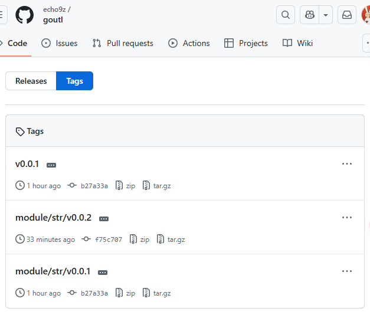
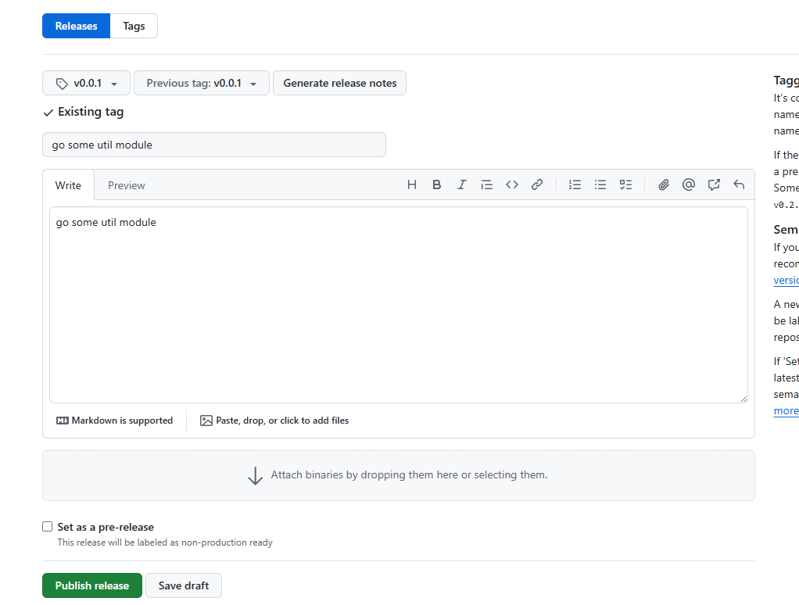
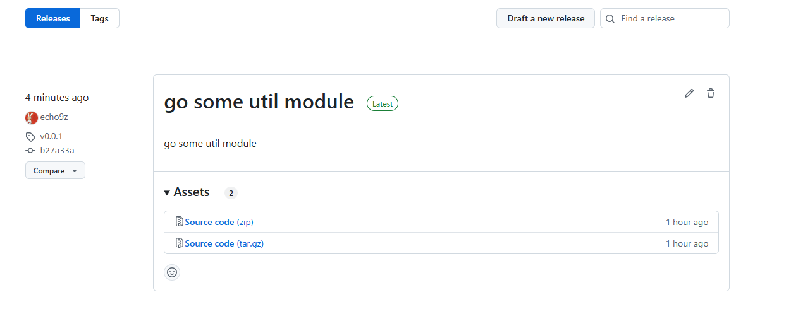

在 Go 的项目中，可以 import 一个托管在远程仓库的模块，在我们使用 go get 的时候，会将模块下载到本地。如何发布一个开源的go模块，共他人使用。

## 新建github仓库
Github 上新建一个仓库，选择 Public（默认）:


## 编写模块
通过`go mod init`命令进行初始化，注意这里的模块名称。
```bash
git clone https://github.com/echo9z/goutl.git
正克隆到 'goutl'...
remote: Enumerating objects: 3, done.
remote: Counting objects: 100% (3/3), done.
remote: Total 3 (delta 0), reused 0 (delta 0), pack-reused 0 (from 0)
接收对象中: 100% (3/3), 完成.
```

进入`goutl`仓库，并初始化`go mod init`模块。
```bash
~/Desktop via 🌙 v5.4.7 
$ cd goutl 

goutl on  master [?] 
$ go mod init github.com/echo9z/goutl    
go: creating new go.mod: module github.com/echo9z/goutl

goutl on  master [?] via 🐹 v1.23.1 
$ mkdir hash
```

新建一个 hash 文件夹，存放编写的计算 md5 值工具包 `md5.go` 
```go
package hash  
  
import (  
    "crypto/md5"  
    "encoding/hex"
    "errors"
    "fmt"
    "io"
    "os"
)  
  
// get file md5  
func FileMd5(filename string) (string, error) {  
    file, err := os.Open(filename) // 尝试打开文件  
    if err != nil {  
       return "", errors.New(  
          fmt.Sprintf("md5.go hash.FileMd5 os open error %v", err)) // 如果打开文件失败，返回错误信息  
    }  
    h := md5.New()            // 创建一个新的 MD5 哈希对象  
    _, err = io.Copy(h, file) // 将文件内容复制到哈希对象中  
    if err != nil {  
       return "", errors.New(fmt.Sprintf("md5.go hash.FileMd5 io copy error %v", err)) // 如果复制文件内容失败，返回错误信息  
    }  
    return hex.EncodeToString(h.Sum(nil)), nil // 返回文件的 MD5 哈希值（以十六进制字符串表示）  
}  
  
// get string md5  
func StringMd5(s string) string {  
    md5 := md5.New()                        // 创建一个新的 MD5 哈希对象  
    md5.Write([]byte(s))                    // 将字符串转换为字节切片并写入哈希对象  
    return hex.EncodeToString(md5.Sum(nil)) // 返回字符串的 MD5 哈希值（以十六进制字符串表示）  
}

```

md5的单元测试 `md5_test.go`
```go
package hash  
  
import "testing"  

// TestMd5 测试文件和字符串的 MD5 哈希函数。  
func TestMd5(t *testing.T) {  
    // 预期的文件 "md5.go" 的 MD5 哈希值。  
    const expectFileMd5 = "3709d29673e226fbaa85c28a6ead0a73"  
    // 计算文件 "md5.go" 的实际 MD5 哈希值。  
    actualFileMd5, err := FileMd5("./md5.go")  
    if err != nil {  
       // 如果出现错误，使用意外错误信息使测试失败。  
       t.Fatalf("unexpected error: %v", err)  
    }  
    // 比较文件的预期和实际 MD5 哈希值。  
    if expectFileMd5 != actualFileMd5 {  
       t.Errorf("expect file md5 is %s; but had %s\n", expectFileMd5, actualFileMd5)  
    }  
    // 用于 MD5 哈希计算的测试字符串。  
    const str = "why did you like golang"  
    // 预期的测试字符串的 MD5 哈希值。  
    const expectStringMd5 = "09a6f16fc1e802003b4c0c11b69761d2"  
    // 计算测试字符串的实际 MD5 哈希值。  
    actualStringMd5 := StringMd5(str)  
    // 比较字符串的预期和实际 MD5 哈希值。  
    if expectStringMd5 != actualStringMd5 {  
       t.Errorf("expect string md5 value is %s; but had %s\n", expectStringMd5, actualStringMd5)  
    }
}
  
// BenchmarkMd5 基准测试文件和字符串的 MD5 哈希函数。  
func BenchmarkMd5(b *testing.B) {  
    // 基准测试文件 "md5.go" 的 MD5 哈希计算。  
    for i := 0; i < b.N; i++ {  
       _, err := FileMd5("./md5.go")  
       if err != nil {  
          // 如果出现错误，使用错误信息引发 panic。  
          panic(err)  
       }    }  
    // 用于 MD5 哈希计算的测试字符串。  
    const str = "why did you like golang"  
    // 基准测试字符串的 MD5 哈希计算。  
    for i := 0; i < b.N; i++ {  
       _ = StringMd5(str)  
    }
}
```

进入 `hash`文件夹，执行 `go test` 命令
```go
goutl/hash on  master [?] via 🐹 v1.23.1 
❯ go test -v -cover -bench=.
=== RUN   TestMd5
--- PASS: TestMd5 (0.00s)
goos: linux
goarch: amd64
pkg: github.com/echo9z/goutl/hash
cpu: Intel(R) Core(TM) i5-6300HQ CPU @ 2.30GHz
BenchmarkMd5
BenchmarkMd5-4             59079             19746 ns/op
PASS
coverage: 81.8% of statements
ok      github.com/echo9z/goutl/hash    1.385s
```

## 发布一个版本
接下来可以把刚刚新增的文件，全部 push 到 git 仓库。
```bash
git add .
git commit -m "add a md5 func"
git push origin
```
对当前提交的commit记录打tag标签
```shell
# 创建v0.0.1 tags
git tag -a v0.0.1 -m "Release util v0.0.1"
# 将tags标签推送至远程仓库中
git push origin v0.0.1
```



选择tagv0.0.1标签，点击`Publish release`发布一个release版本。
生成指定的releases版本


## 如何使用？

使用 go get 命令，在其他项目中下载我们的发布的模块
```shell
go get github.com/echo9z/goutl@v0.0.1
go: downloading github.com/echo9z/goutl v0.0.1
go: upgraded github.com/echo9z/goutl v0.0.0-20250220055007-9ffbc80b86c3 => v0.0.1
```

在其他项目中引入
```go
package main  
  
import "github.com/echo9z/goutl/hash"
  
func main() {  
    hash.StringMd5("test MD5")
}
```

使用 tree 命令，查看一下下载的包已经放入了 `$GOPATH/pkg/mod` 下。
```shell
C:\USERS\11312\GO\PKG\MOD\GITHUB.COM
└─echo9z
    ├─goutl
    │  └─module
    │      └─str@v0.0.1
    │              go.mod
    │              substr.go
    │              substr_test.go
    │
    └─goutl@v0.0.1
        │  .gitignore
        │  go.mod
        │  README.md
        │
        ├─.idea
        │      .gitignore
        │      aws.xml
        │      goutl.iml
        │      MarsCodeWorkspaceAppSettings.xml
        │      modules.xml
        │      vcs.xml
        │
        └─hash
                md5.go
                md5_test.go
```


